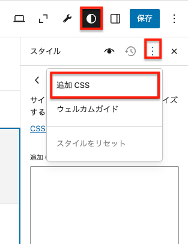
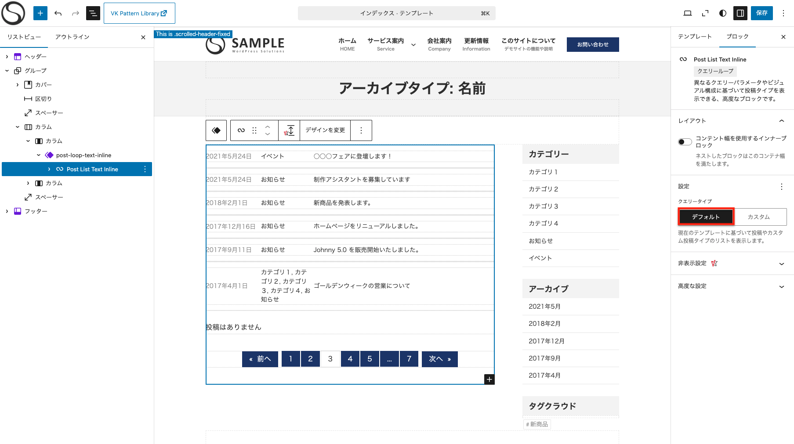
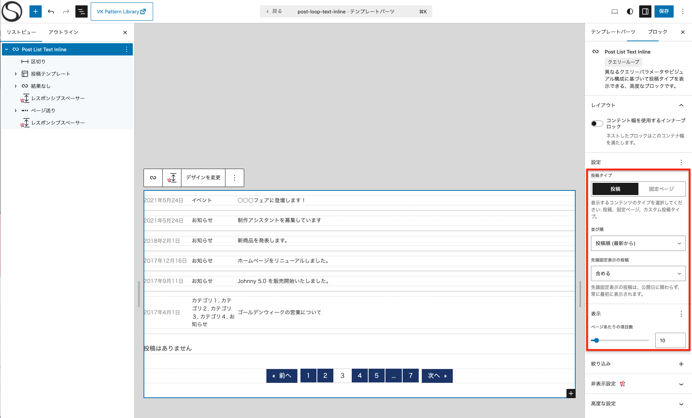

<!-- 
theme: vk-slide
size: 16:9
paginate: true
style: |
_paginate: false 
-->
<link href="./themes/vk-slide/fontawesome-free/css/all.css" rel="stylesheet">

# ブロックテーマ と 最新ツールで作る実用サイト制作術

※というほど大した内容ではありません。

四国合同 WordPress Meetup @高知

Hidekazu Ishikawa@Vektor,Inc.

<!-- https://www.meetup.com/ja-JP/kochi-wordpress-meetup-group/events/307763191/ -->


<!-- _class: title -->


---

PHPベースのクラシックテーマに慣れたユーザー向けに
ブロックテーマでのサイト制作・カスタマイズ手法や、
ブロックパターンやAIといった新しいツールを活用したサイト制作について紹介します。

↑ なるべく意識したつもりの構成です

---

## ブロックテーマ使ってますか？

* 受託とかの案件でもバリバリ使ってる
* 案件では使ってないけど自社サイトなどでは実際に運用してる
* お試しでさわったりした事はある
* まったく使った事がない

---

## ブロックテーマのメリット

### ノーコードで<br>管理画面からサイト全体を自由に編集できる

---

## デメリット

* クライアントがサイトを壊しやすい
* テーマの Git 管理がしにくい
  （編集内容はすべてデータベースに保存される）
* テストサーバー → 本サーバー への反映がしにくい

---

### よくある「どうすんの？」

* そもそもブロックテーマでどんな感じで作ってる？
* 条件分岐とかプログラムでの表示制御してた部分どうすんの？
* カスタムフィールドを表示したい
* わりと大掛かりなテーマ改修する時とかどうすんの？

---

# 主にこのあたりを<br>いろいろ見ていきたいと思います

---
<!-- _class: title-chapter  -->
<!-- _paginate: false  -->


# 小規模サイト一般構築

---

主なお品書き

* 簡単セットアップ
* パターンライブラリ
* グローバルスタイル
* 投稿一覧ループの構築・カスタマイズ
* 部分的な条件分岐で表示を切り替える

---

* カスタムフィールドの値を表示したい
* 同期パターンで一部上書き可能にする
* 低い権限のユーザーでも<br>ナビゲーションだけは編集許可する
* テスト → 本番反映 への問題と対応

---

<!-- _class: title-chapter  -->
<!-- _paginate: false  -->


# ブロックテーマの構築

---

## ゼロから作るなら

プラグイン Create Block Theme 
https://wordpress.org/plugins/create-block-theme/

管理画面 > エディタからいろいろ設定してテーマを書き出す

→ これやりだすとそれだけで時間なくなるのでスキップ

---

## 既存のテーマからのカスタマイズなど

#### テスト用のサイトで解説します

宣伝で気が引けますが、VK FullSite Installer で
サイトごとセットアップする事ができます。

https://vk-fullsite-installer.com

今回は「X-T9 無料版 ビジネス」と「X-T9 Pro版 ビジネス」を元に紹介します。

---

## パターンライブラリとかも便利

サイトでよく使われるようなレイアウトのセクションやページ全体をパターンとして提供しているテーマも多い

.org 公式 : https://ja.wordpress.org/patterns/
Vektor,Inc. : https://patterns.vektor-inc.co.jp

キタジマさん
https://snow-monkey.2inc.org/snow-monkey-patterns/
https://unitone.2inc.org/unitone-patterns/

---

## パターンは良くても中身が思いつかない！

ブロックパターンの中に入れる文章とか画像は <br>AI に相談して出してもらうともらうと便利（・ｗ・

ChatGPTとかに「歯医者のウェブサイト用のサービスメニューを４つと簡単な説明文を200文字くらいでください」とかやればそれっぽい文章はくれる

※ プラグインとかもあるけど実用性が微妙なのでスルーします。

---

<!-- _class: title-chapter  -->
<!-- _paginate: false  -->


# ブロックテーマのサイトの<br>カスタマイズ

---

# グローバルスタイルについて

---

## 追加CSSを書く場所

■ クラシックテーマ

外観 > カスタマイズ > 追加CSS

---


■ ブロックテーマ
<div class="row">
<div class="col-6">

1. 外観 
2. エディタ
3. テンプレート一覧
4. 適当に選ぶ
5. スタイルアイコン
6. 三点アイコン
7. 追加CSS

→ めっちゃ隠れてる！
</div>
<div class="col-6">

</div>
</div>

<!--  -->

---

### 個人的には...

* ブロックに直接CSSを追加できるプラグイン（有料）を使う
* カスタムHTMLブロックにスタイルタグでCSSを書く
`<style type="text/css">.my-style-red { color:red; }</style>`
* 外観 > カスタマイズ > 追加CSSからでも普通に書ける
* その他追加CSSを書けるプラグインもあるし...

グローバルスタイルから追加CSSを書くケースは
ほぼない印象ですが...（・ｗ・；

---

### グローバルスタイルの追加CSSのメリット

* 一括管理の方が複数人で作業の場合とか混乱が少ない
* 一応一番読み込み（ページ表示）が速い？
* 外観 > カスタマイズ > 追加CSS の場合編集画面には反映されない？

---

## デフォルトのブロックスタイルを指定できる

外観 > エディタ > スタイル > ブロック 

各ブロックのデフォルトのスタイルを独自に設定変更しやすいようになっている

他にもカラーパレットとかも簡単に変更できる

__カスタムCSSを書かなくてもそれなりにスタイルをつけられる__

---

## フォントの追加

任意のGoogleフォントも簡単に追加できます。

※ 時間の都合で説明スキップしますので下記参照

https://www.vektor-inc.co.jp/post/add-google-fonts-block-theme/

---

# 記事一覧で同じレイアウトを使う

---

### home / index / category / archive など<br>記事一覧は同じレイアウトにしたい

クラシックテーマでは1件分をテンプレートパーツのphpファイルとして作成して、
get_template_part() で呼び出すのが一般的だった。

---

## ブロックテーマのテンプレートパーツ

"テンプレートパーツ" という機能はあるが...

* クエリーループの中の１件分の要素が入っている"投稿テンプレート"の中身をテンプレートパーツとして登録しても、テンプレートパーツは作られるが、ループの中には反映されない...
* "投稿テンプレート" ブロックを直接テンプレートパーツにしても動作不良
  - 個別の編集モードにいけない
  - 他の場所でも呼び出せない

---

<p class="mb-32">どうすんの？</p>

### 手法１

"投稿テンプレート" の中身を __同期パターン__ にして登録

→ 他のテンプレートにも配置

<div class="alert alert-danger mt-32">
留意事項 : <br>
DBに投稿として保存されて、テーマとしてはその"投稿id" を参照するので、Create Block Theme でテーマを書き出しても同期パターンは書き出してもらえない
</div>

---

### 手法２（そこそこの規模の案件向け）

カスタマイズ用のプラグインの中で1件分を自作して、
プラグインファイルをバージョン管理する

A. 投稿１件分のカスタムブロックを自作する
B. 投稿１件分表示用のショートコードを作る


<div class="alert alert-info mt-32">バージョン管理やテストサーバー → 本番反映など運用しやすい</div>

---

### クエリーループごとテンプレートパーツ化する

home / index / archive の一覧への表示だけなら、
クエリーループごとテンプレートパーツ化して共通化できる。

---

<div class="alert alert-danger mt-32">

#### 注意！

テンプレートファイルの編集ではなく、テンプレートパーツや同期パターン単体の編集画面ではクエリー自体がデフォルトを選べなくなる

→ 一度保存するとカスタムクエリになってしまう

</div>

<div class="text-danger">

＿人人人人人人人人人人人人人人人人人人人人＿
＞　どのページを開いても一覧の内容が同じ　＜
￣Y^Y^Y^Y^Y^Y^Y^Y^Y^Y^Y^Y^Y^Y^Y^Y^Y￣

</div>

---



<div class="telop telop--left" style="bottom:150px;">

#### テンプレート編集画面からはデフォルトにできるが...

</div>

---



<div class="telop telop--left" style="bottom:150px;">

#### テンプレートパーツの編集画面からは<br>デフォルトが指定できない

</div>

---

## 投稿ループのクエリのカスタマイズ

__固定ページの中などに__ 投稿一覧を配置する場合
指定のカテゴリーだけどかもう少し細かい条件を指定

* Advanced Query Loop
  https://wordpress.org/plugins/advanced-query-loop/

※ 先述の通りアーカイブ用のテンプレートなどで使うと、本来のページに応じた表示内容にならなくなるので注意

---

# 部分的な条件分岐で表示を切り替える

---

投稿一覧アーカイブページなど、レイアウトは概ね同じだが、
__投稿タイプによってサイドバーだけ変更したい__ とか...

一部分のためにテンプレートファイルを増やすと管理が面倒になる

PHPのテンプレートファイルで if 分で条件分岐をしていたようにブロックでも条件分岐はできる

* VK Dynamic If Block
  https://ja.wordpress.org/plugins/vk-dynamic-if-block/
* Block Visibility
  https://ja.wordpress.org/plugins/block-visibility/

---

# カスタムフィールドの値を表示したい

---

## ブロック自作

ちょっとハードル高いよね

<br>

## プラグインなど

カスタムフィールドを表示できるプラグインとかもあるで
VK Blocks Pro のダイナミックテキストブロックとか...

---

メモ : ショートコード使う場合

https://www.vektor-inc.co.jp/post/shortcode-in-query-loop/

---

## カスタムブロック作るプラグイン

PHPでクラシックテーマ自作してた人なら Lazy Blocks とかで作るのも手軽
https://wordpress.org/plugins/lazy-blocks/

ブロックにPHPを登録
```
<?php
$cf_value = get_post_meta( get_the_ID(), 'works-tech', true );
echo nl2br(esc_textarea( $cf_value ));
?>
```

---

とは言え...
管理画面からPHPが書けてしまうのはセキュリティ面でよろしくない空気を感じるのですが...
そのあたりどうなんですかね...

---

## 同期パターンで一部上書き可能にする

カスタムフィールド使わなくてもいける場合も多い

同期パターンの中の要素は、テキストと画像に限って上書き可能にする事ができる

1. 同期パターン化
2. 同期パターンの編集画面移動
3. 編集可能にさせたいブロックを選択
   高度な設定 > 上書きを有効化

---

# 低い権限のユーザーでも<br>ナビゲーションだけは編集許可する

---

ブロックテーマはテーマファイルがノーコードで編集可能
<br>

＿人人人人人人人人人人人人人人人人人人人人人人人人＿
＞　クライアントに迂闊にテーマをさわってほしくない　＜
￣Y^Y^Y^Y^Y^Y^Y^Y^Y^Y^Y^Y^Y^Y^Y^Y^Y^Y^Y^Y￣
<br>
でもナビゲーション項目は変更できるようにしたい (´・ω・｀)

---

* 編集権限ユーザー
  - そもそも 外観 > エディタにアクセスできない
* ナビゲーション変更用にナビゲーションブロックだけ非公開の固定ページにおいておく
  - ナビゲーションブロックの内容自体は編集者権限では保存できない
* 編集権限のユーザーにナビゲーション編集権限を付与するプログラムを書いておく

https://www.vektor-inc.co.jp/post/allow-navigation-edit-for-editor/

---
<!-- _class: title-chapter  -->
<!-- _paginate: false  -->


# テスト → 本番反映 への問題と対応

---

### 運用中のサイトを改修というケースで地味に困る

テストサーバーで確認 -> OK出てから本番反映

クラシックテーマと違ってファイルで管理していない

---

## Create Block Theme の問題

プラグイン Create Block Theme を使えばテーマは書き出せるが...

テストと本番で例えばヘッダーのナビゲーションの参照IDが違うと本番でメニューの再設定などが必要
（クラシックテーマはスラッグ指定できたのでまだマシ）

---

#### Create Block Theme で子テーマとして書き出すと...
→ 同期パターンなどを使用しても、同期パターンはDB内に保存されるので、テーマとしては書き出してもらえない

---

## どうすればいい？

### 1. テンプレートパーツをプラグインのコードで作る

＿人人人人人人人人人人人人人人人人人人人人人人人人＿
＞　コード書きまくりでフルサイト編集の意味なし！　＜
￣Y^Y^Y^Y^Y^Y^Y^Y^Y^Y^Y^Y^Y^Y^Y^Y^Y^Y^Y^Y￣

---

### 2. よほど大きくなければ本番サイトで...

#### A. 確認用ページテンプレートで

1. 確認用のページテンプレートを作る
2. 非公開ページを作成して確認用のページテンプレートを適用
3. OKが出たら確認用のページテンプレートの中身を本番テンプレートの中身に入れ替え

バージョン管理はバックアッププラグインなどでサイト全体として使えばいいのでは？

---

#### B. 条件分岐で

条件分岐で表示できるプラグインを使って
ログインしている特定のユーザー権限の場合には改修用のヘッダーが表示されるようにする

---

# みんなどうしてる？

---

# ありがとうございましたん


