<!-- 
theme: vk-slide
size: 16:9
paginate: true
style: |
_paginate: false 
-->

<link href="./themes/vk-slide/fontawesome-free/css/all.css" rel="stylesheet">
<!-- _class: title -->

<!--
今回は
ABテストがめちゃめちゃ簡単にできるプラグイン
VK AB Testing について紹介します。
-->

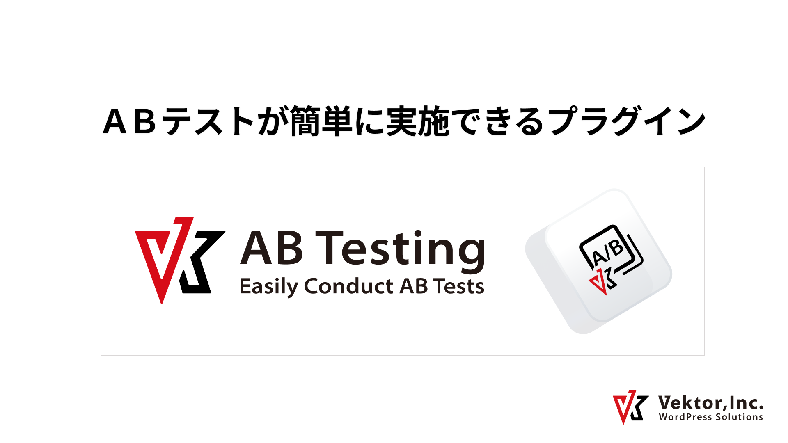

---

<!-- 
ウェブサイトに貼るバナーで AのパターンとBのパターン
どちらがクリック率が高いのかとか、
 -->

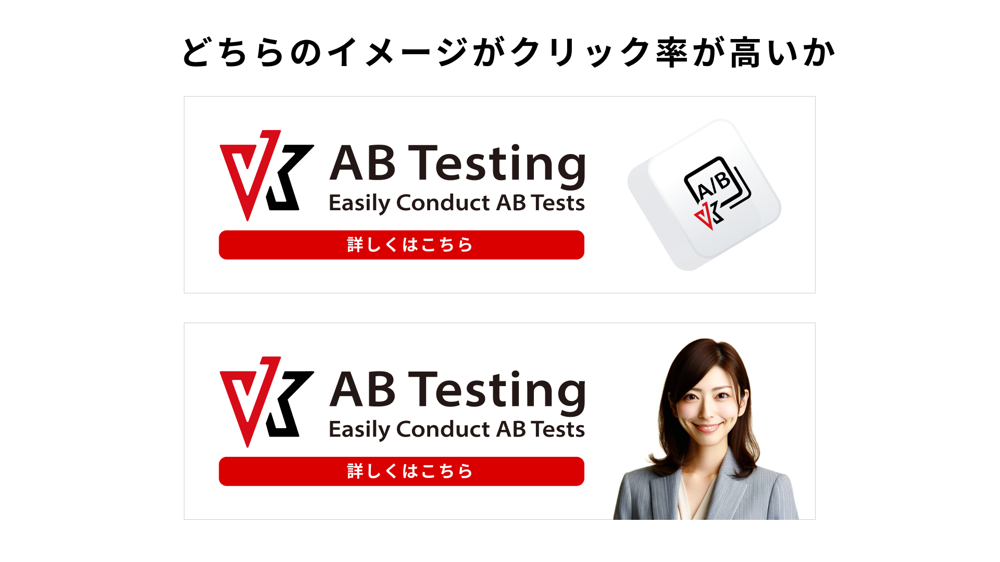

---

<!-- 
どちらのコピーがクリック率が高いかなど
簡単にテストする事ができます。
 -->

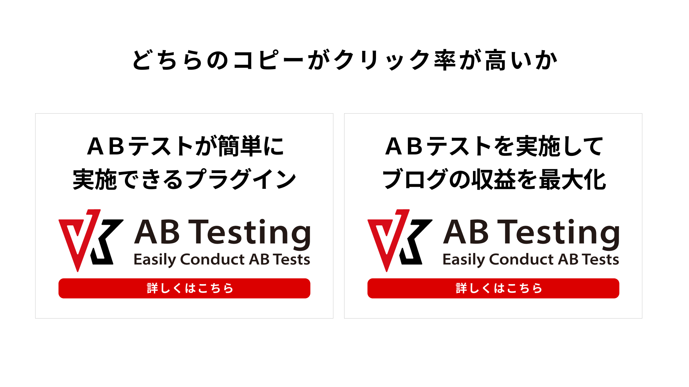

---

<!-- 
使い方はめちゃめちゃ簡単
 -->

---

<!-- 
まず投稿タイプ「VK AB Testing」から
新規投稿を追加します。
 -->

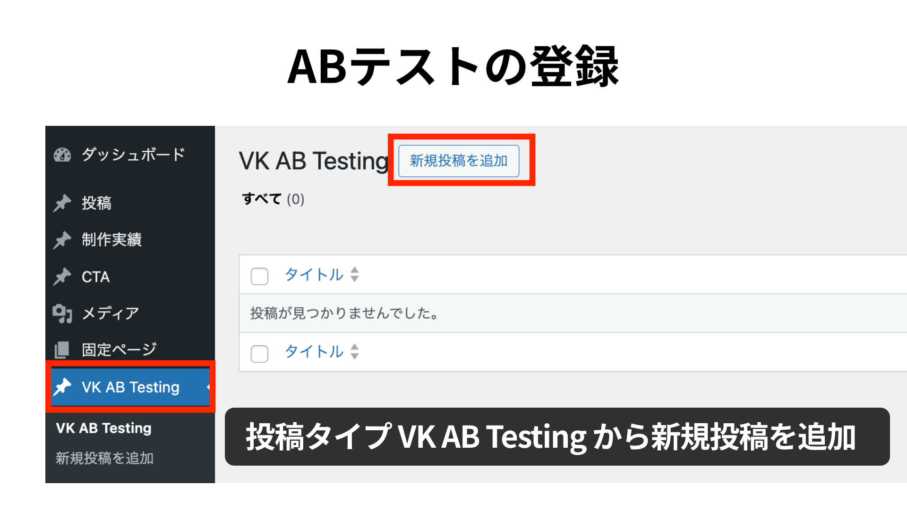

---

<!-- 
最初から AB Test ブロックと、
インナーブロックとして AB Test Item ブロックが配置されています。
 -->

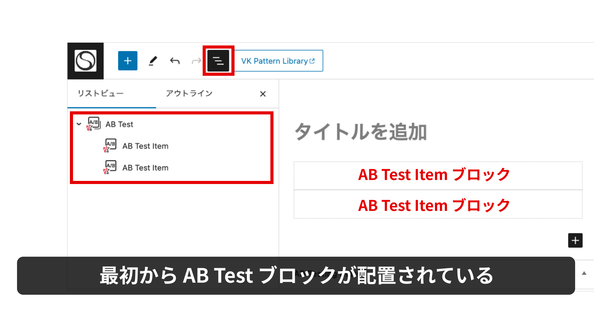

---

<!-- 
AB Test Item ブロックの中にバナー画像などを配置して、
AB Test Item 名を登録します。
 -->

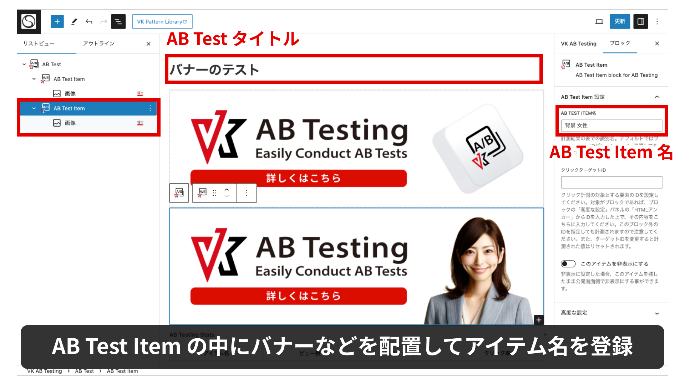

---

<!-- 
AB Test Item は自由に追加可能で、
画像だけでなくブロックでも自由に作成できます。
 -->

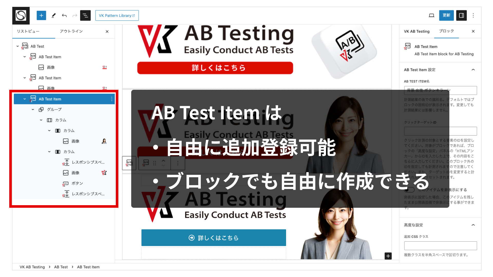

---

<!-- 
クリック対象がボタンの場合は、
クリック計測対象のブロックを選択して、
高度な設定パネルの中にあるHTMLアンカーを入力して
 -->

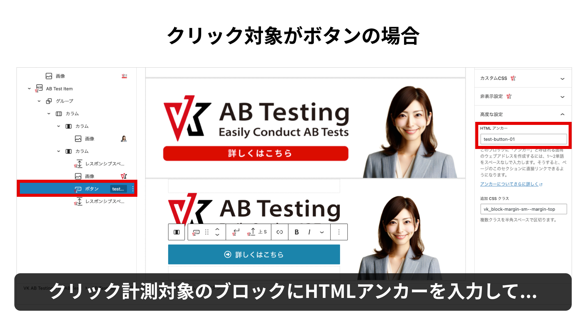

---

<!-- 
その入力した内容を、
AB Test Item ブロックのクリックターゲットIDの欄にも
入力します。
 -->

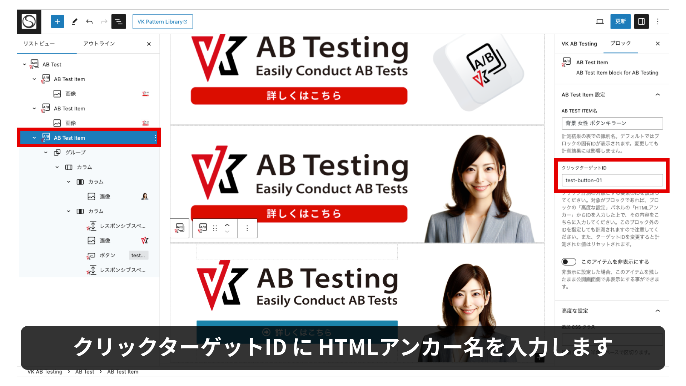

---

<!-- 
次に作成した AB テストを実際に配置します。
AB テストを表示したい場所に Call AB Test ブロックを配置して、
設定サイドバーから、表示するABテストを指定します。
 -->

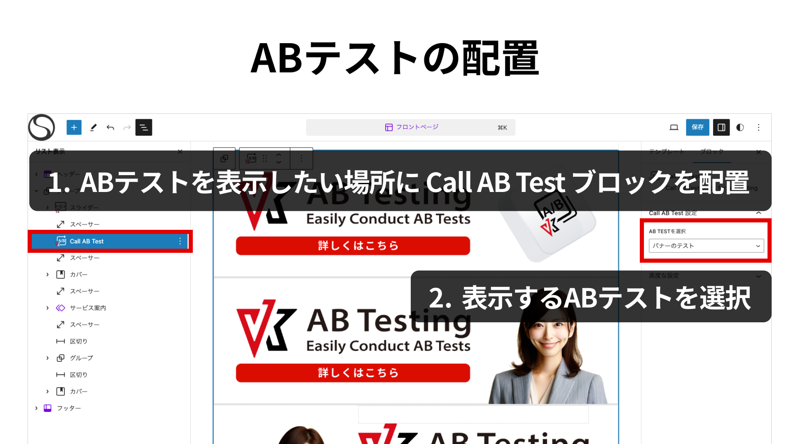

---

<!-- 
これで公開ページを見ると、
登録済みの AB テストアイテムがランダムで表示されます。
 -->

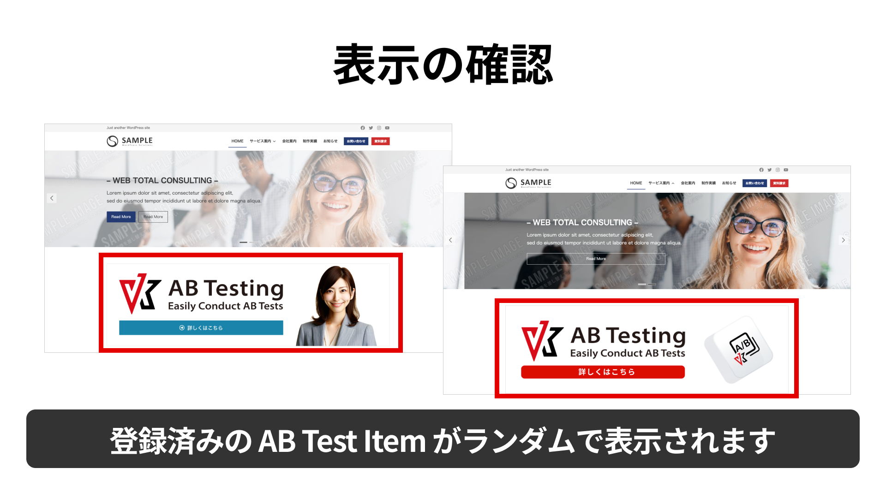

---

<!-- 
計測結果については、
作成した AB Test 編集画面の下部に
ビュー数 / クリック数 / クリック率 が
表示されます 
 -->

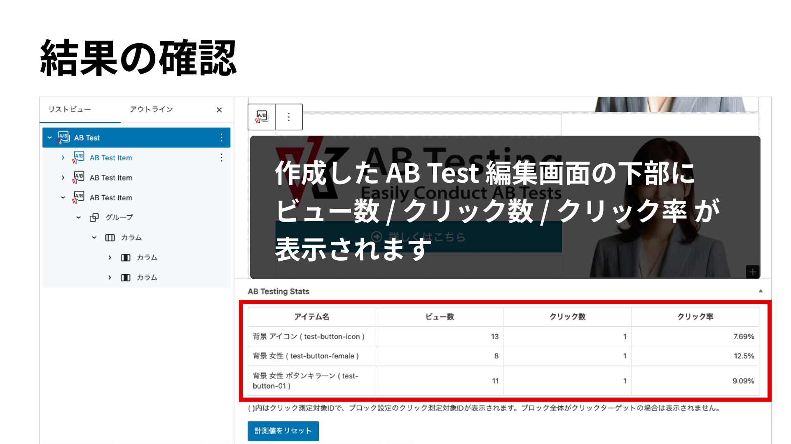

---

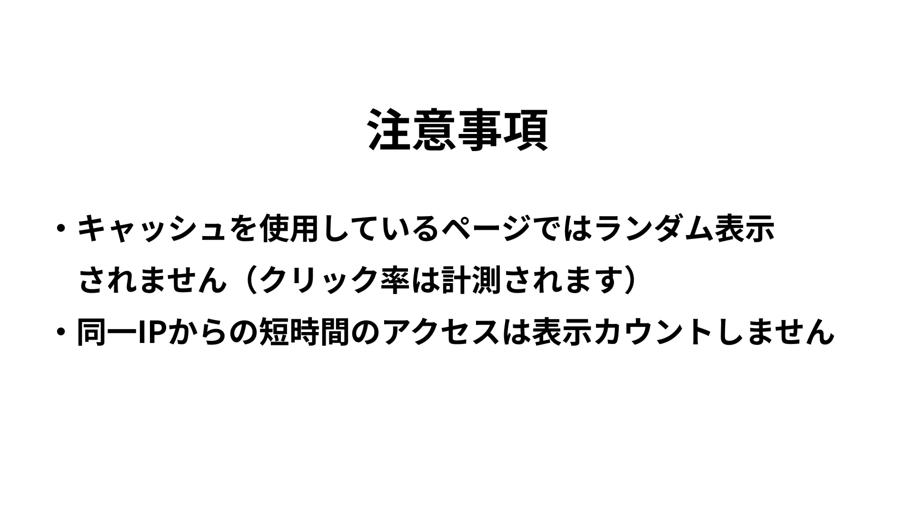

---

---

