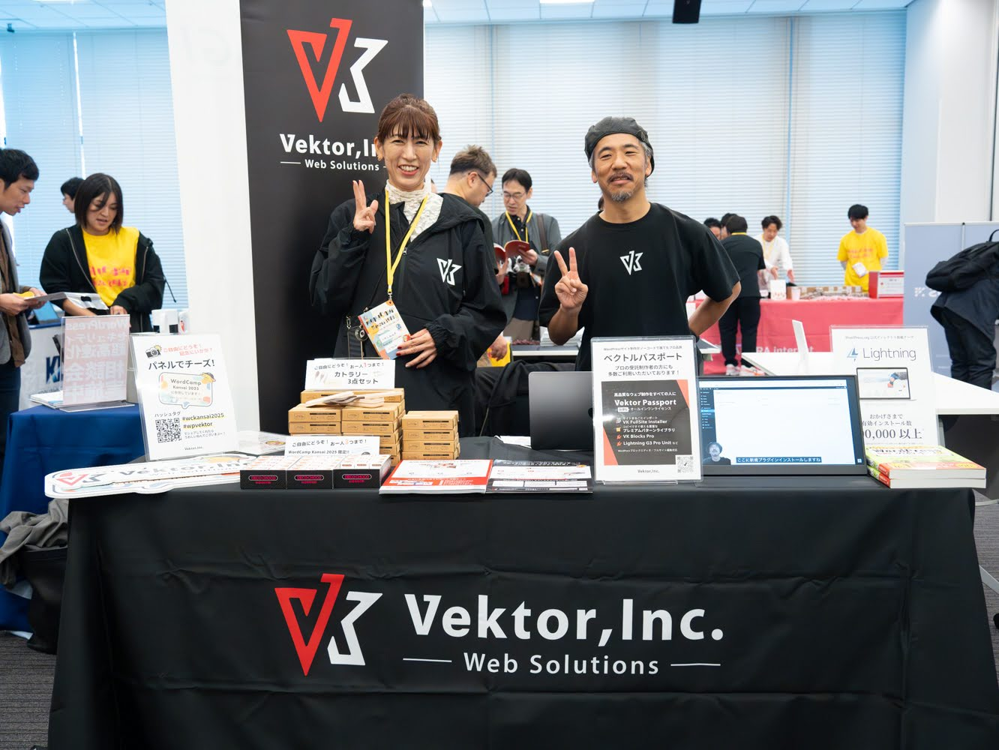
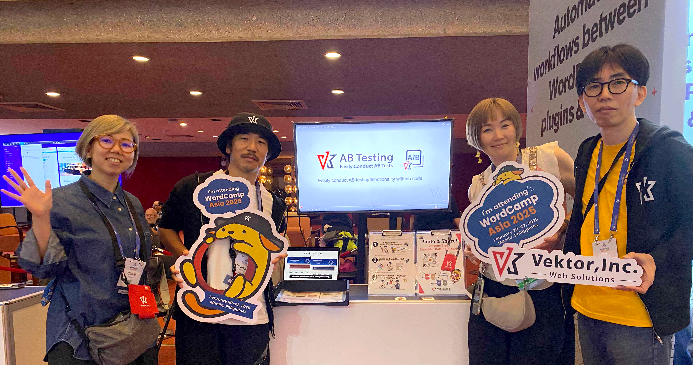
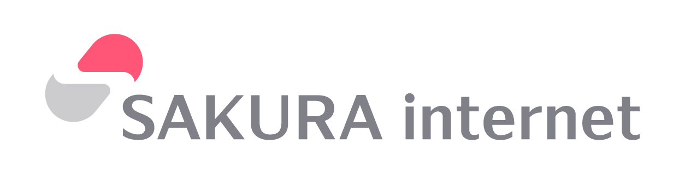
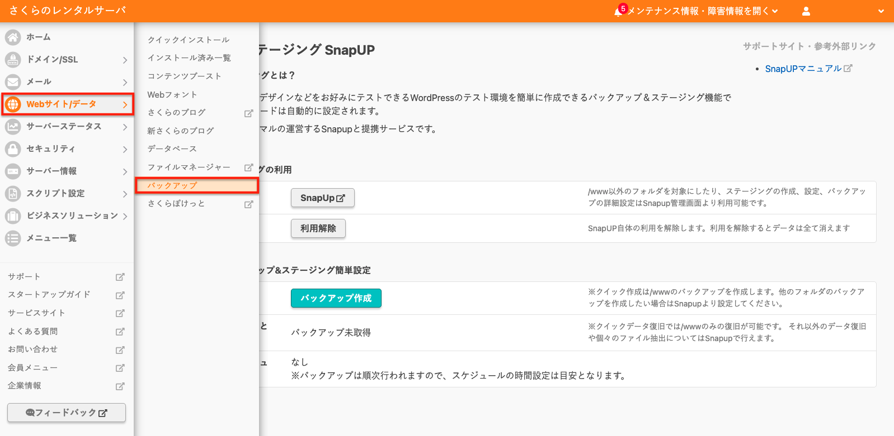
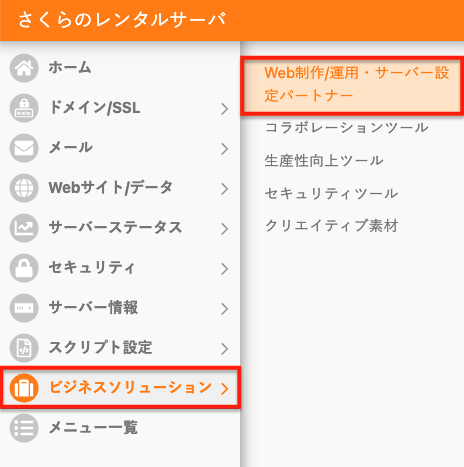
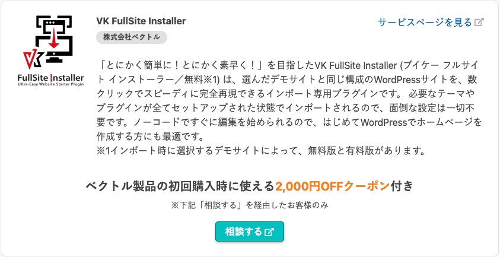
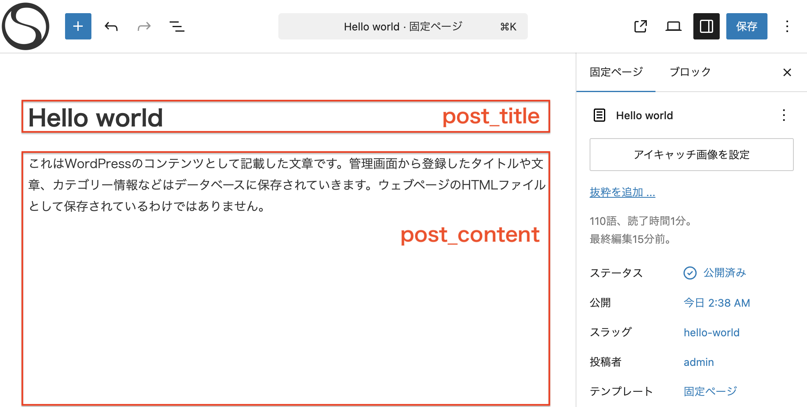
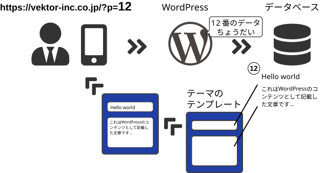
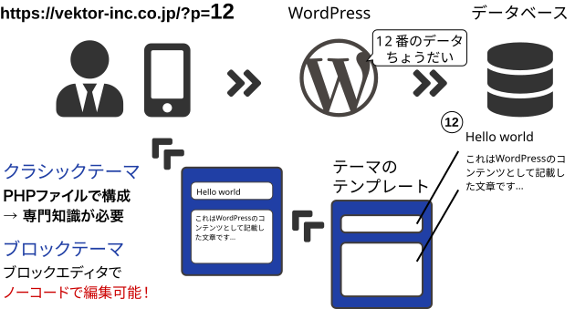

<!-- 
theme: vk-slide
size: 16:9
paginate: true
style: |
_paginate: false 
-->
<link href="./themes/vk-slide/fontawesome-free/css/all.css" rel="stylesheet">

# ゼロから覚えたくない WordPress の最新フルサイト編集

VWSオンライン勉強会 #047

石川栄和@Vektor,Inc.

<!-- https://www.meetup.com/ja-JP/kochi-wordpress-meetup-group/events/307763191/ -->

<!-- _class: title -->

---

<!-- _class: title-chapter  -->
<!-- _paginate: false  -->

# ようこそ！はじめに

---

## この勉強会について

WordPressやウェブ制作にまつわる様々なテーマをとりあげて開催しているオンライン勉強会。

ご興味がある方であれば、経験や技術レベルに関係なく、どなたでもご参加いただけます。

---

## 運営元 : 株式会社ベクトル

WordPress テーマ「Lightning」をはじめ、WordPress 関連のテーマ・プラグインなどを多数開発しています。

---

<!-- _paginate: false  -->

国内外の WordCamp に協賛しています。

WordCamp Kansai 2025 
WordCamp Asia 2025 
など...

---

## 自己紹介 - Self introduction -

 

<h3 class="mb-8">石 川 栄 和</h3>

Hidekazu Ishikawa

<i class="fa-solid fa-laptop-code"></i>Vektor,Inc．代表 / テーマ開発
<i class="fa-brands fa-x-twitter"></i>[kurudrive](https://x.com/kurudrive)
<i class="fa-brands fa-facebook"></i>hidekazu.ishikawa
<i class="fa-solid fa-heart"></i>SUP / ランニング / ベース / 将棋

---

## メディアスポンサー

---

指定のディレクトリを対象にしたバックアップ・ステージング環境をつくれる機能が特におすすめ！

---

  

  

さくらのレンタルサーバーのコントロールパネルから弊社製品2,000円割引のクーポンが入手できます。

https://rs.sakura.ad.jp/biz/solutions/web-development/vektor/

---

## 勉強会中のコメント

勉強会中のコメントは YouTube の方によろしくお願いします。
できるかぎり拾っていきたいとは思っています。

#### 歓迎されること

* __チャットでわいわい__ コメントしてください。
* ぜひSNSにも投稿して盛り上げてください <strong>#wpvektor</strong>
* __やさしい言葉使い__ を心がけて、誰にとっても快適な勉強会となるようにご協力ください。

---

## 本日の流れ

* ご挨拶・その他お知らせ（約10分）
* 本編（45分程度）
* 質疑応答（〜30分程度）
* 懇親会・質問会・ユーザーフィードバック会

---

## セッションの内容は後から振り返りできます

URLリンク情報などはコメント欄や twitter(X) のアカウントから投稿します。

https://x.com/vektor_inc

動画もシェアされますので安心してゆっくり見てください。

---

<!-- _class: title-chapter  -->
<!-- _paginate: false  -->

# それでは本編スタート

ゼロから覚えたくないWordPress の最新フルサイト編集

---

## この勉強会の対象

* ビジネス用のウェブサイトを簡単に作りたい人
  （個人事業主・店舗オーナーなど）
* WordPressの基本操作はわかるが、ブロックテーマでフルサイト編集に慣れていない人
* 他の人がブロックテーマをどう使ってるのか見たい人

---

## 本職のWeb制作者向け

[ 動画・スライドあり ] VWSオンライン勉強会 #045 WordPressブロックテーマで作る実用サイト制作術

https://www.vektor-inc.co.jp/post/vws-45-report/

---

## ちなみに

＿人人人人人人人人人人人人人人人人人人人人人人人＿
＞　ブロックテーマ ≠ ブロックエディタ対応テーマ　＜
￣Y^Y^Y^Y^Y^Y^Y^Y^Y^Y^Y^Y^Y^Y^Y^Y^Y^Y^Y￣

### ブロックテーマ

テンプレートファイルが html ファイルで構成されていて、
ヘッダーやフッターを含めてページ全体がサイトエディタから自由に編集可能な __フルサイト編集に対応したテーマ__

---

## ブロックエディタの操作に慣れてない人

ゼロから覚えたくない人のためのWordPressブロックエディタハンズオン

https://training.vektor-inc.co.jp/courses/wordpress-block-editor/lessons/creating-web-pages-using-block-patterns/

---

* デモサイトのインポート
* WordPressの編集箇所に関する大まかな概念について
  （ページコンテンツとテンプレート）
* ロゴ画像の変更
* 色の変更
* ヘッダーの変更 / フッターの変更
* ナビゲーションの変更
* ページテンプレートの変更
* 投稿一覧の変更
etc...

---

## デモサイトのインポート

VK FullSite Installer から「X-T9 無料版」をインポート
https://vk-fullsite-installer.com/

---

<!-- _class: title-chapter  -->
<!-- _paginate: false  -->

# WordPressの編集箇所に関する 大まかな概念
※ 今まで WordPressを使ってない非エンジニア向け

---

## WordPress はページ毎のファイルを 表示しているわけじゃない

タイトルや本文などがデータベースに保存される。

---

## URLにアクセスされたらページを生成する

---

## テンプレートがノーコードで編集可能

---

<!-- _class: title-chapter  -->
<!-- _paginate: false  -->

# テンプレートを編集していきましょう

---

## ヘッダーの調整

* ヘッダーロゴ変更 / サイズ調整
  - alt はサイトタイトルになる
* ヘッダーメニューの変更
  - 不要メニューの削除
  - メニューの追加
  - メニューのハンバーガーの切り替え
  - ※ ページのURL変更したらリンク切れます

---

## ヘッダーレイアウトの変更

  - パターン（同期）に登録しておく
  - ヘッダーパターンの変更（ロゴ+サイトタイトル）
  - メニューセットの入れ替え
  - サイトタイトルとキャッチコピーは連動してる
  - サイトタイトルのフォント変更

---

## サイトアイコンの変更

サイトロゴブロック or 設定 > 一般 から指定できます

---

## 色の変更

* キーカラー / ホバーカラーの変更

---

## フッターの変更

住所やコピーライト

---

## テンプレートの切り替え

* 記事編集画面でテンプレートの表示
* 適用するページテンプレートの変更
  - デフォルト / 2カラム / ランディングページ / ブランク

---

## 固定ページ / 投稿テンプレートの編集

* 固定ページのページヘッダーに背景色を設定してみる
* 投稿のページヘッダーにアイキャッチ画像を指定編集してみる

---

## アーカイブページの編集

* アーカイブページ一覧のレイアウトを変更してみる
* アーカイブページ一覧の投稿テンプレートを変更してみる

---

## おまけ（時間があれば）

* リビジョン（過去のバージョンに戻す）
* サイトタイトルは h1 タグになっちゃうやで...

---

# いかがでしょう？

---

### クラシックテーマ

* テーマで用意されたレイアウトしか使用できない
* カスタマイズする
   * 該当箇所のファイルを探す
   * ソースコードの変更
   * サーバーへのアップロード

---

### ブロックテーマ

＿人人人人人人人人人人人人人＿ 
＞　管理画面だけでほぼできる　＜ 
￣Y^Y^Y^Y^Y^Y^Y^Y^Y^Y^Y￣

|・ｗ・）.oO（ 慣れると便利やで ）

---

<!-- _class: title-chapter  -->
<!-- _paginate: false  -->

# プロのウェブ制作者向け

---

## 本職のWeb制作者向け

[ 動画・スライドあり ] VWSオンライン勉強会 #045 WordPressブロックテーマで作る実用サイト制作術

https://www.vektor-inc.co.jp/post/vws-45-report/

---

### Vektor Passport ユーザー向け

ブロックテーマでカスタム投稿タイプやカスタムフィールドを
使ったデモサイトのデータがダウンロードできます。

* X-T9 Pro 版ビジネス
  https://demo.dev3.biz/x-t9-pro/
* X-T9 工務店（ ナチュラル ）
  https://demo.vk-fullsite-installer.com/architect/

---

<!-- _class: title-chapter  -->
<!-- _paginate: false  -->

# 質疑応答

---

<!-- _class: title-chapter  -->
<!-- _paginate: false  -->

最後までご参加ありがとうございました！

# 告知とお知らせ

---

## 次回の告知

2025/12/25?(木) 21:00 〜 22:30
### 何かやります

https://vektor.connpass.com/

---

🎄ベクトル製品にまつわるブログリレー🎄

## 12月開催 VWS アドベントカレンダー ぜひご参加ください🎁

カレンダーに参加登録をして、自分のサイトにベクトル製品に関する記事を書いて公開していただくと、ベクトル製品のお買い物に使える __1,000円分__ のクーポンをプレゼント！🎟️✨

無料版のテーマやプラグインに関するブログ記事でもOK！
https://www.vektor-inc.co.jp/info/adventar-2025/

---

<!-- _class: title-chapter  -->
<!-- _paginate: false  -->

ベクトルって、どんな製品があるの？
# ベクトル製品ご紹介
沢山あるので、おすすめトップ３をご紹介

---

# おすすめ ①

本日のセッション序盤でも活用しました！
## VK フルサイトインストーラー
https://vk-fullsite-installer.com/
お好みのデモサイトを数クリックで爆速セットアップ！
選択するデモサイトによって無料版・有料版があります。

---

# おすすめ ②

## VK パターンライブラリ
https://patterns.vektor-inc.co.jp/
コピペで使える WordPress のブロックパターンライブラリ
ただいま 470 パターンを公開中（無料版も沢山！）
実用的なビジネスLPも丸ごとコピペできる有料パターンも好評✨

---

# おすすめ ③
ベクトル主要製品とサービス使えるお得なライセンス
## ベクトルパスポート
https://vws.vektor-inc.co.jp/vektor-passport
コピペで使える豊富なプロ品質プレミアムパターンをはじめ、
高機能プラグインや、お気に入り機能・学習サービスなどが
オールインワン！
プロの受託制作者さまにも多数ご活用いただいております。

---

<!-- _paginate: false  -->

# ありがとうございました！
懇親会でもお待ちしております

