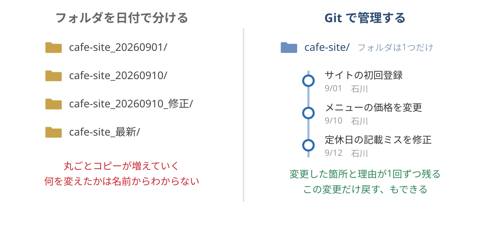
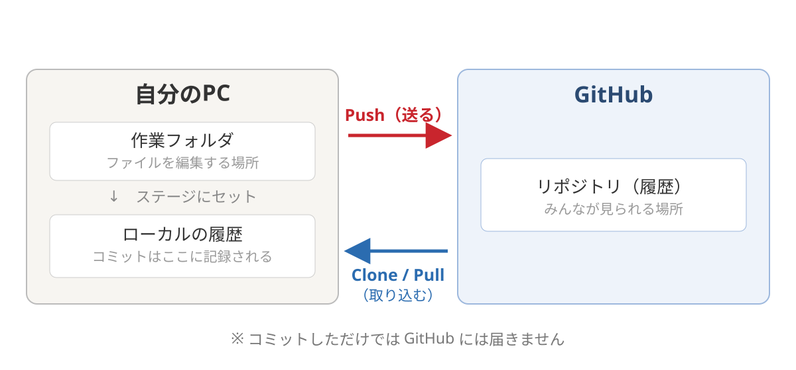
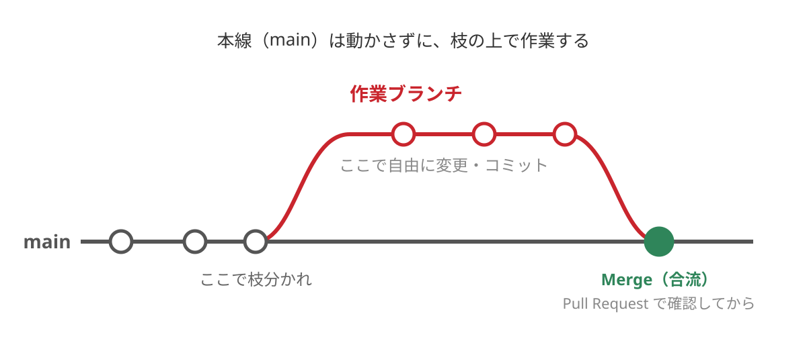
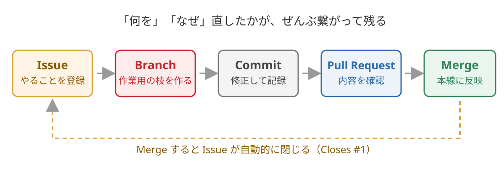

<!-- 
theme: vk-slide
size: 16:9
paginate: true
style: |
_paginate: false 
-->
<link href="./themes/vk-slide/fontawesome-free/css/all.css" rel="stylesheet">

# AI時代に最低限 知っておきたい GitHub入門

VWSオンライン勉強会 #50

石川栄和@Vektor,Inc.

<!-- https://vektor.connpass.com/event/405149/ -->

<!-- _class: title -->

---

<!-- _class: title-chapter  -->
<!-- _paginate: false  -->

# ようこそ！はじめに

---

## この勉強会について

運営 : 株式会社ベクトル

WordPressやウェブ制作にまつわる様々なテーマをとりあげて開催しているオンライン勉強会。

ご興味がある方であれば、経験や技術レベルに関係なく、どなたでもご参加いただけます。

<!--
また、ベクトル製品のアップデート情報・カスタマイズ・運用方法についてもご案内しています。
-->
---

この勉強会は無料ですが...

知見をシェアします！

というような崇高な精神ではやっていません。

---

＿人人人人人人人人人人人人人人人人＿ 
＞　全ては自社製品PRのためです！！　＜ 
￣Y^Y^Y^Y^Y^Y^Y^Y^Y^Y^Y^Y^Y^Y￣

---

## 宣伝

■ WordPress 用予約管理プラグイン
https://vk-booking-manager.com/

* ヘアサロン/ 整体 / セミナー / ツアーガイド など幅広く対応
  （ 宿泊にはまだ対応微妙 ）
* 買い切り & インストール数無制限
  → 自分で AI で作るより安い！

---

## 宣伝 その2

■ WordPress テーマ Lightning / X-T9 （無料）

■ コピペで簡単にページが作れる VK Pattern Library
https://patterns.vektor-inc.co.jp/

■ 数クリックでデモサイトをまるごとインポート
https://vk-fullsite-installer.com/

無料版もあるけど... 

---

■ Vektor Passport

* 合計500以上のブロックパターン
* パスポートユーザー専用デモサイトデータ
* ブロック拡張プラグイン
* スマポンシブの WordPress テーマ
* AB テストプラグイン

その他多機能プラグインなどいろいろ使えます！

https://vws.vektor-inc.co.jp/vektor-passport

---

## なぜ今回勉強会の題材が GitHub なのか？

https://www.vektor-inc.co.jp/service/products/vk-orchestrator/

GitHub の登録した issue を複数並列全自動で処理してくれる
Vektor Passport ユーザー向けのオマケとして配布したのに...

---

＿人人人人人人人人人人人人人人人人人人人人＿ 
＞　GitHub の使い方わかってないと無意味　＜ 
￣Y^Y^Y^Y^Y^Y^Y^Y^Y^Y^Y^Y^Y^Y^Y^Y^Y￣

せっかくだから一般公開の勉強会にするか...

<!--

---

<h2 style="position:absolute;">メディアスポンサー</h2>

---

### さくらのレンタルサーバー

  

  

ディレクトリ単位や簡単インストールでインストールした
WordPressを指定してステージング環境の作成や
スケジュールバックアップができます

---

  

  ベクトル製品 2,000円OFF クーポン付き

-->

---

## 勉強会中のコメント

勉強会中のコメントは YouTube の方によろしくお願いします。
なるべく拾っていきたいとは思っています。

#### 歓迎されること

* __チャットでわいわい__ コメントしてください。
* ぜひSNSにも投稿して盛り上げてください <strong>#wpvektor</strong>
* __やさしい言葉使い__ を心がけて、誰にとっても快適な勉強会となるようにご協力ください。

---

## 本日の内容

* ご挨拶・その他お知らせ（約10分）
* 本編（約60分）
* 質疑応答（〜20分程度）

<!-- * 懇親会・ユーザーフィードバック会 -->
---

## セッションの内容は後から振り返りできます

URLリンク情報などはコメント欄や  
X のアカウントから投稿します。

https://x.com/vektor_inc

フォローよろしくお願いいたします。

<!-- 動画もシェアされますので安心してゆっくり見てください。 -->

---

<!-- _class: title-chapter  -->
<!-- _paginate: false  -->

# それでは本編スタート

---

## 今日の内容

GitHub、名前はよく聞くけれど...

<i class="fa-regular fa-circle-question"></i> そもそも何をするサービスなの？
<i class="fa-regular fa-circle-question"></i> Git とは何が違うの？
<i class="fa-regular fa-circle-question"></i> エンジニアじゃなくても使えるの？
<i class="fa-regular fa-circle-question"></i> リポジトリ、コミット、プルリクエスト……言葉が難しい

という方に向けて、実際に操作しながら基本を紹介します。

---

<!-- _paginate: false -->

## 今日のゴール

GitHub で何ができるのかがわかる 
自分の案件での活用方法がわかる

（・ｗ・

---

## 今日覚える言葉は5つ

<i class="fa-solid fa-box-archive"></i> **Repository**（リポジトリ）
<i class="fa-solid fa-floppy-disk"></i> **Commit**（コミット）
<i class="fa-solid fa-code-branch"></i> **Branch**（ブランチ）
<i class="fa-solid fa-code-pull-request"></i> **Pull Request**（プルリクエスト）
<i class="fa-regular fa-circle-dot"></i> **Issue**（イシュー）

この5つだけ押さえれば、とりあえず使い始められます。

---

## 今日やらないこと

* 難しい Git コマンドを覚える
* 複雑なブランチ操作の話
* CI/CD や自動デプロイの話

<i class="fa-sharp fa-solid fa-arrow-right"></i> 今日は<b class="text-danger">ブラウザと VS Code だけ</b>で進めます。

---

※ はじめに

本日は「普段コードを書かないウェブ制作者」を想定して、  
かなりざっくりした説明をします。

厳密には違う表現も出てくると思いますが、  
まずは全体像をつかんでもらうことを優先します。  
あらかじめご了承ください。

|・ｗ・）.oO（ ざっくり ）

---

## 本日の流れ

1. Git / GitHub って何？
2. 環境準備
3. リポジトリを作ってファイルを管理してみよう
4. Branch と Pull Request を使ってみよう
5. Issue を使って作業を管理してみよう
6. AI時代になぜ GitHub を使うのか
7. まとめ・質疑応答

---

<!-- _class: title-chapter  -->
<!-- _paginate: false  -->

# 1. Git / GitHub って何？

---

<!-- _paginate: false -->

# みなさん、 制作データどう管理してます？

（・ｗ・？

---

### ファイル名で分ける派

index.html 
index_修正.html 
index_最新.html 
index_最新_最終.html 
index_最新_最終_これ.html

---

### フォルダを日付で分ける派

cafe-site_20260901/ 
cafe-site_20260910/ 
cafe-site_20260910_修正/ 
cafe-site_最新/

---

＿人人人人人人人人人人人＿ 
＞　どれが最新やねん　＜ 
￣Y^Y^Y^Y^Y^Y^Y^Y^Y￣

---

## フォルダを日付で分ける方式

こちらは...まぁ健全とは言える...の...かな...

<i class="fa-regular fa-circle-check"></i> ある時点の状態にまるごと戻せる
<i class="fa-regular fa-circle-check"></i> 日付順に並ぶので、時系列は追える

実際これで回している方も多いと思います。

---

## それでも出てくる困りごと

* フォルダが増え続けて、**どれが本番と同じ状態かわからなくなる**
* 変わっていないファイルも丸ごとコピーされる（容量も食う）
* **「何を」「なぜ」変えたのかはフォルダ名からはわからない**
* 「一部分だけ前に戻したい」ができない
* 複数人で作業すると、各自が別々のフォルダを育てはじめる
* 結局、比較ツールで差分を取るはめになる

---

## 実際に欲しいのは

<i class="fa-solid fa-star"></i> 最新がどれかが**ひとつに決まっている**こと
<i class="fa-solid fa-star"></i> いつ・誰が・どこを・なぜ変えたかが**記録されている**こと
<i class="fa-solid fa-star"></i> 変更した箇所だけを**あとから確認・復元できる**こと
<i class="fa-solid fa-star"></i> 複数人で作業しても**混ざらない**こと

これを全部解消できるのが <b class="text-danger">Git</b> です

---

## Git とは

ファイルの「変更履歴」を記録してくれる仕組み

<i class="fa-regular fa-clock"></i> いつ
<i class="fa-regular fa-user"></i> 誰が
<i class="fa-regular fa-file"></i> どのファイルの、どこを
<i class="fa-regular fa-comment"></i> なぜ（コメント）

変更したかが全部残り、<b class="text-danger">いつでも過去に戻せる</b>。

---

## フォルダ運用と Git の違い

---

## GitHub とは

その Git の履歴をインターネット上に置いて、  
みんなで共有・共同作業できるようにしたサービス

<i class="fa-solid fa-gears"></i> **Git** = 履歴を記録する「仕組み」（自分のPCの中）
<i class="fa-brands fa-github"></i> **GitHub** = それを置いて共有する「場所」＋便利機能

Microsoft が運営。個人利用は基本無料。

---

## 補足 : GitHub は 「Gitを使ったサービスのひとつ」

Git はあくまで仕組みの名前。  
その Git を置いて共有するサービスは他にもあります。

<i class="fa-brands fa-github"></i> **GitHub** … 一番よく使われている。今日はこれ
<i class="fa-brands fa-gitlab"></i> **GitLab** … 自社サーバーに自前で構築することもできる
<i class="fa-brands fa-bitbucket"></i> **Bitbucket** … Jira や Confluence と組み合わせやすい
<i class="fa-solid fa-ellipsis"></i> その他

---

## どれを使っても Git は同じ

中身の仕組み（Git）は共通なので、  
**コミット / ブランチ / マージ** といった考え方や操作は、  
サービスが変わってもほぼそのまま通用します。

「GitHubを覚える」＝<b class="text-danger">潰しが効く</b>

---

## 迷ったら GitHub でOK

<i class="fa-regular fa-thumbs-up"></i> 利用者が多いので、困ったときに情報が見つけやすい
<i class="fa-regular fa-thumbs-up"></i> 制作会社や外注先とのやり取りで話が通じやすい
<i class="fa-regular fa-thumbs-up"></i> AI系のツールが連携先として対応していることが多い

---

## よくある誤解

「GitHub ってプログラマーが使うものでしょ？」

中身はただのファイルなので、HTML / CSS / JavaScript、  
テーマやプラグインのファイル、テキストの原稿やメモ、  
AI用のスキルファイルなど、なんでも管理できます。

実際<b class="text-danger">このスライドも GitHub で管理</b>しています

---

## バックアップとは何が違うの？

#### 普通のバックアップ

ファイル一式を  
まるごとコピー

<i class="fa-solid fa-arrow-right"></i> 「全部戻す」だけ

#### Git / GitHub

変更した箇所とその理由が  
1回ずつ記録されている

<i class="fa-solid fa-arrow-right"></i> <b class="text-danger">この変更だけ戻せる</b>  
<i class="fa-solid fa-arrow-right"></i> 理由が後から読める

---

## ウェブ制作者が GitHub を使うメリット

<i class="fa-solid fa-clock-rotate-left"></i> 変更履歴が残るので、いつでも前の状態に戻せる
<i class="fa-solid fa-user-pen"></i> 「誰がいつ何を変えたか」が全部わかる
<i class="fa-solid fa-users"></i> 複数人で作業しても上書き事故が起きない
<i class="fa-solid fa-magnifying-glass"></i> 公開前に変更内容をレビューできる
<i class="fa-regular fa-circle-dot"></i> やることリスト（Issue）も同じ場所で管理できる

---

## そしてこれらが揃っていると

<i class="fa-solid fa-arrow-right"></i> AIにやらせたいことを管理したり、 
変更内容を確認したりできる

AIのための特別な機能があるわけではなく、  
もともとある仕組みがそのまま効いてくる、という話です。

※ 後半で改めて説明します。

---

<!-- _class: title-chapter  -->
<!-- _paginate: false  -->

# 2. 環境準備

<!-- 内容は preparation.md と同じ。片方を直したら両方直すこと -->

---

## GitHub のアカウント

https://github.com/

<i class="fa-solid fa-user-plus"></i> 画面右上の「Sign up」から作成
<i class="fa-regular fa-envelope"></i> 必要なもの : メールアドレス / ユーザー名 / パスワード
<i class="fa-solid fa-key"></i> 登録後、メールに届く認証コードの入力が必要
<i class="fa-solid fa-yen-sign"></i> **無料プラン**で問題ありません

---

## ユーザー名は少し慎重に

一度決めると URL などに使われ、  
**他の人からも見える名前**になります。

仕事でも使う可能性を考えて、無難なものがおすすめです。

（例 : yamada-taro / t-yamada など）

---

## 1. Git 本体のインストール

これが入っていないと手元の PC で Git が扱えません

#### Windows

https://git-scm.com/downloads  
オプションは基本そのまま
「次へ」でOK

#### macOS

ターミナルで  
`git --version` を実行  
<i class="fa-solid fa-arrow-right"></i> ダイアログが出たら、  
そのままインストール

※ よくわからない場合はAIに相談（後述）

---

## 2. Git を操作するツールの準備

Git 本体はコマンドで動くものですが、  
画面付きで簡単に操作できるツールがあります。

<i class="fa-solid fa-laptop-code"></i> **VS Code** … エディタ。編集と履歴管理が1つで完結
<i class="fa-brands fa-github"></i> **GitHub Desktop** …  GitHub 公式アプリ
　　Git 操作に特化
<i class="fa-solid fa-code-branch"></i> **SourceTree** … 老舗の Git 操作アプリ。見やすい
<i class="fa-solid fa-terminal"></i> ターミナルでコマンドを直接叩く

どれを使っても、やっていること（中身の Git）は同じです。

---

## 今回は VS Code を使います

https://code.visualstudio.com/

<i class="fa-solid fa-yen-sign"></i> Microsoft が提供している**無料**のコードエディタ
<i class="fa-brands fa-windows"></i><i class="fa-brands fa-apple"></i> Windows / macOS どちらも同じページから
<i class="fa-solid fa-language"></i> 日本語で使いたい場合は、拡張機能から「Japanese Language Pack」を検索してインストール

※ Cursor は VS Code の派生製品なので、Cursorユーザーはそのまま Cursor で構いません。

---

## VS Code は Git の操作機能が入ってる

<i class="fa-regular fa-circle-check"></i> リポジトリのクローン
<i class="fa-regular fa-circle-check"></i> コミット・プッシュ
<i class="fa-regular fa-circle-check"></i> GitHub へのサインイン

VS Code なら、<b class="text-danger">拡張機能を入れなくても</b>使えます。

---

<!-- _paginate: false -->

## 一番つまずくのは初期の認証

* Git のインストール
* GitHub の認証（サインイン）

OS、PCの設定、会社のセキュリティ設定……  
**症状が人によってバラバラ**で、全パターンはカバーできませんので...

（＝ｗ＝

---

## そんなときこそ AI に相談

<i class="fa-solid fa-robot"></i> 「このPCで GitHub が使えるようにしたいです」

* 自分の環境に合わせた手順を出してくれます
* **エラーメッセージをそのまま貼る**と早いです

<i class="fa-solid fa-triangle-exclamation"></i> パスワードやアクセストークンは貼らないこと

---

## 準備が間に合わなくても大丈夫

会社のPCなどで、インストールに制限がかかっている場合もあります。

見ているだけでも内容がわかるように進めます。

スライドや動画は公開しますので  
後でじっくり見かえしながら触ってください。

---

## VS Code で GitHub にサインイン

VS Code の左下にあるアカウントのアイコンから、  
GitHub にサインインします。

* ブラウザが開いて、GitHub 側で許可を求められます
* 許可すると VS Code に戻ってきます

<i class="fa-solid fa-triangle-exclamation"></i> サインインしていないと、<b class="text-danger">自分のリポジトリの一覧が出てきません</b>

---

<!-- _class: title-chapter  -->
<!-- _paginate: false  -->

# 3. リポジトリを作って ファイルを管理してみよう

---

## Repository（リポジトリ）とは

プロジェクト1つ分の入れ物

<i class="fa-solid fa-box-archive"></i> 案件1つ = リポジトリ1つ
<i class="fa-solid fa-box-archive"></i> WordPress テーマ Lightning 1つ = リポジトリ1つ
<i class="fa-solid fa-box-archive"></i> WordPress プラグイン VK Blocks = リポジトリ1つ

ファイル一式＋その変更履歴が丸ごと入っています。

---

## リポジトリを作ってみる（デモ）

GitHub の画面右上「＋」→ New repository

* リポジトリ名（小文字＋ハイフンがおすすめ）
* Public / Private
* README を追加するか

---

## Public と Private

#### Public（公開）

誰でも中身を見られる  
無料
オープンソースや教材向け

#### Private（非公開）

自分と招待した人だけが見られる  
現在は無料アカウントでも作成可能

<b class="text-danger">クライアントワークは Private</b> で作りましょう。

---

## 入れ物ができました

まだ README しか入っていない、空っぽの状態です。

ここに制作データを入れていきます。

|・ｗ・）.oO（ ここから ）

---

## GitHub と自分のPCの関係

---

## VS Code でリポジトリを取り込む（デモ）

さきほど作った「空のリポジトリ」を自分のPCに持ってきます。

<i class="fa-solid fa-1"></i> 「リポジトリの複製（Clone Repository）」
<i class="fa-solid fa-2"></i> 「Clone from GitHub」を選ぶ
<i class="fa-solid fa-3"></i> 一覧から、さきほど作ったリポジトリを選択
<i class="fa-solid fa-4"></i> 保存先のフォルダを指定  
（保存先フォルダの中にリポジトリ名のフォルダが作成される）

これで **GitHub と同期するフォルダ** がPC上にできます。

---

## Clone（クローン）とは

GitHub にあるリポジトリを、  
**履歴ごと**自分のPCにコピーしてくること。

* 以後、このフォルダで普通に制作すればOK
* 変更は自分で「送る」まで GitHub には反映されません

---

## 制作データを入れてみる（デモ）

### 今日の題材

架空のカフェサイト。`index.html` と `style.css` だけの  
ごくシンプルな1ページサイトです。

https://github.com/vektor-inc/vws-github-hands-on

この2つのファイルをダウンロードして、  
クローンしたフォルダに入れてください。

---

## VS Code の「ソース管理」タブ

左のアイコンの中にある、枝分かれしたマーク

ファイルを置いた瞬間、  
**変更されたファイルが一覧に出てきます**。

ファイル内の一部変更の場合は、
ファイルをクリックすると変更箇所が色付きで表示されます。

<i class="fa-solid fa-square" style="color:#2f855a"></i> 緑 : 追加された行
<i class="fa-solid fa-square" style="color:#c9252d"></i> 赤 : 削除された行

---

## Commit（コミット）とは

「ここまでの変更を履歴として記録する」という操作

* 変更内容のまとまり
* 「なぜそうしたか」のメモ（コミットメッセージ）
* 誰が、いつ

をセットで記録します。

セーブポイントを作るようなイメージ

---

## コミットするファイルや箇所を ステージにセットする

* 変更されているファイルが直接すべてコミットされるわけではない
* 選んだファイルや、ファイルの中の変更箇所の一部だけを指定してコミットが可能

コミットする対象を「ステージ」に入れます

---

## メッセージを書いてコミットする

### コミットメッセージの書き方 - 後から読む自分のために -

#### いまいち

* 修正
* 更新

#### 良い

* トップのキャッチコピーを変更
* 定休日の記載ミスを修正

---

## コミットした内容を送る（Push）（デモ）

「変更の同期（Publish Branch）」で GitHub に送信します。

<i class="fa-solid fa-arrow-right"></i> GitHub の画面を再読み込みすると、  
ファイルが上がっています。

---

## コミット と プッシュ は別もの

<i class="fa-solid fa-box-open"></i> **ステージにセット** … コミットする対象を指定する
<i class="fa-solid fa-floppy-disk"></i> **コミット** … 自分のPCの中で変更履歴として記録する
<i class="fa-solid fa-cloud-arrow-up"></i> **プッシュ（同期）** … その履歴を GitHub に送る

コミットしただけでは GitHub には反映されません。 
（VS Code の「変更の同期」がプッシュにあたります）

---

## 宅配便に例えると

#### <i class="fa-solid fa-box-open"></i> ステージ

送る荷物を箱に入れる

#### <i class="fa-solid fa-box"></i> コミット

箱の蓋をしめて伝票に中身を書いた状態。  
**箱はまだ手元にあります**

#### <i class="fa-solid fa-truck-fast"></i> プッシュ

その箱を実際に発送する。  
ここで初めて GitHub に届きます

---

## だから

* 箱詰め（コミット）は何回やってもいい
* まとめて発送（プッシュ）してもいい
* 詰めただけで送っていない箱は、自分にしか見えていない

「あれ、GitHubに反映されてない」の原因は 
だいたい<b class="text-danger">送っていない</b>だけです。

---

## もう一度変更してみる（デモ）

style.css の色の設定を1行変えて保存。

ソース管理タブに、  
**変更した行だけが赤と緑で表示される**

ここがフォルダ管理との<b class="text-danger">決定的な違い</b>

---

## GitHub 側で履歴を見てみる（デモ）

<i class="fa-solid fa-list"></i> コミット一覧
<i class="fa-solid fa-code-compare"></i> 各コミットの変更箇所（赤緑の差分）
<i class="fa-solid fa-clock-rotate-left"></i> ファイルごとの履歴（History）
<i class="fa-solid fa-user-pen"></i> 1行ずつ「誰がいつ変えたか」（Blame）

---

## コミットの粒度のコツ

* 意味のまとまりごとに区切る
* 「作業が一区切りついたらコミット」でOK
* 迷ったら細かめに。多すぎて困ることはあまりない

大きくまとめすぎると、後で戻したいときに戻せなくなります。

---

<!-- _class: title-chapter  -->
<!-- _paginate: false  -->

# 4. Branch と Pull Request を 使ってみよう

---

## いきなり本番を直すのは怖い

<i class="fa-regular fa-face-frown"></i> 修正したけど、やっぱり元に戻したい
<i class="fa-regular fa-face-frown"></i> 確認してもらってから反映したい
<i class="fa-regular fa-face-frown"></i> 別の人が同じファイルを触っているかもしれない

---

## Branch（ブランチ）とは

作業用に枝分かれさせたコピー

* 本線（main）はそのまま動かさない
* 枝の上で自由に変更できる
* うまくいったら本線に合流させる
* ダメなら捨てればいい

---

## ブランチのイメージ

---

## ブランチ名のつけ方

「何をするブランチか」がわかる名前にします。

add-news-section 
fix-business-hours 
update-menu-price

日本語も使えますが、英数字＋ハイフンが無難です。

---

## ブランチを作って作業（デモ）

VS Code の左下にブランチ名が出ています。

<i class="fa-solid fa-1"></i> クリックして「新しいブランチの作成」
<i class="fa-solid fa-2"></i> 名前を入力
<i class="fa-solid fa-3"></i> お知らせセクションを追加して保存
<i class="fa-solid fa-4"></i> コミット
<i class="fa-solid fa-5"></i> 「Branch の発行（Publish Branch）」で GitHub に送る

---

## Pull Request（プルリクエスト）とは

「この変更を本線に入れていいですか？」という申請

<i class="fa-solid fa-code-compare"></i> 何を変更したのかが一覧で見られる
<i class="fa-regular fa-comments"></i> コメントで相談できる
<i class="fa-regular fa-circle-check"></i> 確認してから反映できる

略して「PR」「プルリク」と呼ばれます。

---

## Pull Request を作る（デモ）

GitHub 側に「Compare & pull request」ボタンが出ています。

* タイトルと説明を書く
* Files changed タブで変更箇所を確認
* 行を指定してコメントもできる

---

## Merge（マージ）する（デモ）

内容に問題がなければ「Merge pull request」

* 作業ブランチの変更が main に合流する
* 使い終わったブランチは削除してOK（履歴は残ります）

---

## ローカルにも反映する

GitHub 側で main が新しくなったので、  
自分のPCにも取り込みます。

* VS Code でブランチを main に切り替え
* 「変更の同期」（pull）

---

## ひとりでもPRを使う意味

「自分ひとりの案件なのに申請って意味ある？」

* １つの機能変更が複数回のコミットにわたる場合  
  <i class="fa-solid fa-arrow-right"></i> コミット単位でなく機能変更全体のソースコードを纏めて確認できる
* 後から「この変更なんだっけ」を追いやすい  
  コミットは作業の区切りで頻繁に行ったりする。プルリクの履歴を見た方が大きい改修単位で見返しやすい
* 大きい機能追加作業中に、現行版で緊急対応が発生した時に対応しやすい
* <b class="text-danger">AIが書いた変更をチェックする場所</b>になる

---

<!-- _class: title-chapter  -->
<!-- _paginate: false  -->

# 5. Issue を使って 作業を管理してみよう

---

## Issue（イシュー）とは

そのリポジトリに紐づいた  
「やることリスト」「困りごとメモ」

<i class="fa-solid fa-screwdriver-wrench"></i> 修正依頼
<i class="fa-solid fa-bug"></i> 不具合報告
<i class="fa-regular fa-lightbulb"></i> やりたいこと・アイデア

<b class="text-danger">コードと同じ場所で管理できる</b>のがポイント。

---

## Issue を作ってみる（デモ）

* Issues タブ → New issue
* タイトル : 何を、どうしたいか
* 本文 : 現状と、どうなってほしいか

例）「定休日の記載が間違っている」

---

## ラベル・担当者

<i class="fa-solid fa-tag"></i> ラベル : bug / 要望 / 質問 などの分類
<i class="fa-regular fa-user"></i> 担当者（Assignees）: 誰がやるか
<i class="fa-regular fa-calendar"></i> マイルストーン : いつまでにやるか

最初はラベルだけでも十分です。

---

## Issue → 修正 → PR → Merge（デモ）

---

## 手順

<i class="fa-solid fa-1"></i> Issue を登録する
<i class="fa-solid fa-2"></i> その Issue 用のブランチを作る
<i class="fa-solid fa-3"></i> 修正してコミット
<i class="fa-solid fa-4"></i> Pull Request を作る
<i class="fa-solid fa-5"></i> 説明に `Closes #1` と書く
<i class="fa-solid fa-6"></i> Merge すると **Issue が自動的に閉じる**

---

## Issue を使うメリット

<i class="fa-solid fa-link"></i> 「何を直したか」と「なぜ直したか」が紐づく
<i class="fa-solid fa-magnifying-glass"></i> 後から「この変更、何の依頼だったっけ？」を辿れる
<i class="fa-regular fa-face-smile"></i> お客様からの依頼を放置しない仕組みになる
<i class="fa-regular fa-envelope-open"></i> メールやチャットに埋もれない

---

<!-- _class: title-chapter  -->
<!-- _paginate: false  -->

# 6. AI時代になぜ GitHub を使うのか

---

## AIに任せる機会が増えた

<i class="fa-solid fa-robot"></i> Claude Code
<i class="fa-solid fa-robot"></i> Codex
<i class="fa-solid fa-robot"></i> Cursor

「このページのここ直しといて」で、本当に直してくれる時代。

---

## AIは一瞬で**大量のファイルを書き換える

<i class="fa-regular fa-circle-question"></i> どこが変わったのか把握できてますか？
<i class="fa-regular fa-circle-question"></i> おかしくなったとき、元に戻せますか？
<i class="fa-regular fa-circle-question"></i> 頼んでないところまで変えられていませんか？

＿人人人人人人人人＿ 
＞　把握が難しい　＜ 
￣Y^Y^Y^Y^Y^Y^Y￣

---

## だから Git での管理が効いてくる

### 1. 何が変更されたか確認できる

AIが書き換えた箇所が赤緑の差分で全部出る。

「言ってないところまで触ってないか」がひと目でわかる

---

## だから Git での管理が効いてくる

### 2. いつでも戻せる

こまめにコミットしておけば、  
AIが盛大に壊しても**コミット1つ分だけ巻き戻せる**。

「とりあえずコミットしてから、AIに任せる」 
これが<b class="text-danger">AI時代の安全ベルト</b>

---

## だから GitHub が効いてくる

### 3. Issue がそのまま指示書になる

Issue に「何をどうしてほしいか」を書いておけば、  
それをそのままAIに渡して作業してもらえます。

* 人間向けの依頼メモ = AI向けの指示書
* やり取りの記録も Issue に残る

---

## だから GitHub が効いてくる

### 4. Pull Request でレビューできる

AIの変更をいきなり本番に入れず、  
一度PRにして内容を確認してから反映する。

さらに、**PRのレビュー自体をAIに任せる**こともできます。

例) CodeRabbit  
https://www.coderabbit.ai/ja

---

## AIを使うほど、履歴管理の価値が上がる

#### 昔

自分で書いたから、  
だいたい覚えている

#### 今

AIが書くので、  
**記録がないと誰も  
把握していない状態**になる

だからこそ、コミット・PR・Issue が効いてきます。

---

## ベクトルでの実際の使い方（参考）

<i class="fa-regular fa-file-lines"></i> 仕様やルールをリポジトリ内のドキュメントに置く
<i class="fa-regular fa-circle-dot"></i> Issue を起点にAIへ作業を依頼
<i class="fa-solid fa-code-pull-request"></i> AIの変更は必ずPR経由
<i class="fa-solid fa-magnifying-glass"></i> PRはAIレビュー＋人間の確認
<i class="fa-solid fa-vial"></i> テストも一緒に書いてもらう

このあたりは前回 #49 でお話ししています。

---

## その他の便利な使い方の例

GitHub には、ファイルの管理以外にも  
いろいろな機能があります。

今日は使いませんが、  
「こんなこともできる」という紹介です。

---

## GitHub Actions

リポジトリで**何かが起きたら、自動で処理を走らせる**仕組み。

* Pull Request が出されたら、**自動でテストを実行する**  
  <i class="fa-solid fa-arrow-right"></i> テストが通らないと Merge できないようにできる
* main に Merge されたら、**自動でサーバーにアップする**（デプロイ）
* リリース用の **zip を自動生成**（テーマ・プラグインの配布物）

---

## 何がうれしいか

* 「確認し忘れたまま本番に出ていく」事故を仕組みで防げる
* 手作業のアップロード忘れ・上げ間違いがなくなる
* **AIが書いた変更も、テストが通らなければ入らない**

人間の注意力ではなく、<b class="text-danger">仕組みで品質を守る</b>

---

## チームで使う場合

今日作ったのは、**個人アカウントの下**のリポジトリでした。

会社やチームで使う場合は  
<b>Organization（組織アカウント）</b>を作って、  
その中にリポジトリを置くのが基本です。

---

## Organization のイメージ

#### 個人アカウント

└ 自分のリポジトリ

#### Organization

┠ メンバー
┃（社員・外注先）  
┗ 会社のリポジトリ

* 会社の資産が**個人アカウントにぶら下がらない**
* 担当者が退職・交代しても、リポジトリは会社に残る

---

## 権限も細かく設定できる

<i class="fa-regular fa-eye"></i> このリポジトリは閲覧だけ
<i class="fa-solid fa-pen"></i> このリポジトリは編集もOK
<i class="fa-solid fa-lock"></i> main への直接の変更は禁止
　　（**必ず Pull Request 経由**にする）

外注先や新しいメンバーにも、**必要な範囲だけ**渡せます。

小規模なら無料プランでも Organization は作れます

---

## 今日は設定方法までは触れません

いずれも設定が必要なものなので、  
今日は「こんなことができる」という紹介だけ。

まずは <b class="text-danger">Commit / Branch / Pull Request / Issue</b> 
が使えるようになれば十分です

---

<!-- _class: title-chapter  -->
<!-- _paginate: false  -->

# 7. まとめ

---

## 今日の5つの言葉

<i class="fa-solid fa-box-archive"></i> **Repository** : プロジェクトの入れ物
<i class="fa-solid fa-floppy-disk"></i> **Commit** : 変更を履歴として記録する
<i class="fa-solid fa-code-branch"></i> **Branch** : 作業用の枝。本線を壊さない
<i class="fa-solid fa-code-pull-request"></i> **Pull Request** : 変更を確認してから反映する
<i class="fa-regular fa-circle-dot"></i> **Issue** : やることリスト・困りごとメモ

---

## ひとつだけ注意

<i class="fa-solid fa-triangle-exclamation"></i> 公開リポジトリに**秘密の情報を置かない

* wp-config.php
* パスワードやAPIキー
* お客様の個人情報

`.gitignore` に書いておくと、そもそも記録対象外にできます。  
一度コミットすると<b class="text-danger">履歴に残り続ける</b>ので要注意。

---

## 明日からできる3ステップ

<i class="fa-solid fa-1"></i> GitHub のアカウントを作る（まだの方）
<i class="fa-solid fa-2"></i> 今日と同じ手順で、練習用のリポジトリを1つ作ってみる
<i class="fa-solid fa-3"></i> 自分の案件のファイルをPrivate リポジトリに入れてみる

いきなり全案件でやろうとしないのがコツです

---

<!-- _paginate: false -->

## 質疑応答

* GitHub についてわからないこと
* 実際のウェブ制作での使い方

なんでもどうぞ。

（・ｗ・？

---

### 
ありがとうございました
