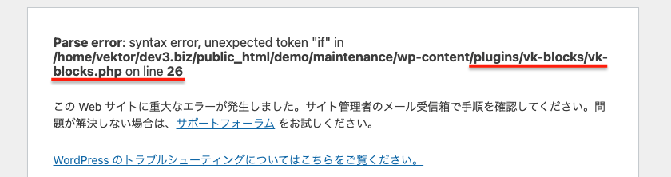
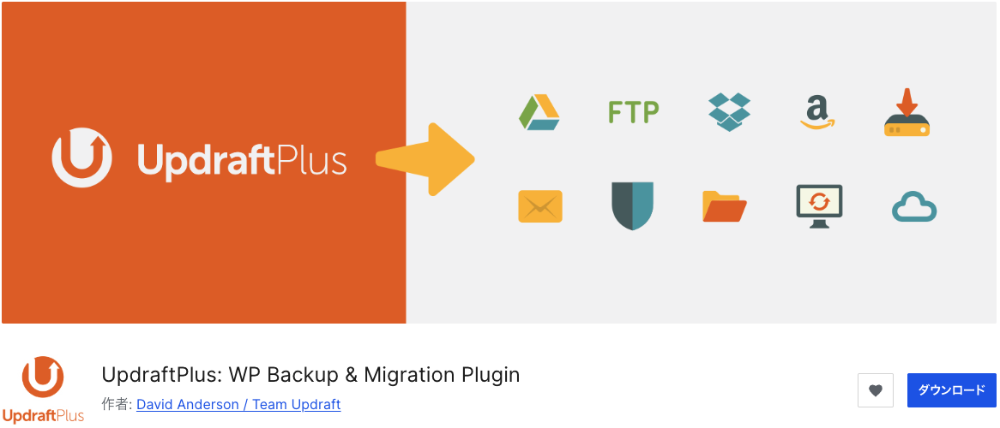
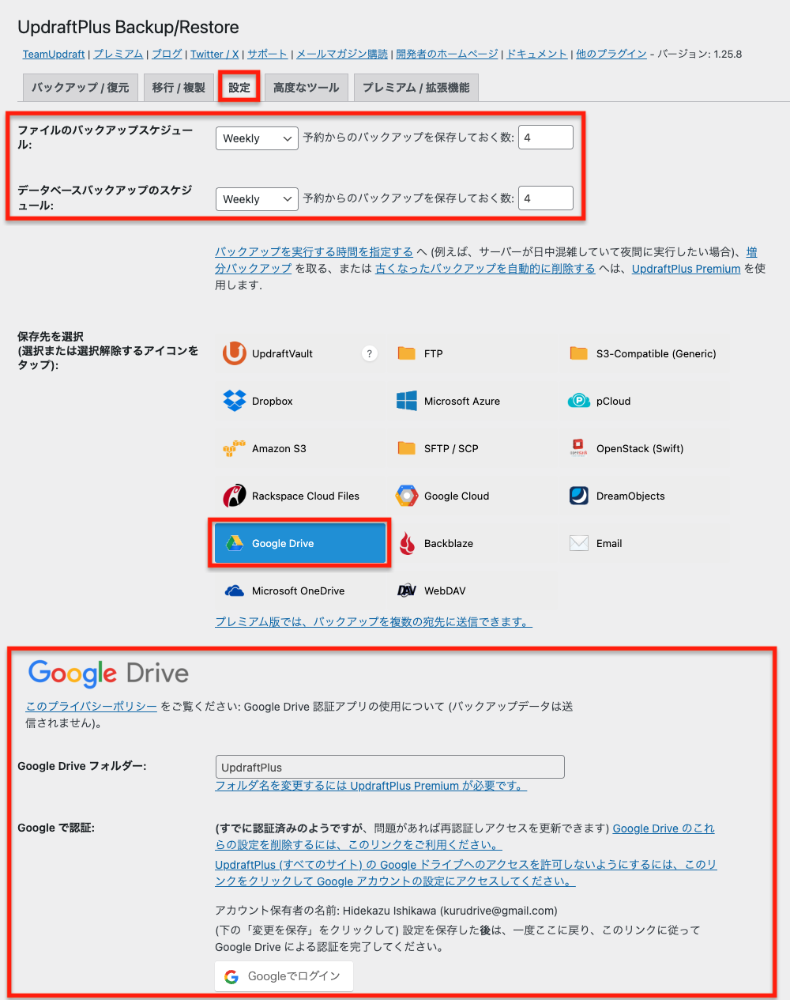
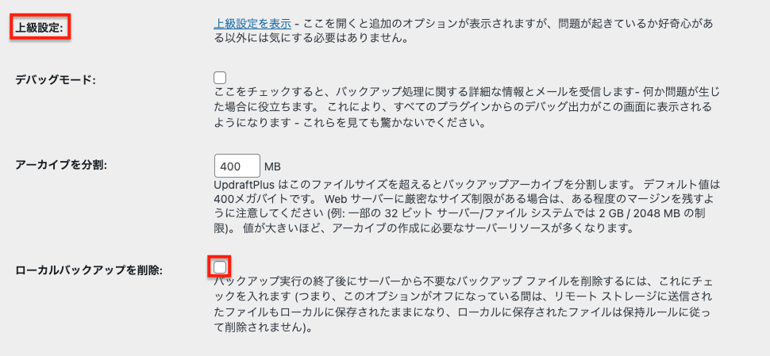
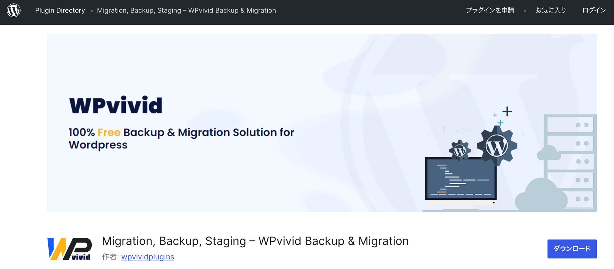
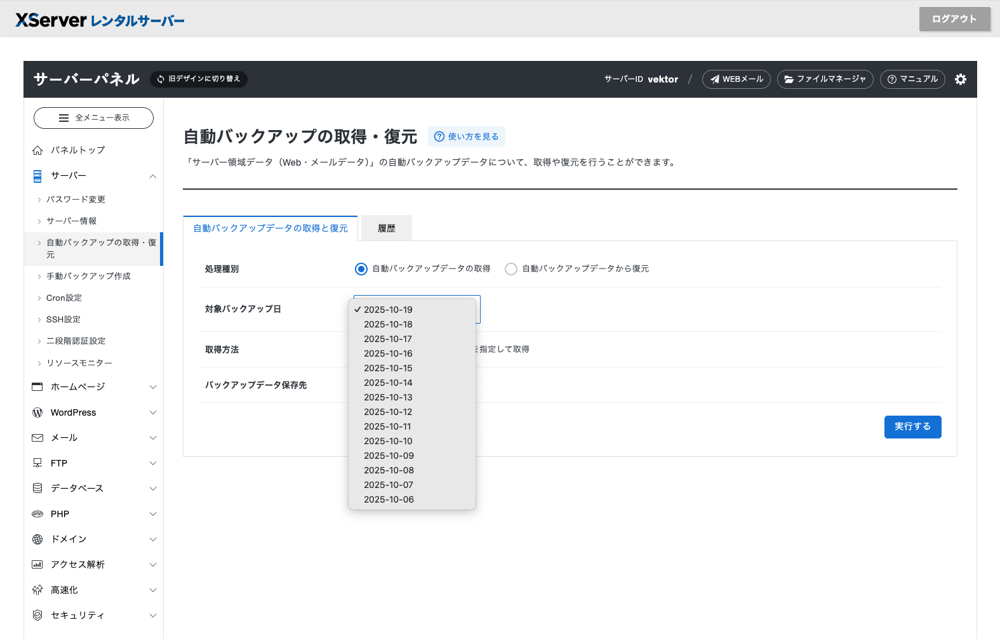

<!-- 
theme: vk-slide
size: 16:9
paginate: true
style: |
_paginate: false 
-->
<link href="./themes/vk-slide/fontawesome-free/css/all.css" rel="stylesheet">

# 怖くない・大変じゃない WordPressサイトの維持管理

VWSオンライン勉強会 #046

Hidekazu Ishikawa@Vektor,Inc.

<!-- https://www.meetup.com/ja-JP/kochi-wordpress-meetup-group/events/307763191/ -->

<!-- _class: title -->

---

<!-- _class: title-chapter  -->
<!-- _paginate: false  -->

# ようこそ！はじめに

---

## この勉強会について

運営 : 株式会社ベクトル

WordPressやウェブ制作にまつわる様々なテーマをとりあげて開催しているオンライン勉強会。

ご興味がある方であれば、経験や技術レベルに関係なく、どなたでもご参加いただけます。

また、ベクトル製品のアップデート情報・カスタマイズ・運用方法についてもご案内しています。

---

## 勉強会中のコメント

勉強会中のコメントは YouTube の方によろしくお願いします。
できるかぎり拾っていきたいとは思っています。

#### 歓迎されること

* __チャットでわいわい__ コメントしてください。
* ぜひSNSにも投稿して盛り上げてください <strong>#wpvektor</strong>
* __やさしい言葉使い__ を心がけて、誰にとっても快適な勉強会となるようにご協力ください。

---

## 本日の内容

* ご挨拶・その他お知らせ（約10分）
* 本編
* 質疑応答（〜30分程度）
* 懇親会・ユーザーフィードバック会

---

## セッションの内容は後から振り返りできます

URLリンク情報などはコメント欄や twitter(X) のアカウントから投稿します。

https://x.com/vektor_inc

動画もシェアされますので安心してゆっくり見てください。

---

<!-- _class: title-chapter  -->
<!-- _paginate: false  -->

# それでは本編スタート

---

## この勉強会の対象

* WordPressの保守管理は大変だと思ってる人
* 「アップデートすると不具合が発生するかもしれない」と思ってアップデートをしていない人

---

## WordPressの保守が大変と思われる理由

* アップデートで不具合が発生する事がある
* 改ざんや脆弱性の事例が多い

実際には...

- ある程度対策されてる
- 定期バックアップとってればすぐ戻せる
- 改ざんされるのは設定がザルすぎるだけ

---

## 主なお品書き

* 最近のWordPressでの対応
* バックアップと復元
  - プラグインでのバックアップ（同一サーバー内）
  - バックアップからの復元
  - プラグインでのバックアップ（外部サーバー）
  - サーバーでのバックアップ
* 管理画面のBASIC認証
* 二段階認証

---

<!-- _class: title-chapter  -->
<!-- _paginate: false  -->

# 最近のWordPressでの対応

---

<!--
## リカバリー機能

アップデートでサイトが落ちるなどのトラブルが発生したら、管理者宛にメールが届き、そのリンクからリカバリーモードで再度管理画面にアクセスできる。

※リカバリーできるゆ
※不具合の内容によってはメールが届かない事はあるので100%ではない。
-->

## 自動更新のロールバック機能

* WordPress 6.6 から
* 自動更新したテーマ・プラグインでエラーがあった場合は元のバージョンに自動的にロールバック

→ 「いつの間にか落ちていた」という事になる確率が減った

※手動アップデートの時はロールバックしてくれません。

---

<!-- _class: title-chapter  -->
<!-- _paginate: false  -->

# バックアップと復元

---

## 定期バックアップは必ず設定して！

__"アップデートするとトラブルが心配"__ と言って
アップデートしないのに、定期バックアップを設定してない

＿人人人人人人人人人人人人人人＿ 
＞　そっちの方がよっぽど心配　＜ 
￣Y^Y^Y^Y^Y^Y^Y^Y^Y^Y^^Y^￣

簡単です。後で説明します。

---

### かなり古いバージョンからの バージョンアップが一番面倒な事になる

* バージョンアップして不具合が発生した時に、
どのバージョンで発生したのかがわかりにくい。
  → __原因調査・不具合解消が格段に面倒__ になる。

---

## バックアップがあれば...

定期やアップデート作業前のバックアップデータがあれば...

### レイアウトなど表示の崩れの場合

* 管理画面からバックアップデータで元に戻せる

---

### サイトが落ちた場合

1. 原因のプラグインなどの情報が表示される
2. SFTPなどでサーバーに接続してエラーのプラグインのディレクトリを削除やリネーム（プラグインが停止される）
3. 管理画面からアップデート前に復元

---

### バックアップからすぐ戻せばいい！

バックアップとっていれば何か不具合があったら、
管理画面からポチっとやればすぐ戻せます！

---

## 長い間アップデートしていない場合の アップデート作業

* プラグイン WPvivid などを使ってテスト環境に複製
* テスト環境でアップデートを実行
* 不具合が出たらテスト環境で原因調査・対応
* テスト環境から本番にデータ移行
（または本番でアップデート実行）

---

## バックアップにおすすめのプラグイン

* UpdraftPlus
* WPvivid
* All in One WP Migration

---

## UpdraftPlus

https://ja.wordpress.org/plugins/updraftplus/

---

* テーマ / プラグイン / データベース など、それぞれ復元できる
  → __プラグインでのエラーならプラグインだけ戻せる__
* サーバー内とリモートストレージ（Google Driveなど）両方にバックアップをとる事ができる

---

  

  

### 設定事項

* バックアップスケジュール
* バックアップ先 
GoogleDriveなどリモートストレージに設定

---

### <i class="fa-solid fa-triangle-exclamation text-danger"></i> ローカルにもバックアップを残す

UpdraftPlus > 設定 > 上級設定 から設定

---

### ローカル（同一） / リモート両方にバックアップ

#### <i class="fa-solid fa-database"></i> ローカルバックアップの利点

素早く復旧できる！
リモートの場合は復元する時にサーバーからダウンロードが必要
→ 復元に時間がかかる

#### <i class="fa-brands fa-google-drive"></i> リモートバックアップの利点

サーバー障害でデータが消えてもリモートまでは被害が及ばない

---

## WPvivid

https://ja.wordpress.org/plugins/wpvivid-backuprestore/

---

* サーバー内とリモートストレージ（Google Driveなど）両方にバックアップをとる事ができる
* __サイトの引っ越しが簡単にできる（データ容量制限なし）__
→ テスト環境を作るのに便利

※ステージング機能もあるけど独特なのでおすすめはしない

---

### WPvividの短所

* リモートストレージのバックアップデータから管理画面経由で復元しようとすると、バックアップをダウンロードするのに時間がかかってタイムアウトになる確率が高い
  - ドライブから直接zipをダウンロードして、それを管理画面からアップロードした方が早い
* 多機能すぎてちょっとわかりにくい

---

## All in One WP Migration

* サイトまるごとエクスポート・インポートがしやすい
* 無料版だとサイトデータの容量制限がある
→ 事実上有料版じゃないと実用的ではない
→ 有料版なら本番からステージングへの引っ越し作業が一番楽

---

## おすすめの設定例

サイトの更新頻度によりますが、頻繁に更新するなら

* UpdraftPlus で ローカル / リモート 両方に毎日で７日分保存

7日以上前の状態に戻したいケースがありえる場合

* WPvivid を併用して、週一回バックアップを４回保存

---

## サーバーでもバックアップはとられている

最近のレンタルサーバーはで標準でバックアップ機能がついているものがある

---

### エックスサーバー

---

### さくらのレンタルサーバー

  

  
ディレクトリや簡単インストールでインストールしたWordPressを指定して、ステージング環境の作成やスケジュールバックアップができる！

---

<!-- _class: title-chapter  -->
<!-- _paginate: false  -->

# 管理画面のセキュリティ対策

---

## 脆弱性報告の大半は管理画面内の操作！

WordPressではよく脆弱性情報が配信されますが、
"管理画面から悪意のあるコードを埋め込んだりする事ができる"
という内容が大半

→ 管理画面への不正なログインをブロック
→ 脆弱性報告の大半は無効化できる

---

## 簡単なパスワードは使わない

簡単なパスワードは使わないでと散々言われていますが...

＿人人人人人人人人人人人人人人人人人＿

＞　相変わらず多い簡単なパスワード　＜

￣Y^Y^Y^Y^Y^Y^Y^Y^Y^Y^Y^Y^Y^Y￣

---

## 管理画面のセキュリティ対策

* 管理画面に別途表示される画像に表示された文字を入力
* ログイン試行回数を制限

これらの対策は有効で、やるに越した事はないが...
そもそも管理画面に辿り着かせない方が確実

---

## 国外IPのアクセスブロック

海外から操作する事がなければ国外IPアドレスからのアクセス制限を有効にする

エックスサーバーやさくらのレンタルサーバーなどは標準で国外IPからのアクセス制限機能がるので、海外から記事の更新などをしないのであれば有効にしておく。

---

---

## 管理画面のBASIC認証

ログイン画面と /wp-admin/ ディレクトリにBASIC認証を追加

Botなどはログイン画面に対して突破処理をするので、
サーバーには負荷がかかったりもする。

→ BASIC認証でログイン画面自体に辿り着けなくする方が効果大

---

### BASIC認証の設定

↓ で解説してあります。
https://www.vektor-inc.co.jp/post/basic-auth/

---

## ２段階認証

BASIC認証も突破される可能性が0ではないので、
念のためログインを２段階認証に設定しておくのがおすすめ。

https://ja.wordpress.org/plugins/two-factor/

---

各ユーザーの編集画面から設定

---

## とりあえず

* パスワードは絶対複雑なものにする
* 定期バックアップ
* 管理画面のBASIC認証
* ２段階認証

を設定しておけばそんなに大変な事になる事はない。

---

# 次回

2025/11/20(木) 21:00 〜 22:30
### ゼロから覚えたくないフルサイト編集

https://vektor.connpass.com/event/373620/

---

# ありがとうございましたん

