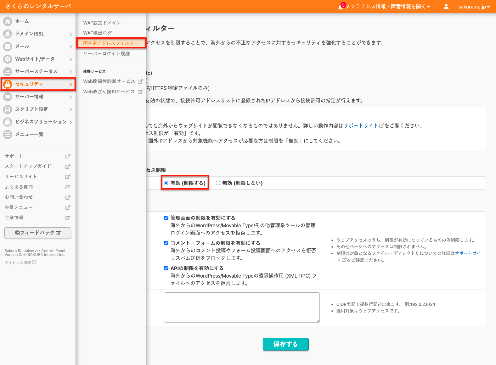
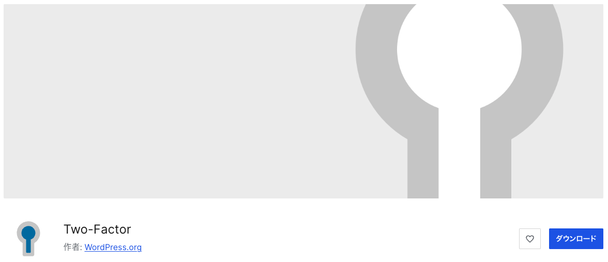
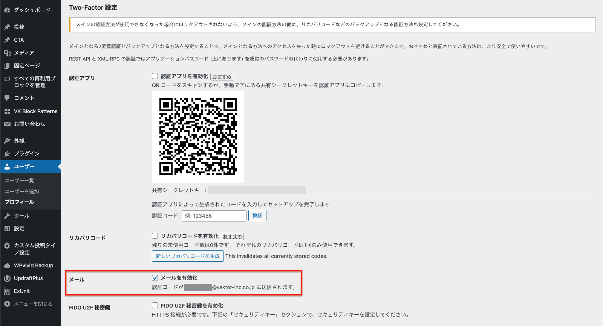

<!-- 
theme: vk-slide
size: 16:9
paginate: true
style: |
_paginate: false 
-->
<link href="./themes/vk-slide/fontawesome-free/css/all.css" rel="stylesheet">

# ゼロから覚えたくないフルサイト編集

VWSオンライン勉強会 #047

石川栄和@Vektor,Inc.

<!-- https://www.meetup.com/ja-JP/kochi-wordpress-meetup-group/events/307763191/ -->

<!-- _class: title -->

---

<!-- _class: title-chapter  -->
<!-- _paginate: false  -->

# ようこそ！はじめに

---

## この勉強会について

運営 : 株式会社ベクトル

WordPressやウェブ制作にまつわる様々なテーマをとりあげて開催しているオンライン勉強会。

ご興味がある方であれば、経験や技術レベルに関係なく、どなたでもご参加いただけます。

また、ベクトル製品のアップデート情報・カスタマイズ・運用方法についてもご案内しています。

---

## 勉強会中のコメント

勉強会中のコメントは YouTube の方によろしくお願いします。
できるかぎり拾っていきたいとは思っています。

#### 歓迎されること

* __チャットでわいわい__ コメントしてください。
* ぜひSNSにも投稿して盛り上げてください <strong>#wpvektor</strong>
* __やさしい言葉使い__ を心がけて、誰にとっても快適な勉強会となるようにご協力ください。

---

## 本日の内容

* ご挨拶・その他お知らせ（約10分）
* 本編
* 質疑応答（〜30分程度）
* 懇親会・ユーザーフィードバック会

---

## セッションの内容は後から振り返りできます

URLリンク情報などはコメント欄や twitter(X) のアカウントから投稿します。

https://x.com/vektor_inc

動画もシェアされますので安心してゆっくり見てください。

---

<!-- _class: title-chapter  -->
<!-- _paginate: false  -->

# それでは本編スタート

---

## この勉強会の対象

* とりあえずウェブサイト作ってみたい人
* ブロックテーマでサイト構築をした事がない人
* 他の人がブロックテーマをどう使ってるのか見たい人

---

## 主なお品書き

* デモサイトのインポート
* WordPressの編集箇所に関する大まかな概念について（ページコンテンツとテンプレート）
* ロゴ画像の変更
* 色の変更
* ヘッダーの変更
* フッターの変更
* 投稿一覧の変更
* ページテンプレートの変更
etc...

---

## デモサイトのインポート

VK FullSite Installer から「X-T9 無料版」をインポート
https://vk-fullsite-installer.com/

---

<!-- _class: title-chapter  -->
<!-- _paginate: false  -->

# WordPressの編集箇所に関する 大まかな概念
※ 今まで WordPressを使ってない非エンジニア向け

---

## WordPress は静的HTMLファイルを表示しているわけじゃない

---

## コンテンツがデータベースに保存される

固定ページや投稿の、タイトルや本文などがデータベースに保存される。

---

## URLにアクセスされたらページを生成する

ページにアクセスされたら、テンプレートにコンテンツデータを反映させて返す。

---

## テンプレートがノーコードで編集可能

クラシックテーマ ・・・　PHPファイル
ブロックテーマ ・・・ ブロックエディタで編集可能

---

* ヘッダーロゴ変更 / サイズ調整
  - 同期パターンが使われてる
* キーカラー / ホバーカラーの変更
* ヘッダーメニューの変更
  - 不要メニューの削除
  - メニューの追加
  - URL変更したらリンク切れるで
* サイトアイコンの変更
* フッターの変更
* ページテンプレートの変更

---

## 簡単なパスワードは使わない

簡単なパスワードは使わないでと散々言われていますが...

＿人人人人人人人人人人人人人人人人人＿

＞　相変わらず多い簡単なパスワード　＜

￣Y^Y^Y^Y^Y^Y^Y^Y^Y^Y^Y^Y^Y^Y￣

---

## 管理画面のセキュリティ対策

■ 管理画面に別途表示される画像に表示された文字を入力
■ ログイン試行回数を制限

これらの対策は有効で、やるに越した事はないが...
そもそも管理画面に辿り着かせない方が確実

---

## 国外IPのアクセスブロック

海外から操作する事がなければ国外IPアドレスからのアクセス制限を有効にする

エックスサーバーやさくらのレンタルサーバーなどは標準で国外IPからのアクセス制限機能がるので、海外から記事の更新などをしないのであれば有効にしておく。

---

---

## 管理画面のBASIC認証

ログイン画面と /wp-admin/ ディレクトリにBASIC認証を追加

Botなどはログイン画面に対して突破処理をするので、
サーバーには負荷がかかったりもする。

→ BASIC認証でログイン画面自体に辿り着けなくする方が効果大

---

### BASIC認証の設定

↓ で解説してあります。
https://www.vektor-inc.co.jp/post/basic-auth/

---

## ２段階認証

BASIC認証も突破される可能性が0ではないので、
念のためログインを２段階認証に設定しておくのがおすすめ。

https://ja.wordpress.org/plugins/two-factor/

---

各ユーザーの編集画面から設定

---

## とりあえず

■ パスワードは絶対複雑なものにする
■ 定期バックアップ
■ 管理画面のBASIC認証
■ ２段階認証

を設定しておけばそんなに大変な事になる事はない。

---

# 次回

2025/11/20(木) 21:00 〜 22:30
### ゼロから覚えたくないフルサイト編集

https://vektor.connpass.com/event/373620/

---

# ありがとうございましたん

