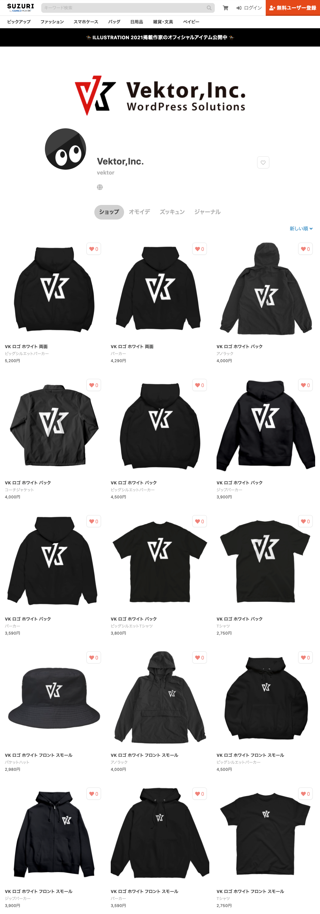

<!-- 
theme: vk-slide
size: 16:9
paginate: true
style: |
_paginate: false 
-->
<!-- _class: title -->
<!-- Scoped style -->

<!-- _class: title -->

年末特別企画

# GoTo Vektor! 2020 クリスマスクイズ大会！

クイズに答えて豪華賞品（自称）プレゼント！

---

<!-- _class: title-chapter  -->
<!-- _paginate: false  -->

# 事前説明

---

## ルール

* 問題の早押しクイズです。
* 早押しなので正解は一人だけ。
* 10問出しますので、正解数の多い人が優勝です。
* 優勝の人から好きな賞品が選べます。

クイズ正解者の中で順位の決着がつかない場合は「オンラインジャンケンシステム」での順位決定を行います。

---

## 参加登録

※登録しないと結果の集計および賞品の受け渡しができません。

https://docs.google.com/forms/d/1JAZ_NM6Lqo0bRmdIYrpBnErPafCGvX8L9r2n4vB8p2w/edit

### クイズ会場

[こちら](https://loungegame.site/enter/aWQ9MjI0MTcmdG9rZW49U0ZNeU5UWS5nM1FBQUFBQ1pBQUVaR0YwWVdJQUFGZVJaQUFHYzJsbmJtVmtiZ1lBdkFQd2IzWUIuSFVSS3VlWkx6TE5rcmo4YlNtdGRNaWE3ZnVEZW5QZDJ5U0ZlNDYyR2tFRQ)に入室してしばらくお待ちください。

---

<!-- _class: title-chapter  -->
<!-- _paginate: false  -->

気になる賞品はこちら！

# 賞品紹介

---

## A賞 ベクトルグッズ
お好みのアイテム１点

## B賞 ベクトルグッズ

3,000円以下のアイテムから 1点

https://suzuri.jp/vektor

---

## C賞 VWS ポイント 4000

## D賞 VWS ポイント 2000

## E賞 プライベートサポート１回
※ コード10行程度で対応できるカスタマイズ範囲内

---

<!-- _class: title-chapter  -->
<!-- _paginate: false  -->

# 練習問題

---

# WordPress の現在の最新バージョンは次のうち何番？

---

<!-- _class: list-lg  -->

1. 4.9
1. 5.0
1. 5.5
1. 5.5.6
1. 5.6
1. 6.0

---

<!-- _class: title-chapter  -->
<!-- _paginate: false  -->

# 問題

---

# Lightningが使えるCMSの正式名称は何番？

---
<!-- _class: list-lg  -->
1. Wordpress
1. wordpress
3. WordPress
4. WorldPress
5. ワードプレス

---

#  Lightningを開発している会社名の正式名称は何番？

---
<!-- _class: list-lg  -->
1. 株式会社ベクター
1. ベクトル株式会社
1. 株式会社ベクトル
1. 株式会社ビズベクトル

---

# 株式会社ベクトルの「ベクトル」の正しい綴りは何番？

---
<!-- _class: list-lg  -->
1. Vector
1. Vekter
1. Vecter
1. Vektor

---

# ベクトルが最初にリリースした無料WordPressテーマの名前は何番？

---
<!-- _class: list-lg  -->
1. Lightning
1. BizVektor
1. Katawara
1. BillVektor

---

# 石川さんの下の名前は何？

---

# プラグインExUnitの正式名称は何？

---

# 株式会社ベクトルの本店所在地があるのは何県何市？

---

# ベクトルはフルリモート勤務ですが以下の内、ベクトルメンバーが住んでいない県は何番？

---
<!-- _class: list-lg  -->
1. 東京都
1. 和歌山県
1. 山口県
1. 兵庫県

---
<!-- _class: list-lg  -->
# 石川さんの趣味じゃないものは何番？

---
<!-- _class: list-lg  -->
1. バイク
1. 将棋
1. キャンプ
1. 自作PC

---

# 石川さんが最近購入したお気に入りものは何番？

---
<!-- _class: list-lg  -->
1. ガンダムのプラモデル
1. 360度カメラ
1. スケートボード
1. キャンプ用アルコールランプ

---

<!-- _class: title-chapter  -->
<!-- _paginate: false  -->

順位がつかない場合のみ

# 順位決定戦

https://www.jan-ken.com/

---

<!-- _class: title-chapter  -->
<!-- _paginate: false  -->

# - 終 了 -

---

<!-- _class: title -->
<!-- _paginate: false  -->

# ありがとうございました
