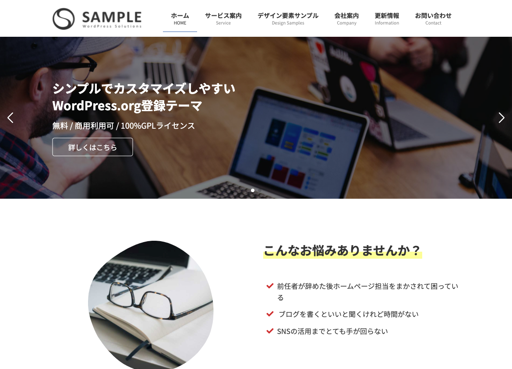
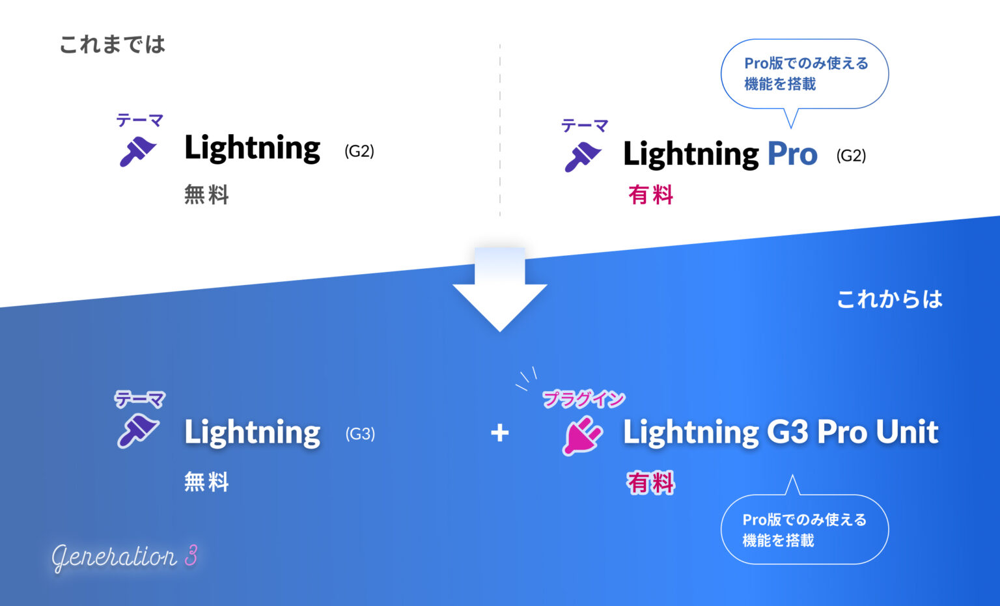
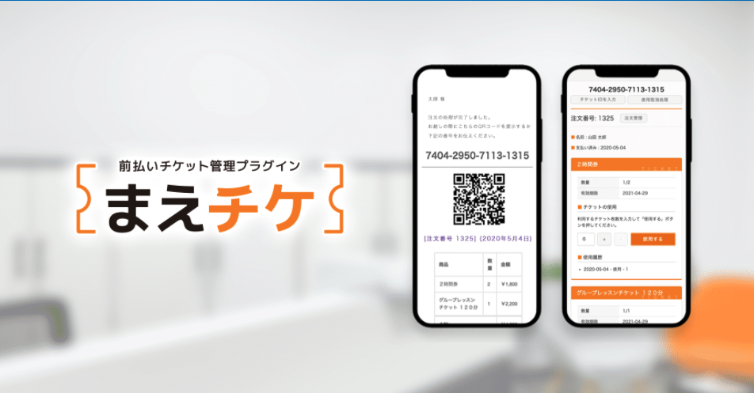
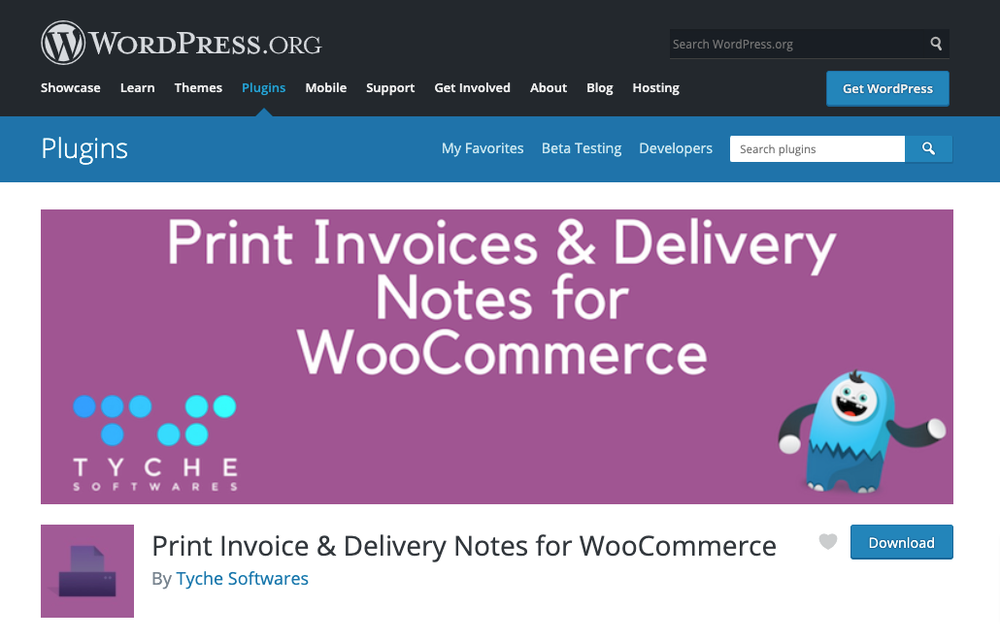
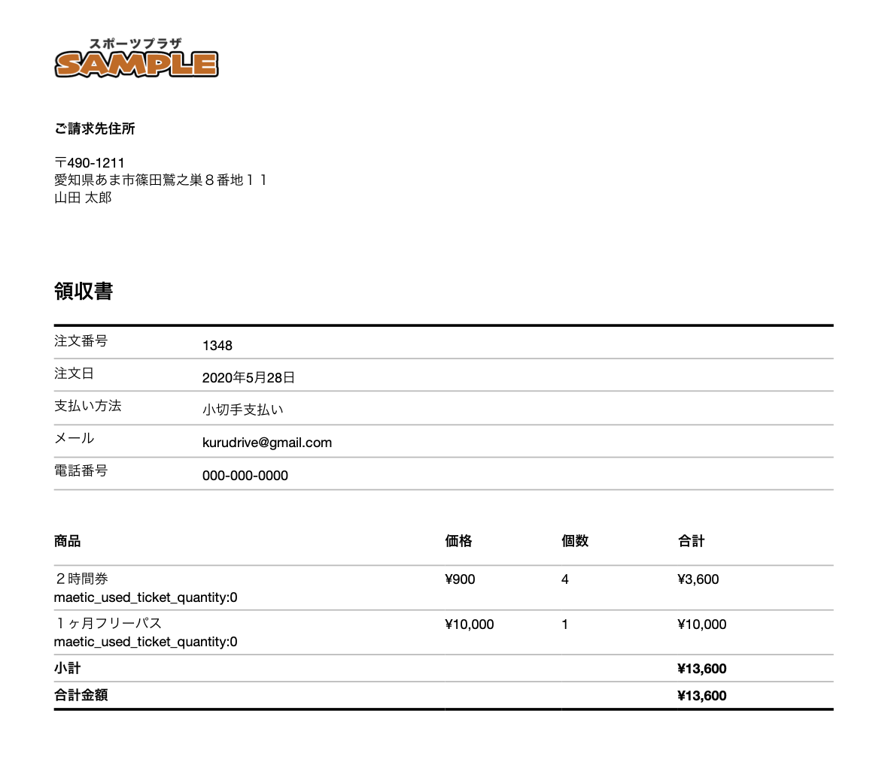
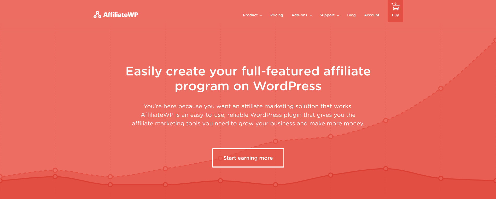
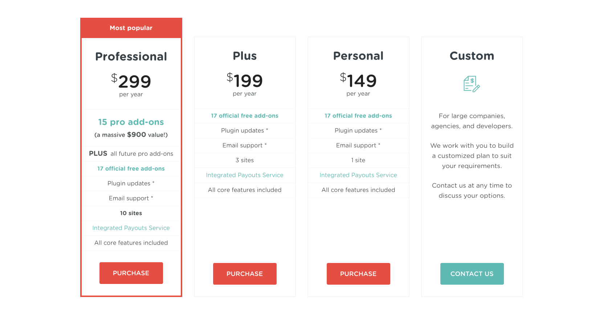
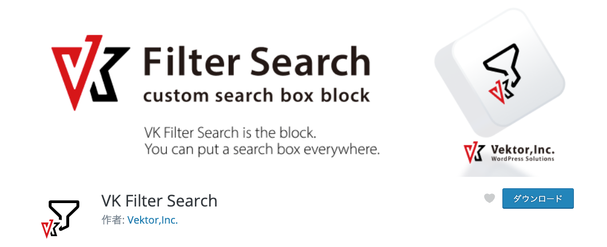

<!-- 
theme: vk-slide
size: 16:9
paginate: true
style: |
_paginate: true 
-->
<!-- _class: title -->
<!-- Scoped style -->

<!-- _class: title -->

# Lightning でつくる ECサイト 

feat. WooCommerce と愉快な仲間たち

---

<!-- _paginate: false  -->

ビジネスサイト向け無料WordPressテーマ

2015年リリース  / おかげ様でアクティブ <b>50,000+</b> インストール

---

* さすがに基本設計が古い
* 互換維持など本来不要なコードが多い
* 諸々改修したいが更に互換コードが増える

#### 最新のウェブ環境にあわせて、 より簡単に、よりカスタマイズしやすく

---

<!-- _paginate: false  -->

<a href="" target="_blank">https://lightning.vektor-inc.co.jp/</a>

---

## Lightning G3 とは

G3 は Generation（世代） の略
* 第１世代 : Bootstrap3 ベース
* 第２世代 : Bootstrap4 に変更
* 第３世代 : <b class="text-danger">New!!</b>

バージョン3は既に通り越しているので、
区別するために「G3」と呼んでいます。

---

## Lightning G3 = Lightning 14.x

* Lightning G3 は __無料版 Lightning 14.x__
* テーマとしては今まで通りの「Lightning」

別テーマではありません

* 基本的に従来版からバージョンアップしても即死しない構造にしています。
* 従来版も継続メンテナンスです。

---

<!---->

## G3版の切り替え

外観 > カスタマイズ > Lightning 機能設定から従来版かG3版かを切り替えます。

__アップデートしていきなりG3版が読み込まれるわけではありません。__

---

## ウェブ制作向けにカスタマイズしやすくなった

受託案件のベーステーマとしてよりカスタマイズしやすいように

#### テンプレート構造の見直し

部分的にカスタマイズしやすくなった

#### CSS構造の見直し

デザインの上書きや独自デザインが適用しやすくなった

#### 速度改善

---

## 爆速セットアップ用データを刷新！

https://demo.dev3.biz/lightning-g3/

新しい Lightning G3 のデモサイトのコンテンツデータを無料で配布しています。

https://lightning.vektor-inc.co.jp/quick-start/

---

<!-- _class: title-chapter  -->
<!-- _paginate: false  -->

# Lightning G3 Pro Unit

Lightning 機能拡張プラグイン

---

---

## 使う機能のみ有効化

使わない機能は設定画面から停止できます。

---

## ヘッダーカスタマイズ機能

従来はスキンによってヘッダーレイアウトが違ったが、G3からは<strong>スキンに関係なく様々なレイアウト・機能が利用可能</strong>

https://www.youtube.com/watch?v=8NPVxaL3Oeg

---

## ページヘッダー機能強化

https://demo.dev3.biz/lightning-g3-pro/

* 投稿ページのページヘッダーの表示要素が切り替え可能
* 固定ページのページヘッダーにサブテキスト表示可能
* 固定ページのページヘッダーに先祖階層を要素を表示可能
* 投稿タイプ毎に色やサイズ指定可能

---

## 非表示機能強化

ページ毎に非表示指定できる要素が増えました

| 従来（G2） | G3 |
| ------------- | ------------- |
| ページヘッダー パンくずリスト  | ヘッダー ページヘッダー パンくずリスト フッター |

ヘッダー・フッターを含まないLPの作成が簡単！

※ G3無料版からは非表示設定がなくなります。

---

## 豊富すぎる機能

今まで紹介したのは従来版との違いの一部
豊富な機能をご用意しています。

https://lightning.vektor-inc.co.jp/lightning-g3-pro-unit/

---

<!-- _class: title-chapter  -->
<!-- _paginate: false  -->

# Lightning と WooCommerce

---

## Lightning は WooCommerce 対応

従来版も新しいG3も特別にアドオンなど入れる事なく標準で対応しています。

---

## WooCommerceの設定ガイド

初心者でもできる！プラグインWooCommerceでネットショップを作る方法
https://www.vektor-inc.co.jp/post/woocommerce-setup/

日本向けの決済方法や配送希望日時の設定を追加できる Japanized For WooCommerce の使い方
https://www.vektor-inc.co.jp/post/japanized-for-woocommerce/

---

## オンライン決済について

初心者でもできる！WooCommerce にクレジットカード決済を導入する PayPal の設定方法
https://www.vektor-inc.co.jp/post/paypal-account-api/

初心者でもできる！WooCommerce にクレジットカード決済を導入する Stripe の設定方法
https://www.vektor-inc.co.jp/post/stripe-account-api/

---

## オンラインチケット販売システム「まえチケ」

https://www.vektor-inc.co.jp/service/wordpress-plugins/maeticket/

デモサイトのデータも無料で
ダウンロードできます。

  

---

<!-- _class: title-chapter  -->
<!-- _paginate: false  -->

# 何を売るか？

---

## 制作業だし物販のクライアントもいない？

### テーマ・プラグイン開発

確かに技術的な専門知識が必要でハードルが高い

### サイトまるごとのデータ

ベクトルが配布・販売しているコンテンツデータのように、業種毎などでサイトを作ってそのデータをエクスポートして販売する

---

### ブロックパターンプラグイン

ブロックパターンのプラグインが簡単につくれるプラグイン
VK Block Pattern Plugin Generator（有料）

https://www.vektor-inc.co.jp/service/wordpress-plugins/vk-block-pattern-plugin-generator/

テーマやプラグイン関係なくすべてのWordPressユーザーに向けて売れる！

---

### デザインスキンプラグイン

Lightning G3 からはデザインスキンも作りやすくなりました。

是非デザインスキンを作って売って欲しいです。

https://www.youtube.com/watch?v=4pwH2SuxgI4

サンプルデータのダウンロード
https://lightning.vektor-inc.co.jp/

---

<!-- _class: title-chapter  -->
<!-- _paginate: false  -->

# ベクトルで利用している WooCommerce プラグイン

---

<h2>領収書の発行</h2>

   

Print Invoice & Delivery Notes for WooCommerce

 

 

https://wordpress.org/plugins/woocommerce-delivery-notes/

---

## ポイント付与

#### WooCommerce Points and Rewards
https://woocommerce.com/products/woocommerce-points-and-rewards

* フォーラムのベストアンサーに自動でポイント付与
（システム自作）
* 本番環境で購入テスト
* $129.00 / 年

---

## アフィリエイト

---

### AffiriateWP

https://affiliatewp.com/

大手のアフィリエイトサービスに高額なみかじめ料を払わなくても
自分のECサイトに簡単にアフィリエイトシステムを簡単に導入できる

---

安くはないけど費用対効果を考えればすごく安い

---

## アフィリエイトの支払い

PayPal PayOuts
https://affiliatewp.com/add-ons/pro/paypal-payouts/

支払いを PayPay アカウントに行うので チマチマ個別に振り込みなどしなくて良い

※ PayPalへの申請・審査が必要

---

## セット販売

複数の商品を組み合わせると割引設定が可能

VarkTech Pricing Deals PRO for WooCommerce

https://www.varktech.com/woocommerce/woocommerce-dynamic-pricing-discounts-pro/

---

## WooCommerce Subscription

毎月定額課金ができる。
VWSではプライベートサポートプランで使用。

https://woocommerce.com/products/woocommerce-subscriptions/

$199 / 年

---

## おまけ

#### VK Filter Search もよろしく

---

<!-- _class: title -->
<!-- _paginate: false  -->

# ありがとうございました