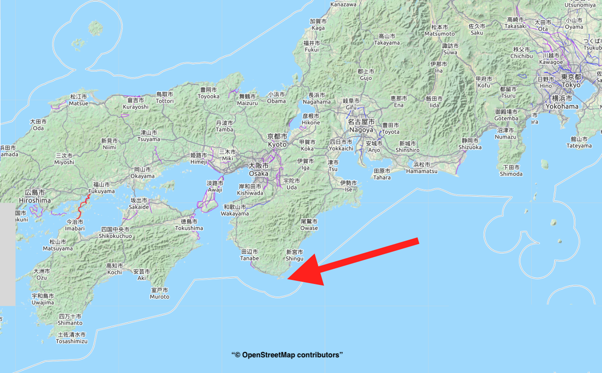
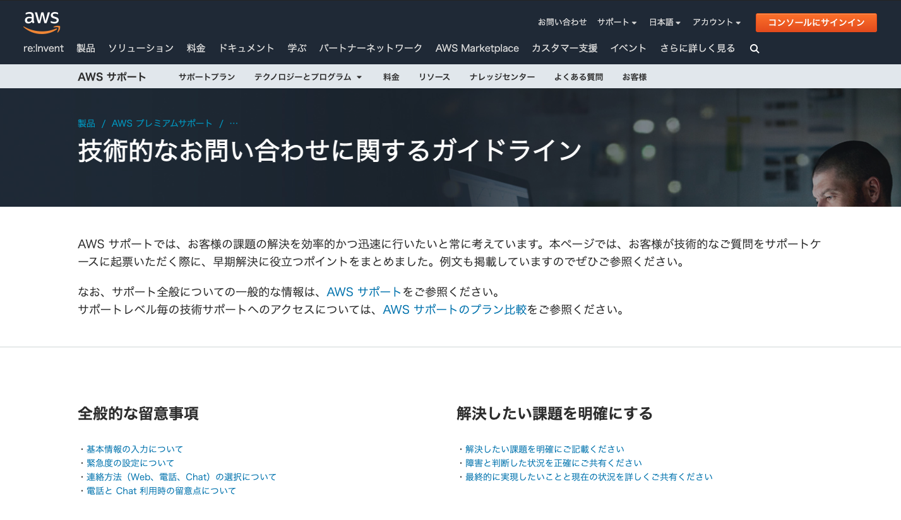

<!-- 
theme: my_theme
size: 4:3
paginate: false
style: |
_paginate: false 
-->
<!-- _class: title -->

<!-- Scoped style -->

# 開発者に喜ばれる フォーラムの使い方🌟

株式会社Vektor,Inc.
大橋直記

<small>2020/11/26</small>

---

## 自己紹介

  
  <ul>
    <li>オオハシナオキ / Naoki Ohashi</li>
    <li>Engineer / VK Blocks・Pro 開発担当</li>
    <li>Twitter: <a href="https://twitter.com/naogify">@naogify</a></li>
    <li>和歌山県・串本町在住</li>
    <li>今年の夏はBBQにハマる</li>
  </ul>

---

---

**❌：~~開発者に喜ばれる、フォーラムの使い方~~**

**⭕️：答えをもらえる、質問のテクニック**

---

## 初心者の時の悩み😖
- 何を/どう質問すれば良いか分からず、悩んでしまう。
- 上級者に抽象的な質問をして、微妙な空気になる

---

## AWSの質問ガイドライン

---

 ## 具体例から、  回答しやすい質問を考えてみる

---

## 前提 ⚠️

- そもそもバグを出すな
- フォーラムで質問する必要がないプロダクトを作れ
- これは特定の、質問者や・過去の質問を指すものではありません
- 質問は全てフィクションです

---

## Q. 画面が真っ白になりました

---

### 例

<blockquote>
VK Blocks Pro 1.2.3を使用しています。 最新版にアップデート後、固定ページを再編集すると、画面が真っ白になりました。  
コンソールのエラーのスクリーンショット送ります。
</blockquote>

---

### ✅ バージョンや環境を伝える
- **バージョンを伝える
- 「アップデート後」のように直前の作業を伝える
- スクリーンショットやエラーメッセージを使って、エラー内容を伝える

---

## Q. スライダーの画像が表示されません

---

### 例

<blockquote>
使用プラグイン：VK Blocks Pro 1.2.3  
スライダーブロックで指定した背景画像が表示されません。サイトをSSL化した直後に表示されなくなりました。  コンソールにエラーが出ているので、該当ページのURLを共有します。
</blockquote>

---

###  ✅ エラー内容を正確に伝える
- **スクリーンショットやURLでエラーを正確に伝える**
- 「SSL化した後」とエラーがおきる直前の作業を伝える
- 状況を正確に共有。
  - ❌：スライダーの画像が表示されない
  - ⭕️：スライダーブロックで背景画像を指定したい

---

## Q. デザインをカスタマイズしたいです

---

### 例
<blockquote>
Lighitnig Pro 1.2.3を使っています。 
パンくずリストの文字サイズを変更したいのですが、どのようにすれば良いでしょうか？
</blockquote>

---

### ✅ やりたい事を具体的に書く
- 例えば
  - ❌：文字サイズをカスタマイズしたい
  - ⭕️：パンくずリストの文字サイズを変更したい
- 注：vwsやvektorサイトに情報がある場合もあるので、まずそちらをチェック!
  - [cssをピンポイントで変更](https://www.vektor-inc.co.jp/post/css_customize/)
  - [スタッフブログ | Vektor,Inc](https://www.vektor-inc.co.jp/post/)
  - [カスタマイズと設定TIPS | VWS](https://vws.vektor-inc.co.jp/archives/customize_tips)

---

## 便利ツール

- デベロッパーツール
  - エラーメッセージが分かる。
  - [【初心者向け】コンソールによるJavascriptのエラー表示方法
](https://eng-entrance.com/javascript-display-error)

- mevie
  - 動画URLで共有できる / 登録不要 
  - [公式サイト](https://mevie.it/)

---
## まとめ

- **やりたい事を具体的に書く**
- **状況を正確に共有する**
  - スクショやURLを使う
  - プラグイン/テーマのバージョンを共有
- **経緯を共有する**
  - 直前の作業や試したこと

---

## ベクトルのサポート窓口

|  フォーラム  |  プライベート サポートプラン  | Slack（β）|
| ---- | ---- | ---- |
|  有料ユーザーのみ投稿 （閲覧無料）|  有料  |  無料  |
|  開発者 + ユーザー回答  |  開発者回答 |  ユーザー回答  |

<!-- - フォーラム
  - 有料ユーザー投稿可 / 無料ユーザー閲覧可
  - 開発者 + ユーザーで回答
- プライベートサポートプラン
  - 有料
  - メールで質問
- Slack（β）
  - 無料
  - ユーザーで回答 -->

---

 ## 質問をする前に…
 
  - 似たような投稿がないかフォーラムを検索
  - 以下を確認
    - [Lightning 設定ガイド](https://lightning.nagoya/ja/setting)
    - [よくある質問](https://vws.vektor-inc.co.jp/contact/faq)
  - 各プラグインを停止したりテーマを変更したり原因を探してみる

---

## 回答される方へ
#### 困っている人がいればぜひ助けてあげてください!
ベストアンサーに選ばれることで300ポイント付与されます！ポイントはvwsサイト内で利用できますのでバシバシ回答してくださいね！

---

## ありがとうございました! 🙌

---
## 参考URL
- [技術的なお問い合わせに関するガイドライン | AWS](https://aws.amazon.com/jp/premiumsupport/tech-support-guidelines/)
- [【新人エンジニア向け】AWSのお問い合わせガイドラインから学ぶ良い質問のポイント | Qiita](https://qiita.com/ooooouchi/items/10e99c9dd701772f29a3)

<!-- ---
## フォーラムでの聞き方大事
- なぜか？
    * 素早くサポートが受けれる
    * 解決方法の検索の仕方が分かる
--- -->