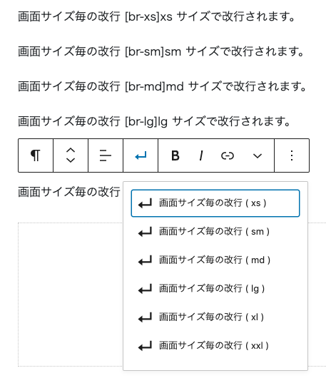
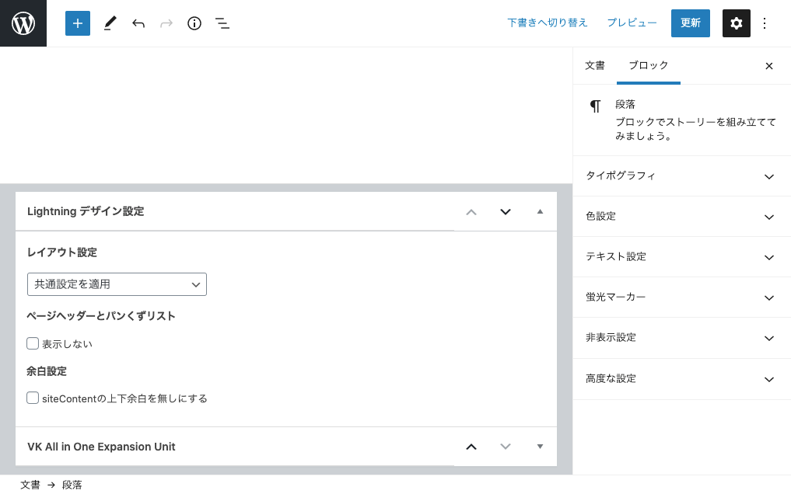

<!-- 
theme: kuruslide
size: 4:3
paginate: true
style: |
  section {
    background-color: #FFFFFF;
  }
_paginate: false 
-->
<!-- _class: title -->
<!-- Scoped style -->

# Lightning 勉強会 #014

* 新機能解説
* 使い方をアップデートしよう
* 質問相談会
* 懇親会

kurudrive@Vektor,Inc.

---

## はじめに

* 随時途中で質問などいただいてかまいません。
* 発言時以外はミュートにしてください。
（テレビ・同居人・外部の騒音）
* 質問はチャットでいただいても結構です。
* 一部録画・公開します。
* ライブビューイングのノリでチャットでわいわいいただければと思います。

---

## ミーティング中のチャット

今回はミーティング中のチャットはzoomの中ではなく slack で行います。
以下の #ミーティング チャンネルで行いますので、事前にテストで適当に挨拶など書き込んでみてください。

https://app.slack.com/client/TG8RZN3SM/C01A20ZGWMN/details/top

---

※上記URLでなくても普通にSlackのアプリを既にご利用されている方はSlackアプリから参加いただければ結構です。
https://slack.com/intl/ja-jp/downloads/

---

## Slackにまだ登録していない

vwsのslackに登録していない方は予め下記より申請ください。

https://vws.vektor-inc.co.jp/vws-community

---

## Slackログイン情報がわからない

申請したにも関わらずログイン方法がわからない場合は以下のURLからログインしてください
https://vektor-vws.slack.com/forgot/signin

■ VWSのSlackのURL
https://vektor-vws.slack.com

---

## 本日の内容

* 新機能解説
* 使い方をアップデートしよう
* 質問相談会
* 懇親会

---

<!-- _class: title-chapter -->

# 今月の新機能紹介

---

## ExUnit

* ページトップボタンの表示設定
→カスタマイズ画面 or ExUnitメイン設定
* 有効化設定のメニューラベルが「有効化設定」になりました...

---

## VK Blocks

画面サイズ毎の
改行

https://demo.dev3.biz/lightning-pro/sample-design/vk-blocks-core-style-expand/

---

## VK Blocks Pro

* ブレイクポイントのxxl対応
（主にKatawara利用時用）
* スライドブロック
切り替え時間変更機能追加
https://demo.dev3.biz/lightning-pro/sample-design/slider-block-sample/

---

## Lightning
* 検索ブロックのデザイン対応
（ 7.4.0 / 12.4.0 ）
https://demo.dev3.biz/lightning-pro/sample-design/vk-blocks-core-style-expand/
* content.phpのスラッグ対応（後述）
（ 7.4.0 / 12.4.0 ）

---

## Lightning Pro
* ヘッダートップのアイコン指定機能
* 編集画面にフォントや見出しデザインが反映されるようになりました

---

## そのほか

* VK Block Patterns で登録したブロックパターンの表示が優先に
* VK Legacy Notice（後述）

---

<!-- _class: title-chapter -->

## Lightning 使い方をアップデートしよう

---

## デザインスキンは Bootstrap4版に

外観 > カスタマイズ > Lightningデザイン設定

Origin II など Bootstrap4表記のあるものを使用してください。

---

## ExUnit の VK Blocks 

ExUnit の VK Blocks は廃止になります。

プラグイン版の VK Blocks あるいは VK Blocks Pro をご利用ください。

---

## ExUnit ファビコン

ExUnit > 有効化設定 で ファビコン設定を有効にしている場合

サイトアイコンは「外観 > カスタマイズ」の「サイト基本情報」パネルから設定できます。

---

## ExUnit CTA

当初は決められた要素・レイアウトでしか表示できませんでしたが、
CTA作成画面で本文欄に自由に配置すれば、そのレイアウトで表示されます。

---

## ウィジェットからブロックへ

トップページやランディングページでウィジェットを利用している場合、
以下のウィジェットは代替ブロックが存在しています。
なるべくウィジェットではなく固定ページ内にブロックを配置して構成しましょう。

---

* VK 3PR エリア 
-> カードブロック（Pro版のみ）
-> カラムブロックなど活用してで自作
* VK PR ブロック
-> アイコンカードブロック
-> PR Block ブロック

---

## Lightningのウィジェット

* PR コンテンツウィジェット
→ Outer + PR Content ブロックなど
* 全幅見出しウィジェット
→ Outer + 見出しブロックなど
* コンテンツエリア投稿ウィジェット
→ 基本的には投稿リストブロック推奨

---

## ExUnit 挿入アイテムがブロックに変更

* 子ページ一覧挿入機能
* HTMLサイトマップ挿入機能
* 先祖階層からのリスト挿入機能
* お問い合わせ情報挿入機能

__ブロックでも挿入できるようになりました__

---

## Lightning スライドの配置

標準スライドでなくスライダーブロックを活用する事ができます
* 自由なレイアウト
* トップページ以外にも配置可能
* 切り替え時間も変更可能

---

## Media Posts ウィジェット

基本的には 投稿リストブロックの利用推奨ですが、
どうしてもウィジェットで投稿一覧を表示したい場合は
Media Posts BS４ ウィジェットの方を使ってください。

---

## Lightningテンプレート廃止

1カラムやランディング用テンプレートは非推奨になりました。

---

### 記事ページ個別に指定可能

---

### レイアウト制御機能

* カスタマイズ > Lightning レイアウト設定
* トップページやアーカイブページ / 記事詳細ページで投稿タイプ毎に指定
* 2カラム / 1カラム / 1カラム（サブセクション無し） から選択

---

### レイアウトサンプル
https://demo-ja.lightning.nagoya/sample-design/layout/

---

## VK Legacy Notice

古い機能を使っている場合に警告と対処方法を表示

https://www.vektor-inc.co.jp/info/vk-legacy-notice/

---

## 子テーマでのカスタマイズ

固定ページでスラッグ毎の変更方法がかわりました。

### 従来

page-スラッグ名.php
single-投稿タイプ名.php

---

### 現行（非推奨）

singular.php を複製してファイル名を下記に変更

page-スラッグ名.php
single-投稿タイプ名.php

でも出来ますがあまり推奨しておらず...

---

### 現行（推奨）

ほとんどの場合カスタマイズしたいのは
本文エリアだけだと思いますので、

template-parts/post/content-スラッグ名.php
template-parts/post/content-投稿タイプ名.php

で変更する事ができます
（ Pro 7.4.0 / 無料 12.4.0 以降 ）

---

<!-- _class: title-chapter -->

# そのほか質問などあれば

---

# ありがとうございました
