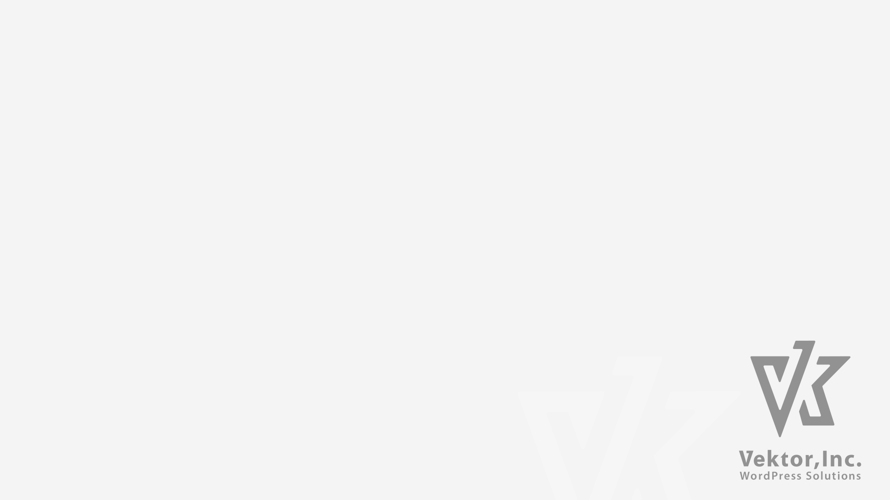

<!-- 
theme: vk-slide
size: 16:9
paginate: true
style: |
_paginate: true 
-->
<!-- _class: title -->
<!-- Scoped style -->

<!-- _class: title -->

All New Lightning

# Lightning G3 について

---

<!-- _paginate: false  -->

ビジネスサイト向け無料WordPressテーマ

2015年リリース  / おかげ様でアクティブ <b>50,000+</b> インストール

---

* さすがに基本設計が古い
* 互換維持など本来不要なコードが多い
* 諸々改修したいが更に互換コードが増える

#### 最新のウェブ環境にあわせて、 より簡単に、よりカスタマイズしやすく

---

<!-- _paginate: false  -->

<a href="" target="_blank">https://lightning.vektor-inc.co.jp/</a>

---

## Lightning G3 とは

G3 は Generation（世代） の略
* 第１世代 : Bootstrap3 ベース
* 第２世代 : Bootstrap4 に変更
* 第３世代 : <b class="text-danger">New!!</b>

バージョン3は既に通り越しているので、
区別するために「G3」と呼んでいます。

---

## Lightning G3 = Lightning 14.x

* Lightning G3 は __無料版 Lightning 14.x__
* テーマとしては今まで通りの「Lightning」

別テーマではありません

* 基本的に従来版からバージョンアップしても即死しない構造にしています。
* 従来版も継続メンテナンスです。

---

<!--  -->

<!---->

## G3版の切り替え

外観 > カスタマイズ > Lightning 機能設定から従来版かG3版かを切り替えます。

__アップデートしていきなりG3版が読み込まれるわけではありません。__

---

## テーマ内で ディレクトリが分かれている

テーマ内に 13系（G2）のファイルと新しいG3のファイルが
それぞれ ___g2__ ディレクトリ、 ___g3__ ディレクトリにわかれています。

---

## 互換性について

G2からG3へモードを切り替えた時互換性はあまりありません。
__受託案件の既存サイトはG3に変更せずそのまま使ってください。__
自分で運営しているサイトをG3に切り替える場合は必ずバックアップをとった上で行ってください。

---

<!-- _class: title-chapter  -->
<!-- _paginate: false  -->

# Lightning G3 で大きく変わった点

受託案件のベーステーマとしてよりカスタマイズしやすいように

---

## 独自デザインの作成が容易

デザインスキンで装飾の切り替えが
できるようにしていたが...

| | 従来 | G3 |
|-| ------------- | ------------- |
| 共通CSS | ブロックエディタ関連  | サイトのレイアウト 各パーツのレイアウト等 ブロックエディタ関連  |
| スキンCSS | サイトのレイアウト 各パーツのレイアウト等 各種装飾  | 各種装飾  |

---

### G2以前のデザインカスタマイズ

* 既存のデザインを打ち消すのが手間
* 最初から自作するとテーマの仕様変更などに対応するのが大変すぎて無理

---

### G3以降のデザインカスタマイズ

* 共通CSS : 基本レイアウト・ブロック
* スキン : 細かい装飾用

独自のデザインスキンが作りやすい構造

---

### 装飾を極力省いたスキン 「Plain」を用意

デザインスキン Plain を選んで、自分で少しだけCSSを書き足す

### デザインスキンのプラグインサンプルを用意

https://github.com/vektor-inc/lightning-g3-skin-sample

---

## 速度改善

* 長年積み重なった古い機能・互換処理のためのコードを削除
* CSSの構造変更

---

 

Lightning Pro

Lightning G3 + Pro Unit 

爆速とまではいきませんが
以前より速くなりました。

---

## テンプレート構造の見直し

子テーマでカスタマイズした時に親テーマのアップデートの影響をなるべくうけないように、部分的にカスタマイズしやすいようにファイル構成を変更しました。

---

## 爆速セットアップ用データを刷新！

https://demo.dev3.biz/lightning-g3/

新しい Lightning G3 のデモサイトのコンテンツデータを無料で配布しています。

https://lightning.vektor-inc.co.jp/quick-start/

---

<!-- _class: title-chapter  -->
<!-- _paginate: false  -->

# Lightning G3 Pro Unit

Lightning 機能拡張プラグイン

---

---

## 使う機能のみ有効化

使わない機能は設定画面から停止できます。

---

## ヘッダーカスタマイズ機能

従来はスキンによってヘッダーレイアウトが違ったが、G3からは<strong>スキンに関係なく様々なレイアウト・機能が利用可能</strong>

https://www.youtube.com/watch?v=8NPVxaL3Oeg

---

## ページヘッダー機能強化

* 投稿ページのページヘッダーの表示要素が切り替え可能
* 固定ページのページヘッダーにサブテキスト表示可能
* 固定ページのページヘッダーに先祖階層を要素を表示可能
* 投稿タイプ毎に色やサイズ指定可能

https://lightning.vektor-inc.co.jp/lightning-g3-pro-unit/page-header/

---

## 非表示機能強化

ページ毎に非表示指定できる要素が増えました

| 従来（G2） | G3 |
| ------------- | ------------- |
| ページヘッダー パンくずリスト  | ヘッダー ページヘッダー パンくずリスト フッター |

ヘッダー・フッターを含まないLPの作成が簡単！

※ G3無料版からは非表示設定がなくなります。

---

## 豊富すぎる機能

今まで紹介したのは従来版との違いの一部
豊富な機能をご用意しています。

https://lightning.vektor-inc.co.jp/lightning-g3-pro-unit/

---

### デザインスキンプラグイン

Lightning G3 からはデザインスキンも作りやすくなりました。

是非デザインスキンを作って売って欲しいです。

https://www.youtube.com/watch?v=4pwH2SuxgI4

サンプルデータのダウンロード
https://lightning.vektor-inc.co.jp/

---

## おまけ

#### VK Filter Search もよろしく

---

<!-- _class: title -->
<!-- _paginate: false  -->

# ありがとうございました