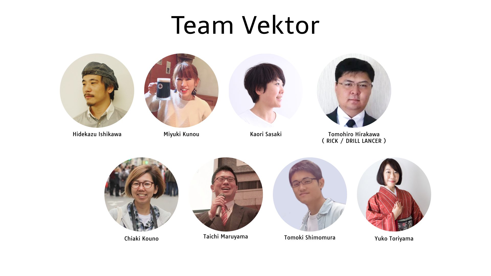

<!-- 
theme: vk-slide
size: 16:9
paginate: true
style: |
_paginate: false 
-->

<!-- Scoped style -->

<!-- _class: title -->

# VWS オンライン勉強会 #032
__Lightningで使える便利なブロック徹底解説__

まもなくスタート
#wpvektor ツイート大歓迎！

---

<!-- _class: title-chapter  -->
<!-- _paginate: false  -->

# ようこそ！はじめに

---

## この勉強会について

株式会社ベクトルが運営、WordPressやWeb制作をとりまくさまざまなテーマをとりあげて開催しているオンライン勉強会。

ご興味がある方であれば、経験や技術レベルに関係なく、どなたでもご参加いただけます。

また、ベクトル製品のWordPressテーマLightningなどの最新機能情報・カスタマイズ・運用方法についてもご案内しています。

基本的に、毎月1回、だいたい第4週目に開催しております。

---

---

## 歓迎されること

* ライブビューイングのノリでチャットでわいわいいただければと思います。
* ぜひツイートして盛り上げてください <strong>#wpvektor</strong>
* 初参加者さんを歓迎してください。

---

## ご参加にあたって

勉強会におきましては、品位のない、差別的・迷惑な行動や発言は慎みましょう。優しい言葉を心がけてください。 受け入れ難い行為や発言をもし見かけられましたらスタッフが対応しますのでお知らせください。誰にとっても快適な勉強会となるようにご協力ください。

---

## ご参加にあたって

* 随時途中で音声でのご質問もOKです。
* 発言時以外はミュートにしてください。
（テレビ・同居人・外部の騒音）
* 質問はSlackや質問スプレッドシートにご記入も可能です。
* 一部録画・公開します。
(Slackで過去の勉強会の動画を振り返りできます)

---

## 勉強会中のチャット

勉強会中のチャットはzoom上ではなくslackで行っております。

<strong>VWS の Slack #ミーティング チャンネル に一言どうぞ！</strong>

- Slackのデスクトップアプリもあり便利です

- Slackにまだ登録していない/ログイン情報を忘れた場合
→ connpassに記載のURLをご参考ください。

---

## 本日の内容

* 製品アップデート・その他お知らせ（約15分）
* 本編: Lightningで使える便利なブロック徹底解説 (約45分)
* 質問相談会（〜22:00まで）
* 22:05くらいから希望者のみ懇親会（Gather）

---
<!-- _paginate: false  -->

## セッションの内容は後から振り返りできます

URLリンク情報などはSlackや後日のレポートブログで共有いたします。動画もシェアされますので安心してゆっくり見てください。

---

<!-- _class: title-chapter  -->
<!-- _paginate: false  -->

## だれでもお気軽に 質問・回答 記入シート
勉強会中に出てきた疑問などぜひこちらに
https://docs.google.com/spreadsheets/d/1Yvk3AN4pWn2tjL7DBe0HZm4OvvWOWhfp9ub76bAjmpQ/edit?usp=sharing

---

## ハッシュタグは #wpvektor

## コメントスクリーンはこちらから 
https://commentscreen.com/comments?id=NqqS64dXkE1UrcPDGBke

コメント、リアクションをぜひお願いします！

---

<!-- _class: title-chapter  -->
<!-- _paginate: false  -->

## 今月の新機能 / 新製品その他お知らせ

---
## VK Blocks レスポンシブスペーサーのブレイクポイント変更のお知らせ

https://www.vektor-inc.co.jp/product-update/vk-blocks-1-28-0-break-point/

---
## VK Blocks (Pro) / Lightning / Lightning Pro / Katawara で Font Awesome 6 に対応しました

https://www.vektor-inc.co.jp/product-update/support-font-awesome-6/

---
## 各ブロックから共通の余白設定ができるようになりました
https://www.vektor-inc.co.jp/product-update/vk-blocks-1-29-0-block-margin-setting-add/

---
## VK Grid Column Card ブロックが β版から正式にVK Blocks Proに
VK Blocks Pro 1.29.0
https://www.vektor-inc.co.jp/product-update/vk-blocks-pro-1-29-0-add-vk-grid-column-card/

---
## Google アナリティクスのタグをログイン時は出力しないよう設定できるようになりました
ExUnit 9.74.0.0
https://www.vektor-inc.co.jp/product-update/exunit-9-74-0-0-disable-google-analytics-tag/

---
## VK Filter Search Pro でカスタムフィールド検索ブロック（β版）について
バージョン 1.6.0 
※非推奨である理由など、ご利用には _注意事項_ をよくご確認ください。

https://www.vektor-inc.co.jp/product-update/vk-filter-search-pro-1-6-0-add-custom-field-search-block/

---
## VK Filter Search Pro で検索ボタンにFont Awesomeのアイコンを設定できるようになりました
バージョン1.7.0
https://www.vektor-inc.co.jp/product-update/vk-filter-search-pro-1-7-0-set-font-awesome-icon-on-the-search-button/

---
## VK Filter Search Pro 4月1日価格改訂

https://www.vektor-inc.co.jp/info/product-price-revision-information-vk-filter-search-pro/

対象製品： VK Filter Search Pro（WordPress向け高機能絞り込み検索プラグイン – 買い切りタイプ）
改定時期： 2022年4月1日（金）より
現在：29,700円（税込）→ 改定後：31,900円（税込）
★3月31日までは現在の価格でご提供させて頂きます。

---

## FSE対応ブロックテーマ「X-T9」を公開しております
X-T9は、WordPress5.9から β版 として実装されているフルサイト編集機能に対応したブロックテーマです。
https://x-t9.vektor-inc.co.jp/
WordPressの公式テーマディレクトリよりご利用いただけます。
使用感などのフィードバック大歓迎です！

---
<!-- _class: title-chapter  -->
<!-- _paginate: false  -->

# 本編

## Lightningで使える便利なブロック徹底解説

Speaker：Ishikawa 

ご感想など **#wpvektor** ツイート大歓迎！

---

<!-- _class: title-chapter  -->
<!-- _paginate: false  -->

## Lightning 質問大会

スプレッドシートで皆さんからの質問・回答を見ていきましょう！

---
<!-- _class: title-chapter  -->
<!-- _paginate: false  -->

## 次回の勉強会
2022/4月27日（水）予定 VWSオンライン勉強会 #033

__「WordPressのトラブルシューティングについて（仮）」__

WordPressで作ったサイトを運営する上で押さえておきたい、トラブルシューティングについてご紹介できたらと思います。
https://vektor.connpass.com/event/243316

---

<!-- _class: title-chapter  -->
<!-- _paginate: false  -->

# 参加後アンケートのお願い

参加後アンケートよろしくおねがいします！（1〜2分）
https://forms.gle/pTjnAbxaMrkUPQ1L7

- 勉強会の感想
- 今回紹介したブロックのうち、よく使うブロック、知らなかったブロック、これから使ってみたいブロックなど
- 今後取り上げてほしいテーマなど

よろしければご意見をお聞かせください。

---
<!-- _class: title-chapter -->

## ショーケースについて

https://showcase.vektor-inc.co.jp/

LightningやKatawaraで作成したサイトを掲載して参考にしたり、制作者に制作に関する依頼の問い合わせが出来るサイトです。

実績掲載・受注の流れ
https://showcase.vektor-inc.co.jp/flow

---

## フォーラムを活用しよう！500ポイントへ増量！キャンペーン実施中です（期間未定）
ベストアンサーに選ばれると、これまで300ポイントだったところ、500ポイント付与されます！🎉
https://www.vektor-inc.co.jp/info/forum-point-up-campaign/
フォーラムの回答にぜひご参加いただけると嬉しいです！

✅質問した人は、解決に役立った返信に「ベストアンサー」をつけてください✨

---

<!-- _class: title-chapter  -->
<!-- _paginate: false  -->

# その他の連絡事項、告知など

---

## Gather の懇親会場
https://app.gather.town/app/RrlcO1UDQoLwXa0u/202203-vws
カメラはオフのままでもOK！ウロウロして楽しんでください！
名前に★がある人は「気軽に話しかけてね」
名前に●がある人は「ゆるっと聞くだけ参加」

---
<!-- _class: title -->
<!-- _paginate: false  -->

# ありがとうございました
