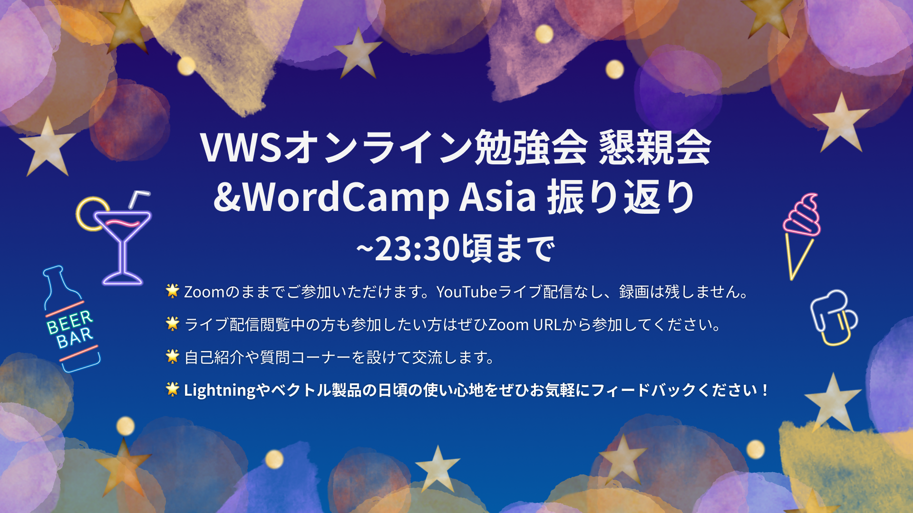

<!-- 
theme: vk-slide
size: 16:9
paginate: true
style: |
_paginate: false 
-->

<!-- Scoped style -->

<!-- _class: title -->

VWS オンライン勉強会 #044
# CSSの小技とパターンで作るWordPressサイト第2弾

まもなくスタート
#wpvektor ツイート大歓迎！

---

<!-- _class: title-chapter  -->
<!-- _paginate: false  -->

# ようこそ！はじめに

---

## この勉強会について

株式会社ベクトルが運営、WordPressやウェブ制作にかかせないさまざまなテーマをとりあげて開催しているオンライン勉強会。

ご興味がある方であれば、経験や技術レベルに関係なく、どなたでもご参加いただけます。

また、ベクトル製品のWordPressテーマLightningなどの最新機能情報・カスタマイズ・運用方法についてもご案内しています。

基本的に、毎月1回、だいたい第4週目に開催しております。

---

---

## 歓迎されること

* ライブビューイングのノリで __チャットでわいわい__ していただければと思います。
* ぜひツイートして盛り上げてください <strong>#wpvektor</strong>
* __初参加者さんを歓迎__ してください。
* __やさしい言葉使い__ を心がけて、誰にとっても快適な勉強会となるようにご協力ください。

---

## ご参加にあたって

* 随時途中で音声でのご質問もOKです。
* 発言時以外はミュートにしてください。
（テレビ・同居人・外部の騒音）
* 一部録画し、YouTubeにてアーカイブとして公開します。

---

## 勉強会中のチャット

勉強会中のチャットはZoom・YouTube上ではなくDiscordで行っております。

<strong>VWS の Discord #ミーティング チャンネル に一言どうぞ！</strong>

- Discordのデスクトップアプリもあり便利です

- Discordにまだ登録していない/ログイン情報を忘れた場合
→ connpassに記載のURLをご参考ください。

---

## 本日の内容

* 製品アップデート・その他お知らせ
* 『CSSの小技とパターンで作るWordPressサイト第2弾』
  * 前半:現場で使える見出しパターン21選！
  * 後半: サイト作成をスムーズに！パターンで作るWordPressサイト LP編
* なんでも質問相談会（〜22:00まで）
* 22:05頃から懇親会・ユーザーフィードバック会（Zoomのみ、配信なし）

---

## セッションの内容は後から振り返りできます
URLリンク情報などはSlackや後日のレポートブログで共有いたします。動画もシェアされますので安心してゆっくり見てください。

---

## ハッシュタグは #wpvektor
## コメントスクリーンはこちらから
https://commentscreen.com/comments?id=IIDfWRgwBVeikyRM859x

コメント、リアクションをぜひお願いします！

---

<!-- _class: title-chapter  -->
<!-- _paginate: false  -->

## だれでもお気軽に 質問・回答 記入シート

https://docs.google.com/spreadsheets/d/1Yvk3AN4pWn2tjL7DBe0HZm4OvvWOWhfp9ub76bAjmpQ/edit?usp=sharing

---

<!-- _class: title-chapter  -->
<!-- _paginate: false  -->

## 今月の新機能 / 新製品その他お知らせ

---

---

---

---

## VK All in One Expansion Unit で特定の固定ページをページリストから除外する機能を追加しました。

Ver. 9.88.0.0

https://www.vektor-inc.co.jp/product-update/vk-all-in-one-expansion-unit-9-88-0-0/

---

## VWSオンラインコミュニティをDiscordに移行します。
https://www.vektor-inc.co.jp/info/migration-to-discord/

---

## 有料版インポートデータの配布を開始しました

---

<!-- _class: title-chapter  -->
<!-- _paginate: false  -->

## CSSの小技とパターンで作るWordPressサイト第2弾

ご感想など **#wpvektor** ツイート大歓迎！

---
## CSSの小技とパターンで作るWordPressサイト第2弾
### 前半: 現場で使える見出しパターン21選！
（無料版・他社テーマでもコピペOK）

### 後半: サイト作成をスムーズに！パターンで作るWordPressサイト LP編
(有料版ベース・デザインと組み合わせのご参考に)

---
## CSSの小技とパターンで作るWordPressサイト第2弾
### 前半：現場で使える見出しパターン21選！

スピーカー：ベクトルスタッフ 久納さん

https://www.vektor-inc.co.jp/post/copy-and-paste-heading/

---

## VK Simple Copy Block のご紹介

__スピーカー：ベクトル開発リーダー石川__

WordPressサイトでよく使うブロックパターンを管理する場合に、ブロックパターンのコピーボタンを追加できる便利なプラグインを公開しました！
https://www.vektor-inc.co.jp/service/wordpress-plugins/vk-simple-copy-block/

---

## CSSの小技とパターンで作るWordPressサイト第2弾
### 3. サイト作成をスムーズに！パターンで作るWordPressサイト LP編

スピーカー：ベクトルスタッフ 久納さん&鳥山さん

https://www.vektor-inc.co.jp/post/vk-pattern-library-lp/

---

<!-- _class: title-chapter  -->
<!-- _paginate: false  -->

## Lightning 質問大会

スプレッドシートで皆さんからの質問・回答を見ていきましょう！

---

<!-- _class: title-chapter  -->
<!-- _paginate: false  -->

# 参加後アンケートのお願い

参加後アンケートよろしくおねがいします！（1〜2分）
https://forms.gle/yPb4VWPB1S6TcesNA

- 勉強会の感想
- 今後取り上げてほしいテーマなど

よろしければご意見をお聞かせください。

---

## 勉強会はいかがでしたか？過去の動画アーカイブをYouTubeでご覧いただけます！

https://www.youtube.com/@VektorInc
🌟2022年12月までの勉強会動画がまるッとみれます！

おすすめプラグイン / フルサイト編集 / Googleタグマネージャー / トラブルシューティング / CSSカスタマイズ / PHP超入門 / アクションフック / 物件情報サイト作成 / ビジネスサイト作成 / パターン活用 / Lightningカスタマイズ / 配色の基本 / SEO関連
 

__🔔チャンネル登録もよろしければぜひ！__

---
<!-- _class: title-chapter  -->
<!-- _paginate: false  -->

## 次回の勉強会（予定）
2023/5/21(日)15時30分〜 【東京開催＆ライブ配信】

### WordPress 最新機能フルサイト編集での制作実演
今回は東京にて4年ぶりに現地開催をすることになりました！
コンパスにてご参加登録受付中！
https://vektor.connpass.com/event/280075/

---

<!-- _class: title-chapter  -->
<!-- _paginate: false  -->

# その他の連絡事項、告知など

---

---
<!-- _class: title -->
<!-- _paginate: false  -->

# ありがとうございました

また次の勉強会でお会いしましょう！
