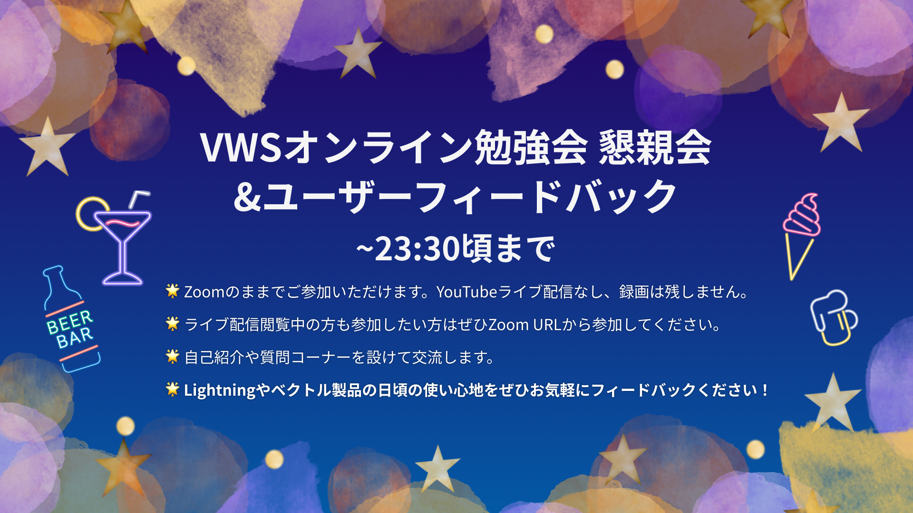

<!-- 
theme: vk-slide
size: 16:9
paginate: true
style: |
_paginate: false 
-->

<!-- Scoped style -->

<!-- _class: title -->

VWS オンライン勉強会 #043
# WordPress最新バージョン6.2を 触ってみよう

まもなくスタート
#wpvektor ツイート大歓迎！

---

<!-- _class: title-chapter  -->
<!-- _paginate: false  -->

# ようこそ！はじめに

---

## この勉強会について

株式会社ベクトルが運営、WordPressやウェブ制作にかかせないさまざまなテーマをとりあげて開催しているオンライン勉強会。

ご興味がある方であれば、経験や技術レベルに関係なく、どなたでもご参加いただけます。

また、ベクトル製品のWordPressテーマLightningなどの最新機能情報・カスタマイズ・運用方法についてもご案内しています。

基本的に、毎月1回、だいたい第4週目に開催しております。

---

---

## 歓迎されること

* ライブビューイングのノリで __チャットでわいわい__ していただければと思います。
* ぜひツイートして盛り上げてください <strong>#wpvektor</strong>
* __初参加者さんを歓迎__ してください。
* __やさしい言葉使い__ を心がけて、誰にとっても快適な勉強会となるようにご協力ください。

---

## ご参加にあたって

* 随時途中で音声でのご質問もOKです。
* 発言時以外はミュートにしてください。
（テレビ・同居人・外部の騒音）
* 一部録画し、YouTubeにてアーカイブとして公開します。

---

## 勉強会中のチャット

勉強会中のチャットはzoom上ではなくslackで行っております。

<strong>VWS の Slack #ミーティング チャンネル に一言どうぞ！</strong>

- Slackのデスクトップアプリもあり便利です

- Slackにまだ登録していない/ログイン情報を忘れた場合
→ connpassに記載のURLをご参考ください。

---

## 本日の内容

* 製品アップデート・その他お知らせ
* 『WordPress最新バージョン6.2を触ってみよう』
  * 前半：ブロックエディターユーザー向け(約30分)
  * 後半：開発者向け(約30分)
* なんでも質問相談会（〜22:00まで）
* 22:05頃から懇親会・ユーザーフィードバック会（Zoomのみ、配信なし）

---

## セッションの内容は後から振り返りできます
URLリンク情報などはSlackや後日のレポートブログで共有いたします。動画もシェアされますので安心してゆっくり見てください。

---

## ハッシュタグは #wpvektor
## コメントスクリーンはこちらから
https://commentscreen.com/comments?id=IIDfWRgwBVeikyRM859x

コメント、リアクションをぜひお願いします！

---

<!-- _class: title-chapter  -->
<!-- _paginate: false  -->

## だれでもお気軽に 質問・回答 記入シート

https://docs.google.com/spreadsheets/d/1Yvk3AN4pWn2tjL7DBe0HZm4OvvWOWhfp9ub76bAjmpQ/edit?usp=sharing

---

<!-- _class: title-chapter  -->
<!-- _paginate: false  -->

## 今月の新機能 / 新製品その他お知らせ

---

## VK Blocks のスライダーブロックで複数枚表示の際にデバイス毎の表示数を指定できるようになりました（再度のご案内）

https://www.vektor-inc.co.jp/product-update/vk-blocks1-50-0-slider/

---

## VK Block Patterns で 作成したパターンを任意の投稿タイプのデフォルトパターンに指定する機能を追加しました。

https://www.vektor-inc.co.jp/product-update/vk-block-patterns-1-26-0/

---

## WordCampAsia バンコクに行ってきました！
https://vektor-inc.co.jp/wca2023/

懇親会で舞台裏のお話をする予定です！

---

<!-- _class: title-chapter  -->
<!-- _paginate: false  -->

# 本編

## WordPress最新バージョン6.2を 触ってみよう

ご感想など **#wpvektor** ツイート大歓迎！

---

## 前半：ブロックエディターユーザー向け

スピーカー：佐々木

（ブログ記事リンク）

---

## 後半：開発者向け

スピーカー：石川

---

<!-- _class: title-chapter  -->
<!-- _paginate: false  -->

## Lightning 質問大会

スプレッドシートで皆さんからの質問・回答を見ていきましょう！

---

<!-- _class: title-chapter  -->
<!-- _paginate: false  -->

# 参加後アンケートのお願い

参加後アンケートよろしくおねがいします！（1〜2分）
https://forms.gle/dX76RV9izP7s4sya9

- 勉強会の感想
- 今後取り上げてほしいテーマなど

よろしければご意見をお聞かせください。

---

## 勉強会はいかがでしたか？過去の動画アーカイブをYouTubeでご覧いただけます！

https://youtube.com/playlist?list=PL_Z0nmiLLW6tzsuoy15eAwn-8qrtCEyyF

CSSカスタマイズ / PHP超入門 / アクションフック /
物件情報サイト作成 / ビジネスサイト作成 / パターン活用 /
Lightningカスタマイズ / 配色の基本 / SEO関連設定
 

__🔔チャンネル登録もよろしければぜひ！__

---
<!-- _class: title-chapter  -->
<!-- _paginate: false  -->

## 次回の勉強会（予定）
2023/4/?(木)予定 VWSオンライン勉強会 #044

### Lightning勉強会何かやります！

コンパス準備中！受付開始をしましたらご案内します！
ぜひスケジュールをチェックしておいてください。

---

<!-- _class: title-chapter  -->
<!-- _paginate: false  -->

# その他の連絡事項、告知など

---

---
<!-- _class: title -->
<!-- _paginate: false  -->

# ありがとうございました

また次の勉強会でお会いしましょう！
