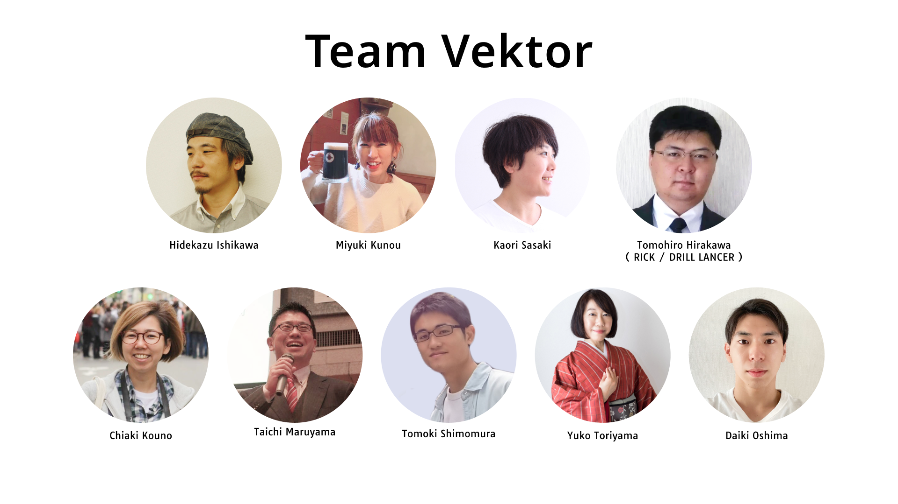
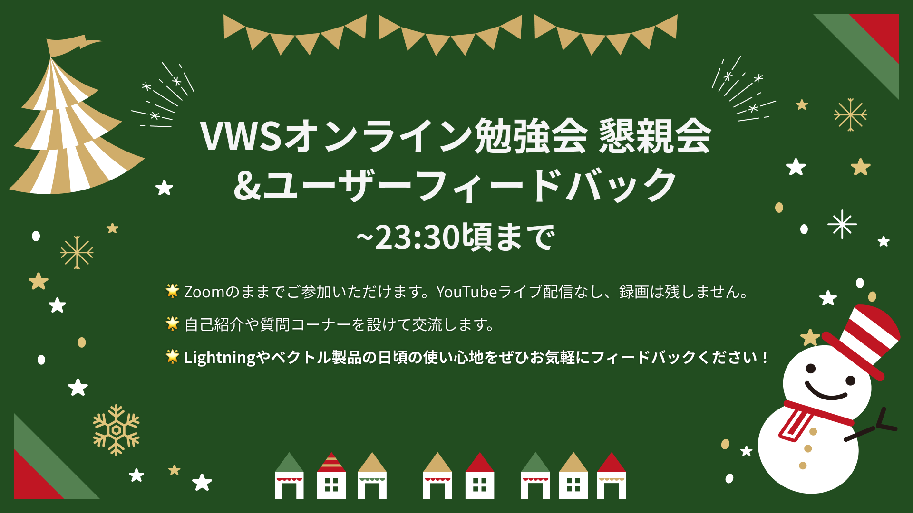

<!-- 
theme: vk-slide
size: 16:9
paginate: true
style: |
_paginate: false 
-->

<!-- Scoped style -->

<!-- _class: title -->

VWS オンライン勉強会 #041
# Lightning質問大会 2022年振り返りとXmasクイズ！

まもなくスタート
#wpvektor ツイート大歓迎！

---

<!-- _class: title-chapter  -->
<!-- _paginate: false  -->

# ようこそ！はじめに

---

## この勉強会について

株式会社ベクトルが運営、WordPressやウェブ制作にかかせないさまざまなテーマをとりあげて開催しているオンライン勉強会。

ご興味がある方であれば、経験や技術レベルに関係なく、どなたでもご参加いただけます。

また、ベクトル製品のWordPressテーマLightningなどの最新機能情報・カスタマイズ・運用方法についてもご案内しています。

基本的に、毎月1回、だいたい第4週目に開催しております。

---

---

## 歓迎されること

* ライブビューイングのノリで __チャットでわいわい__ していただければと思います。
* ぜひツイートして盛り上げてください <strong>#wpvektor</strong>
* __初参加者さんを歓迎__ してください。
* __やさしい言葉使い__ を心がけて、誰にとっても快適な勉強会となるようにご協力ください。

---

## ご参加にあたって

* 随時途中で音声でのご質問もOKです。
* 発言時以外はミュートにしてください。
（テレビ・同居人・外部の騒音）
* 一部録画し、YouTubeにてアーカイブとして公開します。

---

## 勉強会中のチャット

勉強会中のチャットはzoom上ではなくslackで行っております。

<strong>VWS の Slack #ミーティング チャンネル に一言どうぞ！</strong>

- Slackのデスクトップアプリもあり便利です

- Slackにまだ登録していない/ログイン情報を忘れた場合
→ connpassに記載のURLをご参考ください。

---

## 本日の内容

* 製品アップデート・その他お知らせ（約15分）
* 2022年振り返り (約00分)
* Lightning質問大会 (約00分)
* Xmasクイズ (約00分)
* 22:05頃から懇親会・ユーザーフィードバック会

---

<!-- _class: title-chapter  -->
<!-- _paginate: false  -->

## だれでもお気軽に 質問・回答 記入シート

https://docs.google.com/spreadsheets/d/1Yvk3AN4pWn2tjL7DBe0HZm4OvvWOWhfp9ub76bAjmpQ/edit?usp=sharing

---

## ハッシュタグは #wpvektor
## コメントスクリーンはこちらから
https://www.commentscreen.com/comments?id=w9V4IxYmyksMjm3j9VZW

コメント、リアクションをぜひお願いします！

---

<!-- _class: title-chapter  -->
<!-- _paginate: false  -->

## 今月の新機能 / 新製品その他お知らせ

---
## Lightningクイックスタート デモデータを最新にアップデートしました

https://www.vektor-inc.co.jp/info/2022-12-ltg-quickstart-data-update/
配布用デモデータは無料でご利用いただけます。

---

## 無料版 VK Blocks でスライダーブロックが使えるようになりました！
Ver. 1.47.0以降
https://www.vektor-inc.co.jp/product-update/vk-blocks-1-47-0-slider-block/

---

## VK Blocks Proで「カスタム書式設定機能」追加

Ver. 1.48.0
https://www.vektor-inc.co.jp/product-update/vk-blocks-pro-1-48-0-add-custom-format-setting/

---

## VK Blocks / VK Blocks Pro で 「ブロックマネージャー機能」追加
Ver. 1.48.0
https://www.vektor-inc.co.jp/product-update/vk-blocks-1-48-0-add-block-manager-function/

---
## XT-9 アップデート

---

<!-- _class: title-chapter  -->
<!-- _paginate: false  -->

# 本編

## 2022年の振り返り

ベクトル3大ニュースと、おすすめの新機能追加ニュースを振り返ります！

ご感想など **#wpvektor** ツイート大歓迎！

---
<!-- _class: title-chapter  -->
<!-- _paginate: false  -->

__2022年 ベクトル3大ニュース その①__
## フルサイト編集対応テーマ 「X-T9」リリース！ - ２月
フルサイト編集機能に対応した開発実験テーマ
X-T9 WordPress Theme
https://x-t9.vektor-inc.co.jp/
広がり始めたフルサイト編集の可能性！

---
<!-- _class: title-chapter  -->
<!-- _paginate: false  -->

__2022年 ベクトル3大ニュース その②__
## コピペで使える「VK パターンライブラリ（VK Pattern Library）」公開！- ２月

 コピペで使えるブロックパターンライブラリ！
https://patterns.vektor-inc.co.jp/about/
パターンを選んで組み合わせていくだけで、
サイトが簡単にできあがる！

---
<!-- _class: title-chapter  -->
<!-- _paginate: false  -->

__2022年 ベクトル3大ニュース その③__
## 新パッケージ「Vektor Passport」 リリース！- 11月
https://vws.vektor-inc.co.jp/vektor-passport
プロ品質のプレミアムパターンが使える！
Vektor Passport を販売開始しました

---
<!-- _class: title-chapter  -->
<!-- _paginate: false  -->

__2022年 ベクトル3大ニュース その③ ＋α__
新パッケージ「Vektor Passport」リリースにあわせて、
プレミアムパターンで作成できる工務店サイトも公開！

## 工務店デモサイト公開！
https://demo.dev3.biz/architect/lp/

先月の勉強会のアーカイブをぜひご参考ください！

---
<!-- _class: title-chapter  -->
<!-- _paginate: false  -->

## オススメ！新機能追加で振り返る2022

この１年間にあった便利な新機能追加をまとめてご紹介！

新機能アップデートのお知らせの詳細は全て
https://www.vektor-inc.co.jp/product-update/
からご覧いただけます！

---
<!-- _class: title-chapter  -->
<!-- _paginate: false  -->

__オススメ！新機能追加で振り返る2022__

## Lightning は theme.json に対応

★ Lightning 15系 より テーマ内に theme.json が利用出来るようになりました。有効化すると最新のWordPressの便利な機能が使えるようになります。
https://www.vektor-inc.co.jp/product-update/lightning-15-theme-json/

---
<!-- _class: title-chapter  -->
<!-- _paginate: false  -->

__オススメ！新機能追加で振り返る2022__

## Font Awesome 6 に対応しております
2月の FontAwesome 6 の正式リリースに伴い、3月に以下の製品で対応。下記バージョン以降でご利用可能になっています。

- VK Blocks / VK Blocks Pro 1.27.4 以降
- Lightning 14.18.0 以降
- Lightning Pro 8.14.0 以降
- Katawara 1.12.2 以降

---
<!-- _class: title-chapter  -->
<!-- _paginate: false  -->

__オススメ！新機能追加で振り返る2022__

## VK Blocks（無料版/Pro版） -1/2-
- __各ブロックから共通の余白設定が可能に__
- __ボタンの文字サイズと前後のアイコンサイズを指定可能に__
- 枠線ボックスへ任意の色を指定可能に
- 枠線ボックスの中の要素を中央揃えに可能に

---
<!-- _class: title-chapter  -->
<!-- _paginate: false  -->

__オススメ！新機能追加で振り返る2022__

## VK Blocks（無料版/Pro版） -2/2-
- __無料版でもスライダーブロックが使えるように！__
- __レスポンシブスペーサーに XS / XL サイズを追加__
- __キラッと光るボタンエフェクトを設定可能に__
- 吹き出しブロックの吹き出しの幅を100%に設定可能に

---
<!-- _class: title-chapter  -->
<!-- _paginate: false  -->

__オススメ！新機能追加で振り返る2022__

## VK Blocks Pro版 -1/2-
- __VK Grid Column Card ブロックを追加しました__
-- カラム全体のリンクを指定可能に
-- カラムの最小サイズを画面毎に指定可能に
- 横並びボタンにデバイス毎のボタン幅、ギャップサイズを指定可能に

---
<!-- _class: title-chapter  -->
<!-- _paginate: false  -->

__オススメ！新機能追加で振り返る2022__

## VK Blocks Pro版 -2/2-
- __よく使う書式設定__
- __投稿リストの分類絞り込み条件でANDかORを選択可能に__
- __カスタムCSS機能を追加__

---
<!-- _class: title-chapter  -->
<!-- _paginate: false  -->

__オススメ！新機能追加で振り返る2022__

## ExUnit（無料）

- __CTA ブロックの追加__
- __UAとGA4のタグを両方同時に出力可能に__
- 記事の構造化データ出力機能追加
- パンくずリストの構造化データ出力機能追加
- Google アナリティクスのタグをログイン時は出力しないよう設定可能に

---
<!-- _class: title-chapter  -->
<!-- _paginate: false  -->

__オススメ！新機能追加で振り返る2022__

## VK Block Patterns（無料）
- __ヘッダーのツールバーへVKパターンライブラリへのリンクを追加__
- __デフォルトパターン停止機能を追加__
- __お気に入りパターンを編集画面で直接呼び出し可能に__
（ライセンス有効期間ユーザー機能）

---
<!-- _class: title-chapter  -->
<!-- _paginate: false  -->

__オススメ！新機能追加で振り返る2022__
## Katawara（有料テーマ）
- ページヘッダーにサブタイトルを追加しやすいようにフィルターフックを追加

---
<!-- _class: title-chapter  -->
<!-- _paginate: false  -->

__オススメ！新機能追加で振り返る2022__
## Lightning G3 Pro Unit
- パンくずリストの位置をフッター直上に変更可能に
- ヘッダートップのボタン部分をカスタマイズするフックを追加
- ページヘッダーの背景画像にアイキャッチ画像を表示しない設定が可能に

---
<!-- _class: title-chapter  -->
<!-- _paginate: false  -->

__オススメ！新機能追加で振り返る2022__
## VK Filter Search Pro
- __カスタムフィールド検索ブロック（β版）を追加__
- __検索結果の並び替えが可能に__
- __チェックボックスのタクソノミー検索でユーザーが AND / OR 検索を選べるように__
- 検索ボタンにFont Awesomeのアイコンを設定可能に
- ブロックテーマに対応しました

---
## 2022年もご利用ありがとうございます！

__2022年度ベクトル有償製品ユーザーアンケートを実施しております__

製品とサービスの継続的な開発・改善のために、あなたの声をぜひお聞かせください。

アンケート調査期間：2023年1月31日（火）まで
https://www.vektor-inc.co.jp/info/2022-vektor-annual-survey/

---

<!-- _class: title-chapter  -->
<!-- _paginate: false  -->

## Lightning 質問大会

スプレッドシートで皆さんからの質問・回答を見ていきましょう！

---

<!-- _class: title-chapter  -->
<!-- _paginate: false  -->

# ベクトル X'mas クイズ大会！

---

<!-- _class: title-chapter  -->
<!-- _paginate: false  -->

# 参加後アンケートのお願い

参加後アンケートよろしくおねがいします！（1〜2分）
https://forms.gle/bGgdtc96J8xS2efB9

- 勉強会の感想
- 今後取り上げてほしいテーマなど

よろしければご意見をお聞かせください。

---

## 勉強会はいかがでしたか？過去の動画アーカイブをYouTubeでご覧いただけます！

https://youtube.com/playlist?list=PL_Z0nmiLLW6tzsuoy15eAwn-8qrtCEyyF

CSSカスタマイズ / PHP超入門 / アクションフック /
物件情報サイト作成 / ビジネスサイト作成 / パターン活用 /
Lightningカスタマイズ / 配色の基本 / SEO関連設定
 

__🔔チャンネル登録もよろしければぜひ！__

---
<!-- _class: title-chapter  -->
<!-- _paginate: false  -->

## 次回の勉強会（予定）
2023/1/26(木)予定 VWSオンライン勉強会 #042

### VWSオンライン勉強会 #42 Lightningや他テーマでも使える無料スライダーブロック徹底解説

コンパス予約受付開始しております！
ぜひお気軽にご参加ください！

---
## 2022年度ベクトル有償製品ユーザーアンケートを実施しております（再）

製品とサービスの継続的な開発・改善のために、あなたの声をぜひお聞かせください。

アンケート調査期間：2023年1月31日（火）まで
https://www.vektor-inc.co.jp/info/2022-vektor-annual-survey/

---

<!-- _class: title-chapter  -->
<!-- _paginate: false  -->

# その他の連絡事項、告知など

---

---
<!-- _class: title -->
<!-- _paginate: false  -->

# 2022年もありがとうございました

良いお年をお迎えください！
2023年もどうぞよろしくお願いします！
