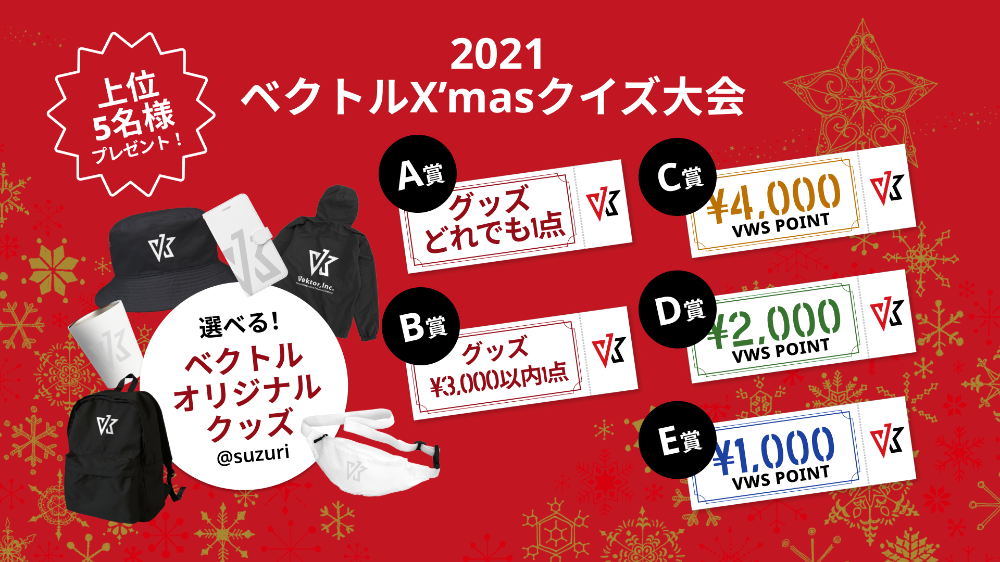
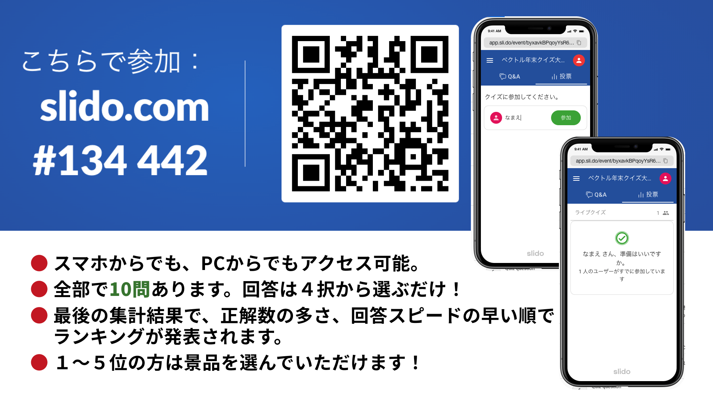

<!-- 
theme: vk-slide
size: 16:9
paginate: true
style: |
_paginate: false 
-->

<!-- Scoped style -->

<!-- _class: title -->

# VWS オンライン勉強会 #029
__Lightning質問大会 & 年末プレゼント企画他__

まもなくスタート
#wpvektor ツイート大歓迎！

---

<!-- _class: title-chapter  -->
<!-- _paginate: false  -->

# ようこそ！はじめに

---

## この勉強会について

株式会社ベクトルが運営、WordPressやWeb制作をとりまくさまざまなテーマをとりあげて開催しているオンライン勉強会。

ご興味がある方であれば、経験や技術レベルに関係なく、どなたでもご参加いただけます。

また、ベクトル製品のWordPressテーマLightningなどの最新機能情報・カスタマイズ・運用方法についてもご案内しています。

基本的に、毎月1回、だいたい第4週目に開催しております。

---

---

## 歓迎されること

* ライブビューイングのノリでチャットでわいわいいただければと思います。
* ぜひツイートして盛り上げてください <strong>#wpvektor</strong>
* 初参加者さんを歓迎してください。

---

## ご参加にあたって

勉強会におきましては、品位のない、差別的・迷惑な行動や発言は慎みましょう。優しい言葉を心がけてください。 受け入れ難い行為や発言をもし見かけられましたらスタッフが対応しますのでお知らせください。誰にとっても快適な勉強会となるようにご協力ください。

---

## ご参加にあたって （続き）

* 随時途中で音声でのご質問もOKです。
* 発言時以外はミュートにしてください。
（テレビ・同居人・外部の騒音）
* 質問はSlackや質問スプレッドシートにご記入も可能です。
* 一部録画・公開します。
(Slackで過去の勉強会の動画を振り返りできます)

---

## 勉強会中のチャット

勉強会中のチャットはzoom上ではなくslackで行っております。

<strong>VWS の Slack #ミーティング チャンネル:</strong>
https://app.slack.com/client/TG8RZN3SM/C01A20ZGWMN/details/top

※Slackのアプリもあります
https://slack.com/intl/ja-jp/downloads/

---

## Slackにまだ登録していない/ログイン情報を忘れた場合
VWSのSlack新規登録はこちら：
https://join.slack.com/t/vektor-vws/shared_invite/zt-qpdex5sh-zjw_M3r38GBaewNKcXa7GA

ログイン方法を忘れた場合：
https://vektor-vws.slack.com/forgot/signin

■ ブラウザでVWSのSlackにアクセス：
https://vektor-vws.slack.com

---

## 本日の内容

* 製品アップデート・その他お知らせ（約20分）
* 今年の出来事・アドベントカレンダー振り返り (約40分)
* Lightningユーザー質問相談会 (約15分)
* Vektor 2021 クリスマスクイズ大会！（21:30頃から）
* 22:00より希望者のみ懇親会

---
<!-- _paginate: false  -->

## セッションの内容は後から振り返りできます

URLリンク情報などはSlackや後日のレポートブログで共有いたします。動画もシェアされますので安心してゆっくり見てください。

★本日は製品アップデート情報と2021年振り返りの内容を、後日YouTubeに公開予定です

---

<!-- _class: title-chapter  -->
<!-- _paginate: false  -->

## だれでもお気軽に 質問・回答 記入シート
https://docs.google.com/spreadsheets/d/1Yvk3AN4pWn2tjL7DBe0HZm4OvvWOWhfp9ub76bAjmpQ/edit?usp=sharing

---

## ハッシュタグは #wpvektor

## コメントスクリーンはこちらから 

https://commentscreen.com/comments?id=GWrqndUaKU10zYvl3h0B

コメント、リアクションをぜひお願いします！

---

<!-- _class: title-chapter  -->
<!-- _paginate: false  -->

## 今月の新機能 / 新製品その他お知らせ

---

## VK Filter Search Pro 投稿日付検索 が加わりました！

---

## グリッドカラムカードブロックβ版テストのお願い
 Ligntning G3 Pro Unit をご利用中の方へ

---
<!-- _class: title-chapter  -->
<!-- _paginate: false  -->

# 2021年もあと10日！

## VWS今年の出来事・アドベントカレンダー 振り返り

---

## Vektor,Inc. 2021年振り返り – テーマ＆プラグイン新規リリース編 –

https://www.vektor-inc.co.jp/post/vektorinc-2021-new-theme-plugins/
by ベクトル石川

---

## 見逃しているかも？ Lightning G3 Pro Unit リリース後に追加したヘッダー・フッターまわりの便利な機能

https://www.vektor-inc.co.jp/post/g3-pro-unit-add-function-header-footer/
by ベクトル佐々木

---

## アドベントカレンダーへのご参加ありがとうございます！！

**Vektor WordPress Solutions Advent Calendar 2021**

https://adventar.org/calendars/6452

いろんな記事が続々！ぜひご覧ください！

---
12/3 [「Katawara」購入予定日](https://www.vektor-inc.co.jp/service/wordpress-theme/katawara/) by 五十嵐暢之さま

12/4 [Lightning G3 Pro Unit 限定のニッチなプラグインを作ってみた](https://lightning-g3.hp1.work/niche-plugin-for-lightning-g3-pro-unit/) by 対馬俊彦さま

12/9 [フリーランスの請求書 – BillVektorをカスタマイズして使ってみよう！](https://taizo.junonet.biz/billvektor/) by ふじたたいぞうさま

12/13 [LIGHTNING テーマを使ってみて感じた「凄い！」と思ったポイント](https://private.hibou-web.com/archives/8830/) by @marushu さま

---

## ご参加くださった皆さんに感謝！

アドベントカレンダーにご参加くださいました皆さん、ありがとうございました！

記事を書き上げて下さった方に、ささやかではございますが、プレゼントをお届けしたいと思っております。ぜひ受け取ってくださいませ！

---

## 来年のアドベントカレンダーのお誘い💖

こんな感じでご参加いただける方はぜひ来年、
2022年のアドベントカレンダーの時期にご参加いただけると
嬉しいです！

---

<!-- _class: title-chapter  -->
<!-- _paginate: false  -->

## Lightning ユーザー質問相談会
Lightning を使用していて、
・素朴な疑問
・みんなどうしてる？
などの質問をみんなでシェア。

音声参加でのご質問も大歓迎です!

---

---
<!-- _class: title-chapter  -->
<!-- _paginate: false  -->

## ベクトル X’mas クイズ大会2021！！

ご参加には、下記２点の情報を先にご登録お願いします！
* クイズ参加時の表示名(ニックネーム可、ユニークなもの)
* 賞品受け取り用、ご連絡先メールアドレス

ご参加登録フォーム：https://forms.gle/X8TQG3WUn1Dovztu5

---

---
<!-- _class: title-chapter  -->
<!-- _paginate: false  -->

## 賞品を選んでください
https://suzuri.jp/vektor

**A賞** ベクトルグッズ（お好みのアイテム１点）
**B賞** ベクトルグッズ（税込3,500円以下１点）

**C賞** ベクトルポイント 4000
**D賞** ベクトルポイント 2000
**E賞** ベクトルポイント 1000

---
<!-- _class: title-chapter  -->
<!-- _paginate: false  -->

## 次回の勉強会
2021/1/21(金) VWSオンライン勉強会 #030
WordPress最新バージョン5.9を見てみよう（仮）
https://vektor.connpass.com/event/234383/
connpassご参加登録受付中！

---

<!-- _class: title-chapter  -->
<!-- _paginate: false  -->

# 参加後アンケートのお願い

https://forms.gle/Xp7TAZ21pVfCVQa17
＜お聞きしたいこと＞
- 本日の勉強会のご感想
- 今後の勉強会でとりあげてほしいテーマ

よろしければご意見をお聞かせください。

---

<!-- _class: title-chapter -->

## ☆VWSフォーラムに回答いただくと！
ベストアンサーには300ポイントが付与されます！✨
付与されたポイントは、VWSサイト内でテーマ・プラグインをご購入の際に「1ポイント=1円」として利用できます。

## ★ 質問して解決した方へ
解決した場合は解決した返信に「ベストアンサー」をつけてください✅

---
<!-- _class: title-chapter -->

## ショーケースについて

https://showcase.vektor-inc.co.jp/

LightningやKatawaraで作成したサイトを掲載して参考にしたり、制作者に制作に関する依頼の問い合わせが出来るサイトです。

実績掲載・受注の流れ
https://showcase.vektor-inc.co.jp/flow

---

<!-- _class: title-chapter -->

## 無料で利用できるオンライン学習サービス「ベクトレ」
Vektor,Inc. のテーマ・プラグインの使い方・カスタマイズや、WordPressの知識を無料で学べます！
https://training.vektor-inc.co.jp/

---

<!-- _class: title-chapter  -->
<!-- _paginate: false  -->

# その他の連絡事項、告知など

---

<!-- _class: title-chapter  -->
<!-- _paginate: false  -->

# Gatherで懇親会

クリスマス仕様の懇親会場
https://gather.town/app/T9oN0wATyQOJlcQl/vws-202112
カメラはオフのままでもOK！ウロウロして楽しんでください！

名前に★がある人は「気軽に話しかけてね」
名前に●がある人は「ゆるっと聞くだけ参加」

---

---
<!-- _class: title -->
<!-- _paginate: false  -->

# ありがとうございました
