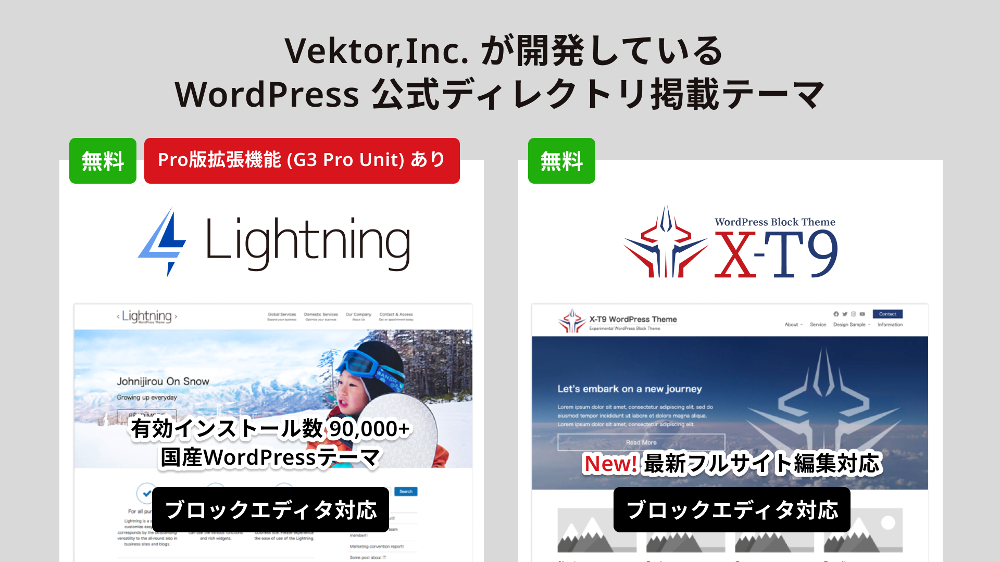
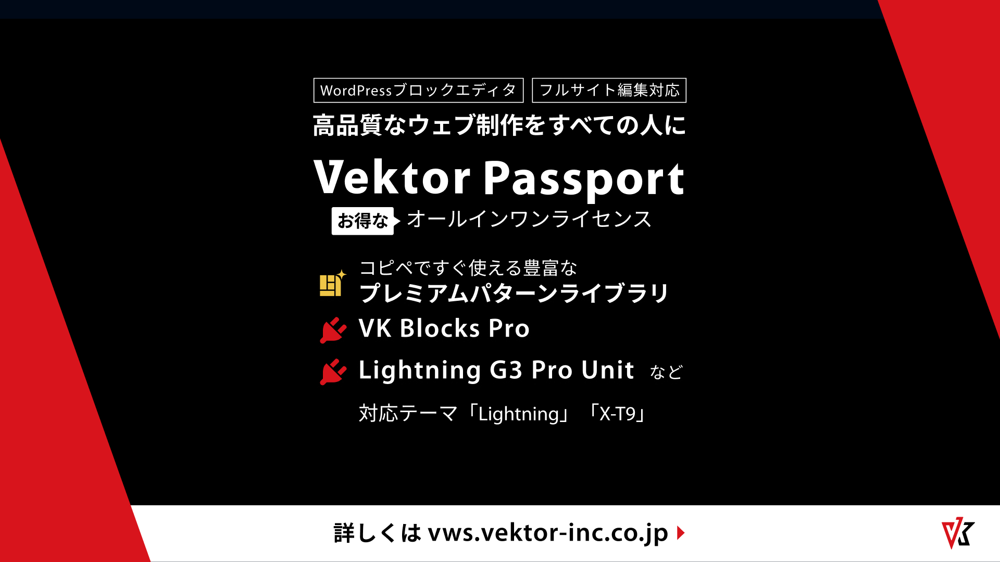

<!-- 
theme: vk-slide
size: 16:9
paginate: true
style: |
_paginate: false 
-->

<!-- Scoped style -->

<!-- _class: title -->

VWS オンライン勉強会 年末企画！
# 2023年のVWS製品アップデート一挙振り返り&参加者全員プレゼントありクイズ企画他

まもなくスタート
#wpvektor ツイート大歓迎！

---

<!-- _class: title-chapter  -->
<!-- _paginate: false  -->

# ようこそ！はじめに

リアルタイムZoom開催は久しぶり！

---

## この勉強会について

株式会社ベクトルが運営、WordPressやウェブ制作にかかせないさまざまなテーマをとりあげて開催しているオンライン勉強会。

ご興味がある方であれば、経験や技術レベルに関係なく、どなたでもご参加いただけます。

また、ベクトル製品のWordPressテーマLightningなどの最新機能情報・カスタマイズ・運用方法についてもご案内しています。

最近は毎月第４木曜日の製品アップデート情報をメインに質問相談会を開催中。

---

---

## ご参加にあたって

* お気軽にチャットでワイワイしてください  ᐠ(  ᐢ ᵕ ᐢ )ᐟ
* 随時途中で音声でのご質問もOKです。
* 発言時以外はミュートにしてください。
（テレビ・同居人・外部の騒音）
* ぜひツイートしてね #wpvektor

---

## 勉強会中のチャット

勉強会中のチャットはZoom上ではなくDiscordで行っております。

<strong>VWS の Discord #ミーティング チャンネル に一言どうぞ！</strong>

- Discordのデスクトップアプリもあり便利です

- Discordにまだ登録していない/ログイン情報を忘れた場合
→ connpassに記載のURLをご参考ください。

---

## 本日の内容

* 第1部：2023年振り返り（約45分）
* 第2部：なんでも質問相談会（約15分）
* 第3部：X'masクイズ大会（約30分）
* 22:05頃から懇親会・ユーザーフィードバック会

---

## ハッシュタグは #wpvektor

コメント、リアクションをぜひお願いします！

---

<!-- _class: title-chapter  -->
<!-- _paginate: false  -->

## だれでもお気軽に 質問・回答 記入シート

https://docs.google.com/spreadsheets/d/1Yvk3AN4pWn2tjL7DBe0HZm4OvvWOWhfp9ub76bAjmpQ/edit?usp=sharing

---

<!-- _class: title-chapter  -->
<!-- _paginate: false  -->

# 第1部
## 2023年の振り返り
ベクトル３大ニュースと、おすすめの新機能追加ニュースを振り返ります！

ご感想など **#wpvektor** ツイート大歓迎！

---
<!-- _class: title-chapter  -->
<!-- _paginate: false  -->

__2023年 ベクトル3大ニュース その①__
## WordCamp Asia バンコクへ - ２月
スポンサーブースと石川リーダーの登壇で参加！
https://www.vektor-inc.co.jp/wca2023/
コロナ禍を乗り越えたイベント、すごい熱量でした！

---
<!-- _class: title-chapter  -->
<!-- _paginate: false  -->

__2023年 ベクトル3大ニュース その②__
## WordCamp マレーシアへ - 9月
海外スポンサーブース単独初出店！
https://www.vektor-inc.co.jp/post/2023-vektor-asia-market/
ブースらしくなった！

---
<!-- _class: title-chapter  -->
<!-- _paginate: false  -->

__2023年 ベクトル3大ニュース その③__
## WordCamp Tokyoに参加！ - 10月
日本も現地開催イベントが復活！
https://www.vektor-inc.co.jp/post/wordcamp-tokyo-2023-report/
2019年から4年ぶりの開催となりました！
お疲れ様ピザパーティで交流もできました♪

---
<!-- _class: title-chapter  -->
<!-- _paginate: false  -->

## オススメ！新機能追加で振り返る2023

この１年間にあった便利な新機能追加をまとめてご紹介！

新機能アップデートのお知らせの詳細は全て
https://www.vektor-inc.co.jp/product-update/
からご覧いただけます！

---

<!-- Figmaデータはこちら:
https://www.figma.com/file/KG5vrcxtDwQGBOwHRiJlHm/VWS%E5%8B%89%E5%BC%B7%E4%BC%9A-%2F-%E3%82%B9%E3%83%A9%E3%82%A4%E3%83%89%E7%94%BB%E5%83%8F%E3%81%AA%E3%81%A9?node-id=705-95&t=J1LhNNlIF3qqVELK-4
-->

---

<!-- Figmaデータはこちら:
https://www.figma.com/file/KG5vrcxtDwQGBOwHRiJlHm/VWS%E5%8B%89%E5%BC%B7%E4%BC%9A-%2F-%E3%82%B9%E3%83%A9%E3%82%A4%E3%83%89%E7%94%BB%E5%83%8F%E3%81%AA%E3%81%A9?node-id=705-154&t=J1LhNNlIF3qqVELK-4
-->
---

<!-- Figmaデータはこちら:
https://www.figma.com/file/KG5vrcxtDwQGBOwHRiJlHm/VWS%E5%8B%89%E5%BC%B7%E4%BC%9A-%2F-%E3%82%B9%E3%83%A9%E3%82%A4%E3%83%89%E7%94%BB%E5%83%8F%E3%81%AA%E3%81%A9?node-id=705-170&t=J1LhNNlIF3qqVELK-4
-->
---
<!-- _class: title-chapter  -->
<!-- _paginate: false  -->

__オススメ！新機能追加で振り返る2023__

## 石川リーダーにバトンタッチ！

---
## 2023年もご利用ありがとうございます！

__2023年度ベクトル有償製品ユーザーアンケートを実施しております__

製品とサービスの継続的な開発・改善のために、あなたの声をぜひお聞かせください。

アンケート調査期間：2024年3月31日（火）まで
https://www.vektor-inc.co.jp/info/2023-vektor-annual-survey/

---

<!-- _class: title-chapter  -->
<!-- _paginate: false  -->

# 第2部
## 質問相談大会

スプレッドシートで皆さんからの質問・回答を見ていきましょう！

---

<!-- _class: title-chapter  -->
<!-- _paginate: false  -->

# 第3部
## ベクトル X'mas クイズ大会！

---

## 過去の動画アーカイブをYouTubeでご覧いただけます！

https://www.youtube.com/@VektorInc

おすすめプラグイン / フルサイト編集 / Googleタグマネージャー / トラブルシューティング / CSSカスタマイズ / PHP超入門 / アクションフック / 物件情報サイト作成 / ビジネスサイト作成 / パターン活用 / Lightningカスタマイズ / 配色の基本 / SEO関連
 

__🔔チャンネル登録もよろしければぜひ！__

---
<!-- _class: title-chapter  -->
<!-- _paginate: false  -->

## 今後の予定（告知）
- __12月23日(土)__  岐阜 WordPress Meetup 石川登壇予定
- __1月27日(土)__  山梨WordPress Meetup 石川登壇予定
- __2月23(金)・24(土)__  WordCamp Kansai 神戸 スポンサー

毎月のYouTube製品アップデート情報も
チェックよろしくお願いします！

---

<!-- Figmaデータはこちら:
-->

---

<!-- _class: title-chapter  -->
<!-- _paginate: false  -->

# その他の連絡事項、告知など

---
## 再度のご案内！

__2023年度ベクトル有償製品ユーザーアンケートを実施しております__

製品とサービスの継続的な開発・改善のために、あなたの声をぜひお聞かせください。

アンケート調査期間：2024年3月31日（火）まで
https://www.vektor-inc.co.jp/info/2023-vektor-annual-survey/

---

<!-- Figmaデータはこちら:
https://www.figma.com/file/jmqd4U5MpLRQeFRF2lxN4o/%E6%87%87%E8%A6%AA%E4%BC%9A%E3%81%AE%E3%81%94%E6%A1%88%E5%86%85?node-id=202-2&t=mtFDFswNDhyA0pgU-4
-->

---
<!-- _class: title -->
<!-- _paginate: false  -->

# ありがとうございました

またイベントや質問相談会でお会いしましょう！
