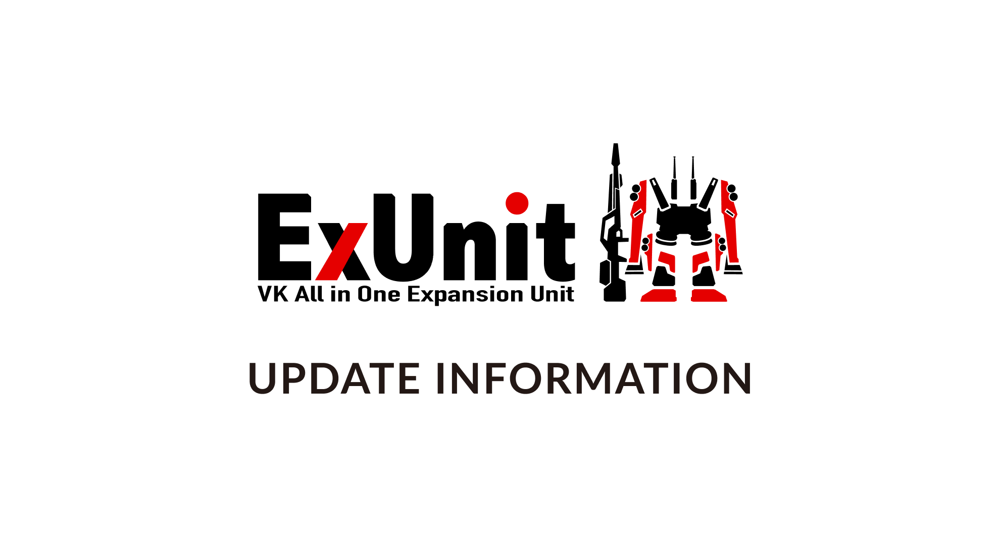
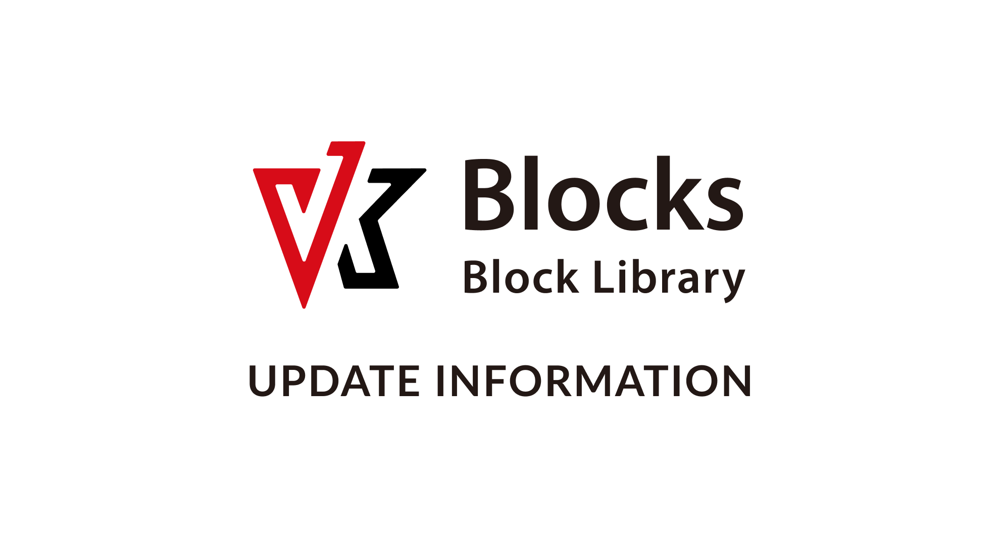
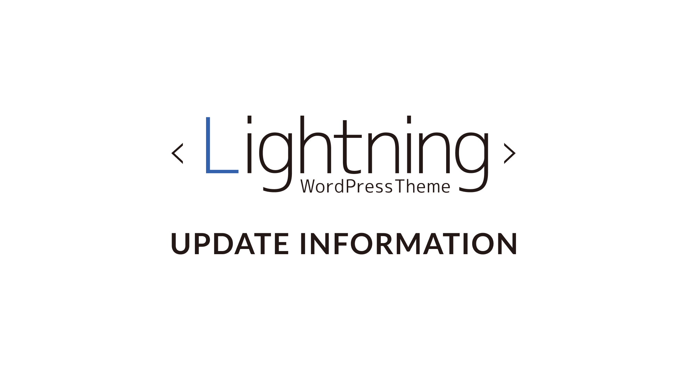
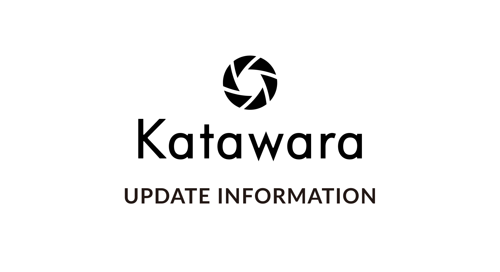

<!-- 
theme: vk-slide
size: 16:9
paginate: true
style: |
_paginate: false 
-->

<!-- Scoped style -->

<!-- _class: title -->

# VWS オンライン勉強会 #018

---

<!-- _class: title-chapter  -->
<!-- _paginate: false  -->

# はじめに

---

* 随時途中で質問などいただいてかまいません。
* 発言時以外はミュートにしてください。
（テレビ・同居人・外部の騒音）
* 質問はチャットでいただいても結構です。
* 一部録画・公開します。
* ライブビューイングのノリでチャットでわいわいいただければと思います。

---

## ミーティング中のチャット

今回はミーティング中のチャットはzoomの中ではなく slack で行います。
以下の #ミーティング チャンネルで行いますので、事前にテストで適当に挨拶など書き込んでみてください。

https://app.slack.com/client/TG8RZN3SM/C01A20ZGWMN/details/top

---

※上記URLでなくても普通にSlackのアプリを既にご利用されている方はSlackアプリから参加いただければ結構です。
https://slack.com/intl/ja-jp/downloads/

---

## Slackにまだ登録していない

vwsのslackに登録していない方は予め下記より申請ください。

https://vws.vektor-inc.co.jp/vws-community

---

## Slackログイン情報がわからない

申請したにも関わらずログイン方法がわからない場合は以下のURLからログインしてください
https://vektor-vws.slack.com/forgot/signin

■ VWSのSlackのURL
https://vektor-vws.slack.com

---

## 本日の内容

* 新機能解説
* 本編「CSSカスタマイズ」
* 質問相談会
* 連絡事項
* 懇親会

---

<!-- _class: title-chapter  -->
<!-- _paginate: false  -->

# 今月の新機能紹介

---

---

---

---

---

<!-- _class: title-chapter  -->
<!-- _paginate: false  -->

# メインセッション

---

<!-- _class: title-chapter  -->
<!-- _paginate: false  -->

# その他の連絡事項など

---

<!-- _class: title-chapter -->

## ショーケースについて

https://github.com/vektor-inc/vk-showcase

---

<!-- _class: title-chapter  -->
<!-- _paginate: false  -->

# そのほか質問などあれば

---
<!-- _class: title-chapter  -->
<!-- _paginate: false  -->

# 次回の勉強会

---
<!-- _class: title -->
<!-- _paginate: false  -->

# ありがとうございました
