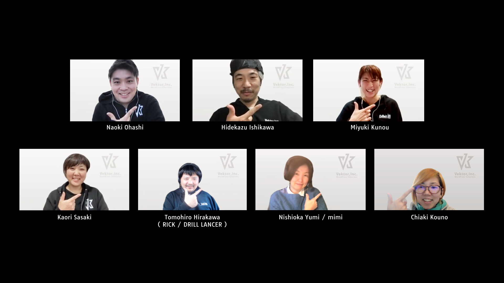

<!-- 
theme: vk-slide
size: 16:9
paginate: true
style: |
_paginate: false 
-->

<!-- Scoped style -->

<!-- _class: title -->

# VWS オンライン勉強会 #020

---

<!-- _class: title-chapter  -->
<!-- _paginate: false  -->

# はじめに

---

## この勉強会について

株式会社ベクトルが提供している、WordPressやWeb制作をとりまくさまざまなテーマをとりあげて開催している勉強会です。

ご興味がある方であれば、経験や技術レベルに関係なく、どなたでも参加できるオンライン勉強会です。

また、ベクトル製品のWordPressテーマ Lightning などの最新機能情報・カスタマイズ・運用方法についてもご案内しています。

基本的に、毎月1回、だいたい第4木曜日の開催です。

---

---

## 歓迎されること

* ライブビューイングのノリでチャットでわいわいいただければと思います。
* ぜひツイートして盛り上げてください <strong>#wpvektor</strong>
* 初参加者さんを歓迎してください。

---

## ご参加にあたって

勉強会におきましては、品位のない、差別的・迷惑な行動や発言は慎みましょう。優しい言葉を心がけてください。 受け入れ難い行為や発言をもし見かけられましたらスタッフが対応しますのでお知らせください。誰にとっても快適な勉強会となるようにご協力ください。

---

## ご参加にあたって

* 随時途中で質問などいただいてかまいません。
* 発言時以外はミュートにしてください。
（テレビ・同居人・外部の騒音）
* 質問はチャットでいただいても結構です。
* 一部録画・公開します。
(Slackで過去の勉強会の動画を振り返りできます)

---

## 勉強会中のチャット

勉強会中のチャットはzoom上ではなくslackで行っております。

<strong>VWS の Slack #ミーティング チャンネル:</strong>
https://app.slack.com/client/TG8RZN3SM/C01A20ZGWMN/details/top

※Slackのアプリを既にご利用されている方はSlackアプリからご参加ください
https://slack.com/intl/ja-jp/downloads/

---

## Slackにまだ登録していない

VWSのslackに登録していない方は予め下記より申請ください。

https://vws.vektor-inc.co.jp/vws-community

---

## Slackログイン情報がわからない

申請したにも関わらずログイン方法がわからない場合は以下のURLからログインしてください。
https://vektor-vws.slack.com/forgot/signin

■ VWSのSlackのURL
https://vektor-vws.slack.com

---

## 本日の内容

* 新機能 / 新製品その他お知らせ など（20分程度）
* 本編「アクションフックを使ったWordPressカスタマイズに挑戦！」（45分程度）
* 使い方・設定方法相談＆雑談会（15分程度）
* 懇親会

---

## 本編「アクションフックを使ったWordPressカスタマイズに挑戦！」

下記の内容＋αを実演しながら進めていきます。
https://www.vektor-inc.co.jp/post/wordpress-about-action-hook/

---

## ハッシュタグは #wpvektor

## コメントスクリーンはこちらから 

https://commentscreen.com/comments?room=wpvektor

※twitterに#wpvektorをつけて呟くとこちらにも反映されます。

---

<!-- _class: title-chapter  -->
<!-- _paginate: false  -->

# 今月の新機能 / 新製品その他お知らせ

https://www.vektor-inc.co.jp/product-update/

---

<!-- _class: title-chapter  -->
<!-- _paginate: false  -->

# メインセッション

#020 アクションフックを使ったWordPressカスタマイズに挑戦！

---
<!-- _class: title-chapter  -->
<!-- _paginate: false  -->

# 使い方・設定方法相談＆雑談会

---
<!-- _class: title-chapter  -->
<!-- _paginate: false  -->

# 意見交換

---
<!-- _class: title-chapter -->

## ショーケースについて

https://showcase.vektor-inc.co.jp/

LightningやKatawaraで作成したサイトを掲載して参考にしたり、制作者に制作に関する依頼の問い合わせが出来るサイトがオープンしています。

実績掲載・受注の流れ
https://showcase.vektor-inc.co.jp/flow

---
<!-- _class: title-chapter  -->
<!-- _paginate: false  -->

# 次回の勉強会

2021/04/22(木) 20:00 〜
VWSオンライン勉強会 #021 
内容が決まり次第、ご案内します！

---

<!-- _class: title-chapter  -->
<!-- _paginate: false  -->

# 参加後アンケートのお願い

https://forms.gle/h1m6ziRQhNQ3GGmPA

＜お聞きしたいこと＞
・今回のPHP基礎はいかがでしたか？続編を希望しますか？
・コンテンツデータ販売を取りやめることについて
よろしければご意見をお聞かせください。

---

<!-- _class: title-chapter  -->
<!-- _paginate: false  -->

# その他の連絡事項、告知など

---
<!-- _class: title -->
<!-- _paginate: false  -->

# ありがとうございました
