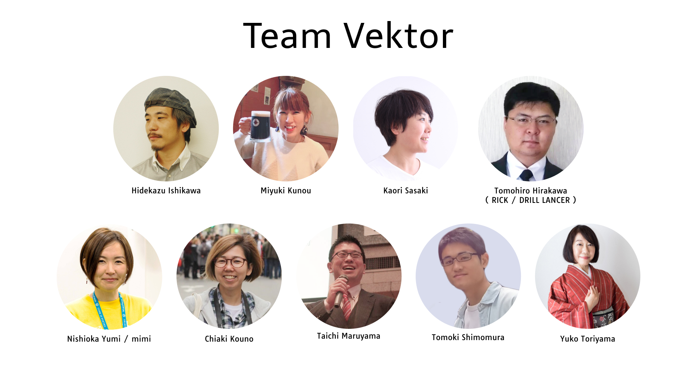

<!-- 
theme: vk-slide
size: 16:9
paginate: true
style: |
_paginate: false 
-->

<!-- Scoped style -->

<!-- _class: title -->

# VWS オンライン勉強会 #025
まもなくスタート！
#wpvektor ツイート大歓迎！

---

<!-- _class: title-chapter  -->
<!-- _paginate: false  -->

# ようこそ！はじめに

---

## この勉強会について

株式会社ベクトルが運営、WordPressやWeb制作をとりまくさまざまなテーマをとりあげて開催しているオンライン勉強会です。

ご興味がある方であれば、経験や技術レベルに関係なく、どなたでもご参加いただけます。

また、ベクトル製品のWordPressテーマ Lightning などの最新機能情報・カスタマイズ・運用方法についてもご案内しています。

基本的に、毎月1回、だいたい第4木曜日の開催です。

---

---

## 歓迎されること

* ライブビューイングのノリでチャットでわいわいいただければと思います。
* ぜひツイートして盛り上げてください <strong>#wpvektor</strong>
* 初参加者さんを歓迎してください。

---

## ご参加にあたって

勉強会におきましては、品位のない、差別的・迷惑な行動や発言は慎みましょう。優しい言葉を心がけてください。 受け入れ難い行為や発言をもし見かけられましたらスタッフが対応しますのでお知らせください。誰にとっても快適な勉強会となるようにご協力ください。

---

## ご参加にあたって

* 随時途中で音声でのご質問もOKです。
* 発言時以外はミュートにしてください。
（テレビ・同居人・外部の騒音）
* 質問はSlackや質問スプレッドシートにご記入も可能です。
* 一部録画・公開します。
(Slackで過去の勉強会の動画を振り返りできます)

---

## 勉強会中のチャット

勉強会中のチャットはzoom上ではなくslackで行っております。

<strong>VWS の Slack #ミーティング チャンネル:</strong>
https://app.slack.com/client/TG8RZN3SM/C01A20ZGWMN/details/top

※Slackのアプリもあります
https://slack.com/intl/ja-jp/downloads/

---

## Slackにまだ登録していない/ログイン情報を忘れた場合
VWSのSlack新規登録はこちら：
https://join.slack.com/t/vektor-vws/shared_invite/zt-qpdex5sh-zjw_M3r38GBaewNKcXa7GA

ログイン方法を忘れた場合：
https://vektor-vws.slack.com/forgot/signin

■ ブラウザでVWSのSlackにアクセス：
https://vektor-vws.slack.com

---

<!-- _class: title-chapter  -->
<!-- _paginate: false  -->

## だれでもお気軽に 質問・回答 記入シート
https://docs.google.com/spreadsheets/d/1Yvk3AN4pWn2tjL7DBe0HZm4OvvWOWhfp9ub76bAjmpQ/edit?usp=sharing

---

## 本日の内容

* 新機能 / 新製品その他お知らせ（約20分）
* 本編１「ブロックパターンを使って効率よくサイト構築しよう」(約30分)
* 〜 5分休憩 (21時ごろ)　〜
* 本編2「Lightningと和風デザイン拡張キットで旅館サイトを作ろう」(約20分)
* Q&A、質問相談会（〜22:00まで）
* 22:00より希望者のみ懇親会

---

<!-- _class: title-chapter  -->
<!-- _paginate: false  -->

## 今月の新機能 / 新製品その他お知らせ

---

## ハッシュタグは #wpvektor

## コメントスクリーンはこちらから 

https://commentscreen.com/comments?id=ToGdajZC9bLFLNFhted0

※twitterに **#wpvektor** をつけて呟くとこちらにも反映されます。

---

<!-- _class: title-chapter  -->
<!-- _paginate: false  -->

## 縦書きメニューに対応しました
Lightning **G3 Pro Unit** 0.4.0 にて、以前からリクエストの多かった縦書きメニューに対応しました。

https://www.vektor-inc.co.jp/product-update/g3-pro-unit-0-4-0/

（※「G3 Pro Unit」は、テーマLightningの機能を拡張する有料プラグインです。）

---

<!-- _class: title-chapter  -->
<!-- _paginate: false  -->

## ページヘッダーの背景画像の固定指定
Lightning **G3 Pro Unit** 0.5.0 にて、ページヘッダー部分の画像を固定指定できるように変更しました。未設定の場合は従来通りスクロールに追従する状態です。

https://www.vektor-inc.co.jp/product-update/lightning-g3-pro-unit-page-header/

---

<!-- _class: title-chapter  -->
<!-- _paginate: false  -->

## キャンペーンテキスト背景にストライプ追加
Lightning **G3 Pro Unit** 0.5.0 にて、キャンペーンテキストの背景がストライプを選択できるようになりました。
キャンペーンテキストの背景が今までは単色のみでしたが、ストライプを選択できるようになりました。

https://www.vektor-inc.co.jp/product-update/lightning-g3-pro-unit-0-5-0-campaign/

---
<!-- _class: title-chapter  -->
<!-- _paginate: false  -->

## 詳細ページの非表示要素設定を追加
Lightning **G3 Pro Unit** 0.6.0 にて、投稿やカスタム投稿タイプの各記事個別ページで、「公開日 / 更新日 / 投稿者」情報や「前の記事 / 次の記事」の非表示設定ができるようになりました。

https://www.vektor-inc.co.jp/product-update/lightning-g3-pro-unit-0-6-0/

---
<!-- _class: title-chapter  -->
<!-- _paginate: false  -->

## ヘッダー透過（全ページ）
Lightning **G3 Pro Unit** でヘッダーの透過に対応しました。

---
<!-- _class: title-chapter  -->
<!-- _paginate: false  -->

## デザインプリセット機能
Lightning **G3 Pro Unit** でデザインプリセット機能が追加されました。

---
<!-- _class: title-chapter  -->
<!-- _paginate: false  -->

## CTA (Call to Action) 機能強化
**ExUnit（VK All in One Expansion Unit）** でCTA の機能が強化されました。

---
<!-- _class: title-chapter  -->
<!-- _paginate: false  -->

## 新しいパターンブロックの追加
**VK Block Patterns**  1.6.0 にてカラム系ブロックパターンなどを多数追加しました。

https://www.vektor-inc.co.jp/product-update/vk-block-patterns-1-6-0-add-patterns/

---
<!-- _class: title-chapter  -->
<!-- _paginate: false  -->

## VK Blocks / Pro のアップデート情報

1. [機能追加][スペーサー] 共通余白設定のサイズ指定機能追加
2. [機能追加][スペーサー] 小中大の共通余白サイズ追加
3. [機能改善] 文字サイズ変更のUIを改善しました https://www.vektor-inc.co.jp/product-update/vk-blocks-1-9-0/
4. [機能改善] スライダーブロックのコントロール切り替え機能

---

<!-- _class: title-chapter  -->
<!-- _paginate: false  -->

## 制作実績へのリンク

showcase.vektor-inc.co.jp に実績を登録している方は
VWSの マイアカウント > アカウント詳細 で showcase.vektor-inc.co.jp の ID を登録するとフォーラム投稿・回答時に実績のリンクが表示されるようになりました。

表示例：
https://vws.vektor-inc.co.jp/forums/topic/site-content-padding-all

---

<!-- _class: title-chapter  -->
<!-- _paginate: false  -->

**和をイメージした Lightning G3 対応デザインスキン**
## 「VEKUAN」2021年7月リリース！

デモサイト：
https://demo.dev3.biz/vekuan/
リリース情報：
https://www.vektor-inc.co.jp/info/vk-filter-search-pro-release/

---

<!-- _class: title-chapter  -->
<!-- _paginate: false  -->

和風デザイン「Lightning G3 VEKUAN キット」
販売価格 ¥9,900(税込)
## 発売記念特価 ¥8,800(税込) 8月31日まで
デザインスキンと専用パターン＋旅館サイト向けコンテンツデータが含まれたキットです。
別途 Lightning G3 Pro Unit プラグインと一緒に
ご利用ください。

---

<!-- _class: title-chapter  -->
<!-- _paginate: false  -->

## 新サービスのお知らせ
C'mon and Join the #ベクトレ !!
https://training.vektor-inc.co.jp/

---

<!-- _class: title-chapter  -->
<!-- _paginate: false  -->

# メインセッション１

ブロックパターンを使って効率よくサイト構築しよう

---
<!-- _class: title-chapter  -->
<!-- _paginate: false  -->

# メインセッション２

Lightningと和風デザイン拡張キットで旅館サイトを作ろう

---
<!-- _class: title-chapter  -->
<!-- _paginate: false  -->

# Lightning 意見交換会
Lightning を使用していて、
・こういうところが使い勝手が良くて好き
・こういうところがもっと改善してほしい
などのご意見をお聞かせください。

---
<!-- _class: title-chapter  -->
<!-- _paginate: false  -->

## 次回の勉強会
2021/09/23(木) ※調整中　VWSオンライン勉強会 #026

内容が決まり次第ご案内します！

---

<!-- _class: title-chapter  -->
<!-- _paginate: false  -->

# 参加後アンケートのお願い

https://forms.gle/1oRiJWwdekSYUyWH6
＜お聞きしたいこと＞
- 本日の勉強会のご感想
- 今後の勉強会でとりあげてほしいテーマ
- 和のデザイン VEKUAN のご感想
- ベクトレのご感想

よろしければご意見をお聞かせください。

---

<!-- _class: title-chapter  -->
<!-- _paginate: false  -->

# その他の連絡事項、告知など

---

<!-- _class: title-chapter  -->
<!-- _paginate: false  -->

## Slackで他のユーザーと交流しよう
ベクトル製品の制作の悩み・相談・雑談などをお気軽に交流していただける場を目指しています！チャンネル増設や情報共有がしやすい仕組みなども考えています！

---
<!-- _class: title -->
<!-- _paginate: false  -->

# ありがとうございました
