<!-- 
theme: vk-slide
size: 16:9
paginate: true
style: |
_paginate: false 
-->
<link href="./themes/vk-slide/fontawesome-free/css/all.css" rel="stylesheet">

<!-- _class: title -->

WordCamp Asia 2023
# How can theme developers monetize in the era of Block Themes?

Hidekazu Ishikawa
@kurudrive

<!-- 
Hello everyone.
From now on, I would like to talk about
"How can theme developers monetize in the era of Block Themes?"
 -->

---------------------------------------------------------------------------

## Who am I ? - Self introduction -

 

### Hidekazu Ishikawa

<i class="fa-solid fa-map-location-dot"></i>From Japan
<i class="fa-solid fa-laptop-code"></i>Theme developer / CEO

__2012__　First General-purpose theme published.

<!-- 
First of all, 
I will briefly introduce myself.

My name is Hidekazu Ishikawa
I came from japan.
I am a WordPress theme developer.

In 2012, 
I released a general-purpose WordPress theme in Japan.
 -->

---------------------------------------------------------------------------
<!-- _paginate: false  -->

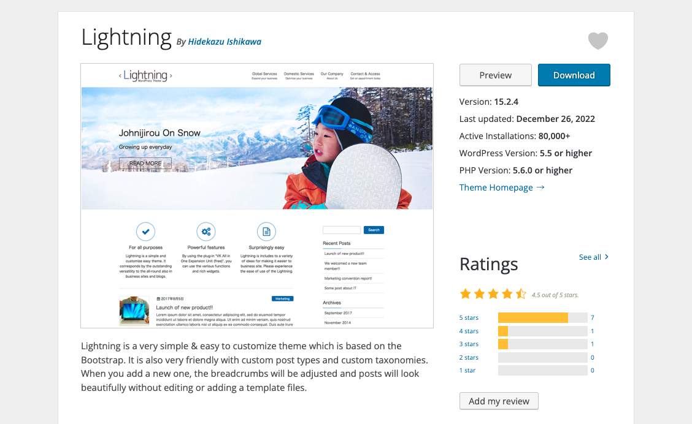

#### 2015

<b style="color:yellow">Theme Lightning</b> published on wordpress.org 
Thanks to <b style="color:yellow">80,000+</b> active installs

<!-- 
In 2015 
I published Theme Lightning on wordpress.org
-->

---------------------------------------------------------------------------
<!-- _paginate: false  -->

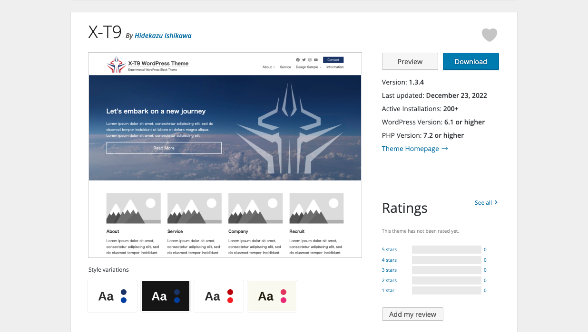

#### 2022

<b style="color:yellow">Block theme X-T9</b> released 
Currently in trial and error for block theme

In addition, development and sales of <b>theme extension plugin</b> and other plug-ins

<!-- 
In 2022
I published Block theme X-T9 on wordpress.org

I also make a living by developing and selling 
theme extension plugins and other plug-ins.
-->

---------------------------------------------------------------------------

## Business model of theme authors ( Before full site editing )

Create and Sale

<i class="fa-solid fa-brush"></i>**Premium Themes**
<i class="fa-solid fa-plug"></i>**Theme extension** plugins
<i class="fa-solid fa-plug"></i>**Block extension** plugins ... etc.

<i class="fa-solid fa-sack-dollar"></i> <b class="text-danger">Relatively possible to sell and make money.</b>

<!-- 
like me,
Business model of theme authors is

Create and sell 

→ Premium Themes
→ Theme extension plugins
→ Block extension plugins

I think these were the mainstream.

We could simply create a theme and sell it as a zip file.
It was relatively possible to sell and make money.

-->

---------------------------------------------------------------------------
<!-- _class: title-chapter  -->
<!-- _paginate: false  -->
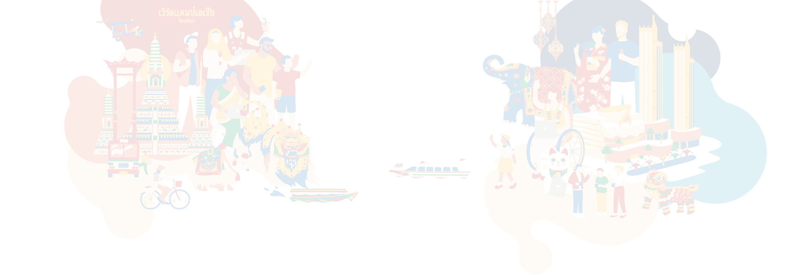

# Points where monetization has become more difficult

---

# # 01
# Traditional monetization points become less effective

<!-- 
No.1
Traditional monetization points become less effective
 -->

---------------------------------------------------------------------------
## Before Full Site Editting

Selling Premium theme

 

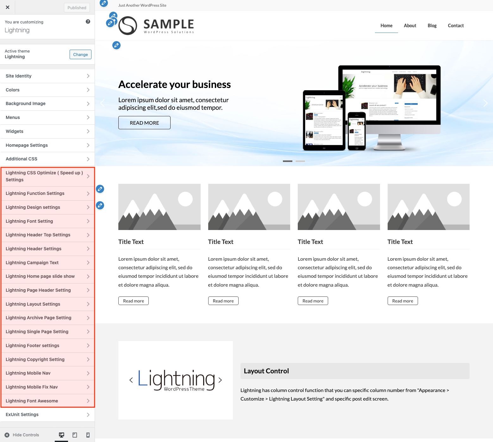

	

	

	

		

		<i class="fa-regular fa-face-smile"></i> User
		

		

		<i class="fa-solid fa-arrow-up"></i> Easily edit　
		<i class="fa-solid fa-arrow-down"></i> Reward <i class="fa-solid fa-sack-dollar" style="color:#d29922"></i>

		

		<i class="fa-regular fa-face-smile"></i> Theme authors
		

		

	

<!-- 
Before FSE

Theme authors
develop themes with unique editing functions
and sell Premium themes

User can easily edit
Theme creators could get rewarded

Such a relationship existed and
there was one monetization point here
-->

---------------------------------------------------------------------------

## Era of Full Site Editing

The entire site can be customized with no code!

<i class="fa-solid fa-paintbrush"></i> Header and footer layout
<i class="fa-solid fa-paintbrush"></i> Specify color and font size
<i class="fa-solid fa-paintbrush"></i> Margin / Padding / Gap settings ...etc

<i class="fa-sharp fa-solid fa-arrow-right"></i> <b class="text-danger">Much less theme dependent</b>.

<!-- 
However, in FSE,

Users can customize entire site with no code, 
just standard WordPress features.

This makes it much less dependent on the theme.
-->

---------------------------------------------------------------------------

### Then as someone who made a living out of theme sales...

 <!-- 
Then as someone who made a living out of theme sales...
-->

---------------------------------------------------------------------------

Monetization points  disappeared... 

 (´；ω；｀)
 

 <!-- 
Monetization points disappeared.

and it is
-->

---------------------------------------------------------------------------

A matter of life and death

il||li ＿|￣|○ il||li

<!-- 
a matter of life and death.
-->

---------------------------------------------------------------------------

# # 02

# Decreased monetization effect by original Block features.

<!-- 
No.2
Decreased monetization effect by original Block features.
 -->

---------------------------------------------------------------------------
<!-- _paginate: false  -->
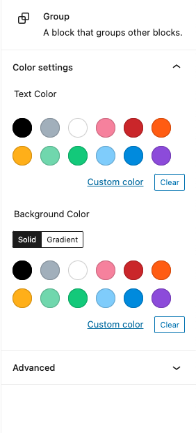

### Early stage block editors

<i class="fa-regular fa-face-frown-open"></i>No margin adjustment function
<i class="fa-regular fa-face-frown-open"></i>No border setting
<i class="fa-regular fa-face-frown-open"></i>Can't Advanced layout
　 ( need like Media Block )  ... etc

We have developed our original blocks

<i class="fa-sharp fa-solid fa-arrow-right"></i> **Added value** ( monetization points ).

<!-- 
Early stage block editors had poor editing capabilities

so

We have developed original blocks with various adjustment functions and layouts,
and 
Used them as added value.
-->

---------------------------------------------------------------------------
<!-- _paginate: false  -->
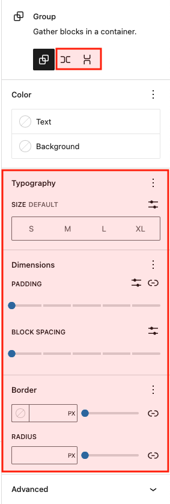

### WordPress version upgrade...

* Advanced layouts are now possible with core blocks
   (Block Patterns).
* The similar function is added to the core block, etc.

<!-- 
However, by the 
WordPress version upgrade...

* Advanced layouts are now possible with core blocks and Block Patterns

and

* Similar functions have been added to the core blocks...

Again, 
-->

---------------------------------------------------------------------------

Monetization points  disappeared... 

 (´；ω；｀)
 

<!-- 
the monetization points have disappeared.
-->

---------------------------------------------------------------------------

### In addition ...

* Released original blocks become an ongoing maintenance burden
* We have to keep checking Gutenberg's development closely ( to avoid unnecessary development ).

<!-- 
In addition to

* once released
Original blocks become an ongoing maintenance burden

and 

* It became necessary to keep a close watch on Gutenberg's developments.
-->

---------------------------------------------------------------------------

# # 03
# CSS output by WordPress becomes complicated

<!-- 
No 3
CSS output by WordPress becomes complicated
 -->

---------------------------------------------------------------------------

* The influence of <b class="text-danger">CSS output by WordPress has increased</b>

* It is <b class="text-danger">difficult to deal with specification changes</b> such as block CSS

* Apart from CSS knowledge, it became <b class="text-danger">essential to understand WordPress's unique CSS method</b>

<!-- 
* The influence of CSS output by WordPress has increased

* It is difficult to deal with specification changes such as block CSS

* Apart from CSS knowledge, it became essential to understand WordPress's unique CSS method
-->

---------------------------------------------------------------------------

Probably many theme & custom block developers are facing this issue?

However, it is inevitable in the evolution of WordPress.

|Ｔ－Ｔ）.oO（ I know. I love WordPress... ）

<!-- 
Probably many theme & custom block developers are facing this issue?

However, it is inevitable in the evolution of WordPress.
-->

---------------------------------------------------------------------------

The area that theme developers 
have focused on for monetization is 
greatly influenced by FSE.

It has become difficult to monetize 
traditional "theme sales".

<!-- 
In this way,
The area that theme developers 
have focused on for monetization is 
greatly influenced by FSEs.

As a result, I feel 
it has become difficult to monetize 
traditional "theme sales"
-->

 ---------------------------------------------------------------------------
<!-- _class: title-chapter  -->
<!-- _paginate: false  -->

# Future direction of theme-related business

---------------------------------------------------------------------------
<!-- _paginate: false  -->

# How add value and differentiate?

（・ｗ・？

---------------------------------------------------------------------------

<h2 style="position:absolute;top:1em;">Differentiation by block patterns</h2>

#### <i class="fa-regular fa-hand-point-right"></i> Easiest way

Includes various block patterns.

I think most theme developers are already working on these.

There is nothing that  
users cannot create on their own,  
so it is <b class="text-danger">weak as a point of monetization</b>.

<!-- 
First, 
we can consider differentiation by block patterns

As the easiest way

Selling themes and plugins that includes various block patterns.

However, as mentioned earlier

There is nothing that 
users cannot create on their own, 
so it is weak as a point of monetization.
-->

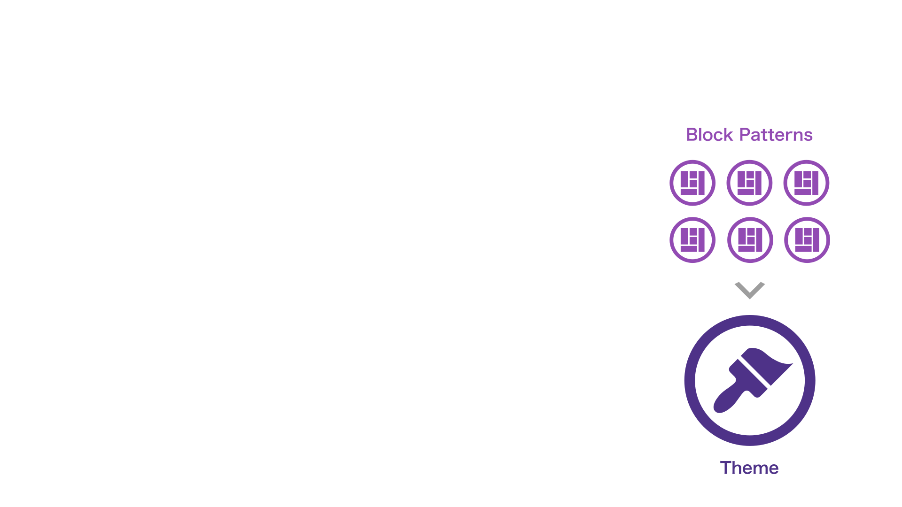

---------------------------------------------------------------------------
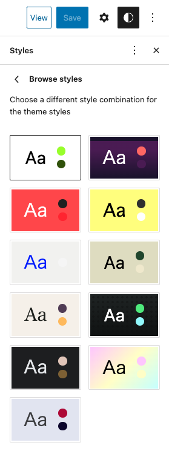

## Differentiation by Global Styles variations

#### <i class="fa-regular fa-hand-point-right"></i> New Easiest way

"Global Styles variations" Feature Introduced in WordPress 6.0

We can create different variations within a single theme.

<!-- 
The second is 
differentiation by Global Styles variations.

It is a feature introduced in WordPress 6.0

This feature allows us to create different variations within a single theme.
-->

---------------------------------------------------------------------------

### Block Patterns / Global Style Variations

Even general users can make it, but...

High quality products created by profesional designers
→ High added value of course

 

<i class="fa-regular fa-thumbs-up"></i> <b class="text-danger">New extensibility</b> and <b class="text-danger">monetization points</b>.

<!-- 
These 
Block pattern and Global Style Variations are

Even general users can make it, but...

High-quality products produced by profesionals 
naturally have high added value.

These are the new extensibility and monetization points 
that WordPress has provided.
-->

---------------------------------------------------------------------------
<!-- _paginate: false -->
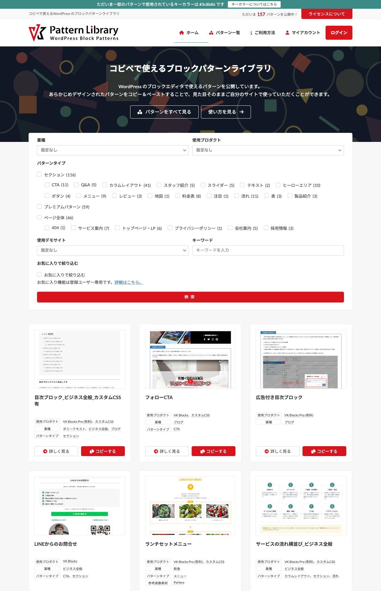

## Our case

#### Publish our own Block Pattern Directory

https://patterns.vektor-inc.co.jp/

<i class="fa-solid fa-language"></i>Only available in Japanese

Inspired by the Org site:
https://wordpress.org/patterns/

<!-- 
Our case

We published our own block pattern directory

This is a site similar to the official pattern directory.
-->

---------------------------------------------------------------------------

<!-- _paginate: false -->
### Why we created our own pattern directory?

（・ｗ・

---------------------------------------------------------------------------

### 1. Still difficult only with core blocks

Want to use our original blocks and CSS 
to provide higher quality patterns

<i class="fa-solid fa-circle-exclamation"></i> .org allowed <b class="text-danger">only core blocks</b> and <b class="text-danger">can't use Custom CSS</b>.

<!-- 
Because
Still difficult only with core blocks,
so
I wanted to use my own original blocks 
to provide more practical patterns.

Practical Patterns can be motivates people to purchase Premium Patterns.

-->

---------------------------------------------------------------------------

### 2.  language problem

Characters look different in English and double-byte characters

<i class="fa-solid fa-language"></i>

<!-- 
Second, there is the language problem.

Characters look different in English and double-byte characters

-->

---------------------------------------------------------------------------

<!-- _paginate: false  -->

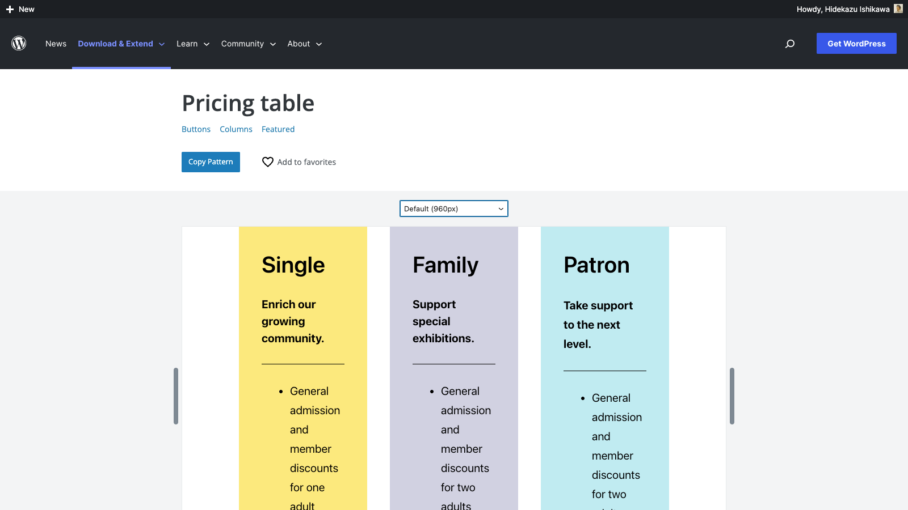

#### English

Even if it looks not bad in English but...

<!-- 
For example

Even if 
it looks not bad 
in English but...

-->

---------------------------------------------------------------------------

<!-- _paginate: false  -->

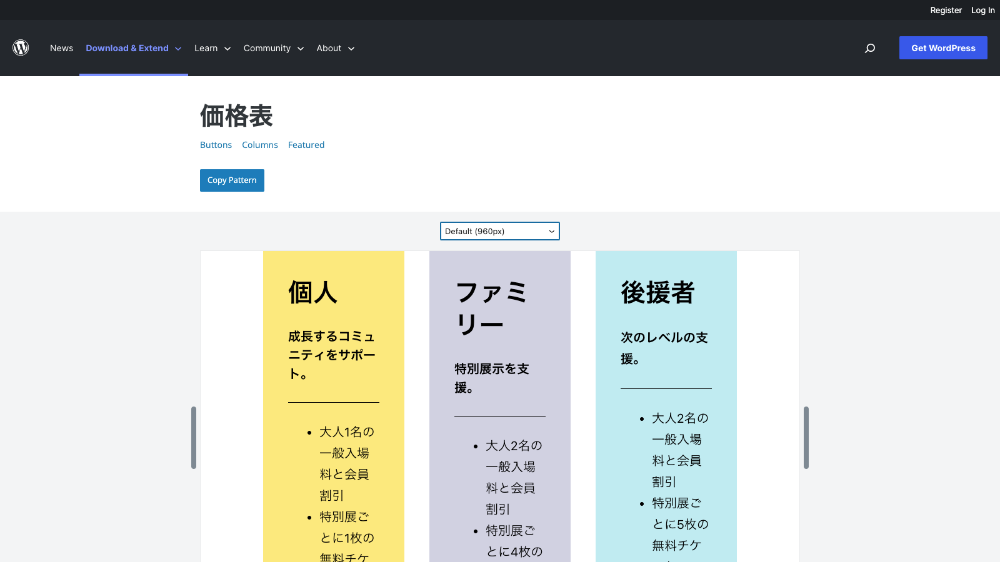

#### Japanese

The balance is bad.

<!-- 
in Japanese.
The balance is bad.
-->

---------------------------------------------------------------------------

### 3. Theme style affects

Even if user paste the .org pattern, 
user need to make adjustments.

<!-- 
The third is 
the effect of theme style.

Even if user paste the .org pattern, 
user need to make adjustments.

-->

---------------------------------------------------------------------------
<!-- _paginate: false  -->
### 4. Monetization

We can't monetize only with the .org pattern directory...

<i class="fa-solid fa-sack-dollar" style="font-size:160px !important;"></i> Oo.（＝ｗ＝

<!-- 
Fourth is monetization

Truth be told, 
it's the most important
We can't monetize only with the .org pattern directory.

-->

---------------------------------------------------------------------------
<!-- _paginate: false  -->
# How we monetize?

（・ｗ・

---------------------------------------------------------------------------
<!-- _paginate: false  -->

#### Through our pattern directory, Offer premium features to paying users

Paid User Benefits are...

（・ｗ・b

<!-- 
Through our pattern directory,
Offer premium features to paying users

The main benefits of paying users are
-->

---------------------------------------------------------------------------

### 1. Premium patterns

* As the name suggests, the design and sample sentences are <b class="text-danger">more elaborate are ready to use</b>.
* Available to only paying users
（need logged in）

<!-- 
At first

Premium patterns 

* As the name suggests, 
the design and sample sentences are more elaborate are ready to use.

* This patterns available to only paying users.
-->

---------------------------------------------------------------------------

### 2. Favorite pattern registration function

Patterns are added one after another
→ <b class="text-danger">Hard to find</b>

Function to register own favorite patterns

※ Same functionality as wordpress.org

<!-- 
Second

Favorite pattern registration function

Patterns are added one after another 
so become hard to find

Therefore

This function allows users to register own favorite patterns 
and easily recall them.
-->

---------------------------------------------------------------------------
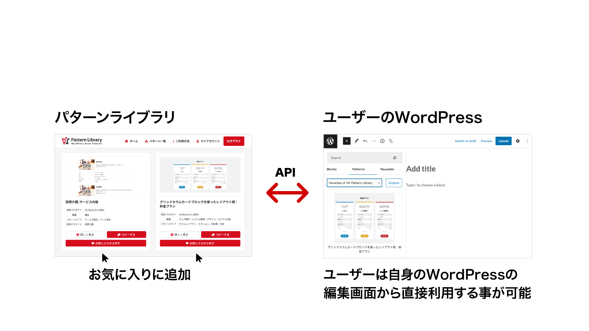

<h3 style="position:absolute;top:1em;">3. Link function for favorite registered patterns</h3>

<!-- 
3rd benefit is
Link function for favorite registered patterns

Call patterns registered in favorites from the user's site with API

then

Users can use it directly from the edit screen of their site

-->

---------------------------------------------------------------------------

## What is a value-added pattern?

Creating and developing more patterns has become very important for developers who were in the theme sales business.

Where is the added value that is the key to monetization?

<!-- 
Creating and developing more patterns has become very important 
for developers who were in the theme sales business.

So
Where is the added value that is the key to monetization?
-->

---------------------------------------------------------------------------

## With many beautiful patterns, is it easy to make a page?

We make and provide stylish and common patterns. But...

* Many non-profesional users can't think about page structure in the first step
* They can't think of the sentences to write

<!-- 
Of course we make and provide stylish and common patterns. But...

* Many non-profesional users can't think about page structure in the first step

and

* They can't think of the sentences to write.
-->

---------------------------------------------------------------------------

<!-- _paginate: false  -->

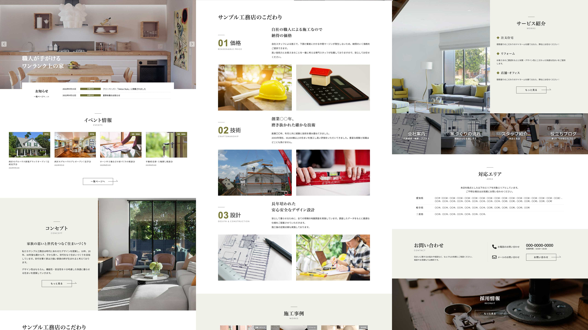

#### Premium patterns

Provide a block pattern to create whole page of a specific page for a specific industry.

<!-- 
Therefore

We are Providing a block pattern to create 
whole page of a specific page 
for a specific industry.
-->

---------------------------------------------------------------------------

#### For the End-user ( Business owner )

Just rewrite the text to suit their business.

#### Commissioned creation

By using a pattern as a draft of the page, 
the meeting with the client becomes smooth

<!-- 
There is 

for the end user
They are Just rewrite the text to suit their business.

for the Commissioned creation
By using a pattern as a draft of the page, 
he meeting with the client becomes smooth

-->

---------------------------------------------------------------------------
## Localization is essential

<ul>
<li data-marpit-fragment="1" data-bespoke-marp-fragment="inactive">Must be in the language of the country</li>
<li data-marpit-fragment="1" data-bespoke-marp-fragment="inactive">A design optimized for each language (characters/typefaces) is better</li>
<li data-marpit-fragment="1" data-bespoke-marp-fragment="inactive">Content and design trends vary by region (country)</li>
<li data-marpit-fragment="1" data-bespoke-marp-fragment="inactive" class="mt-40 ls-none">
	

	<b>Localized versions</b> 
	No competition with English-speaking developers.
	

</li>
</ul>

<!-- 
When providing as a pattern for the entire page including sentences

* Must be in the language of the country

and

* A design optimized for each language (characters/typefaces) is better

Furthermore

* Content and design trends vary by region (country)

* Localized versions also have the benefit of not competing with English-speaking developers.
-->

---------------------------------------------------------------------------

<!-- _class: title-chapter  -->
<!-- _paginate: false  -->

# Is the theme business dead?

<!-- 
About whether the theme business is dead,
-->

---------------------------------------------------------------------------

## Theme is important after all

Themes and patterns are 
closely related to the global styles

Bring in a partial pattern from outside and use it
<i class="fa-solid fa-arrow-right"></i>There is a problem with the uniformity of the design.

Having said that "FSE reduces theme dependency", 
<b class="text-danger">the importance of the theme is high.</b>

<!-- 
I feel, after all, theme is important.

Themes and patterns are closely related to the global style, 

Even if bring in a partial pattern from outside and use it, 
there are many cases where there is a problem with the uniformity of the design.

Having said that "FSE reduces theme dependency", 
In my opinion ,after all the importance of the theme is high.
-->

---------------------------------------------------------------------------

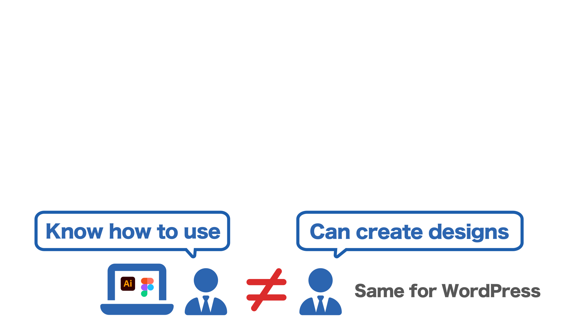

## Users need good themes and  highly practical patterns

FSE is highly configurable and customizable but...
→ <b class="text-danger">Too much configuration work</b>

It's <b class="text-danger">quite cumbersome</b> to make from scratch

<!-- 
Even in the era of FSE
Users need good themes and highly practical patterns

however
FSE is highly configurable and customizable but, 
too much configuration work.

Actually, it's quite cumbersome to make from scratch

-->

---------------------------------------------------------------------------

## Responsive design compatibility

How to control display elements according to screen size?

<ul>
<li data-marpit-fragment="1" data-bespoke-marp-fragment="inactive">With a single screen width,  
it might be possible to lay out well somehow.</li>
<li data-marpit-fragment="2" data-bespoke-marp-fragment="inactive"><b class="text-danger">Layout on multiple widths are actually not that easy</b></li>
<li data-marpit-fragment="3" data-bespoke-marp-fragment="inactive" class="ls-none mt-32">

If a theme/pattern to match your purpose is available, you can have website faster by purchasing it.

</li>
</ul>

<!-- 
Additionally, the website must adapt to different screen sizes.

How to control display elements according to screen size?

* With a single screen width, it might be possible to lay out well somehow.
* However, when it comes to layout on multiple width are actually not that easy.

If a theme/pattern to match user's purpose is available, user can have website faster by purchasing it.
-->

---------------------------------------------------------------------------

It will be difficult to monetize the theme alone

A set with a **Value-added pattern** and **Global styles** are there will be <b>many business opportunities</b>.

<!-- 
* I feel it will be difficult to monetize the theme alone, but...

* considering it as A set with a value-added pattern and global styles are 
There will be many business opportunities.

-->

---------------------------------------------------------------------------
<!-- _class: title-chapter  -->
<!-- _paginate: false  -->

## At the end

What do you think about future theme business?

Please share your opinion 

* Twitter #WCAsia @kurudrive
* Talk to me! ( with simple words and short sentence )

### 
Thank you

<!-- 
At the end

What do you think about future theme business?

Please share your opinion 

on

* Twitter 

or

* Talk to me! ( with simple words and short sentence )

-->
