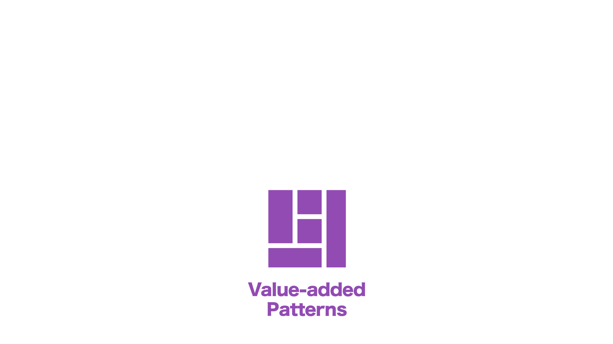

<!-- 
theme: vk-slide
size: 4:3
paginate: true
style: |
_paginate: false 
-->
<link href="./themes/vk-slide/fontawesome-free/css/all.css" rel="stylesheet">
<link href="./themes/vk-slide/css/speak.css" rel="stylesheet">

<!-- _class: title -->

Hello everyone.
From now on, I'd like to talk about

# How can theme developers monetize in the era of  Block Themes?

---------------------------------------------------------------------------

 

First of all, 

My name is Ishikawa
I'm a WordPress theme developer.

In 2012, 
I released a general-purpose WordPress theme in Japan.

---------------------------------------------------------------------------

In 2015 
I published Theme Lightning on wordpress.org

---------------------------------------------------------------------------

In 2022

I published Block theme X-T9 on wordpress.org

I also make a living by developing and selling theme extension plugins and other plug-ins.

---------------------------------------------------------------------------

like me, the business model of theme developers is

Create and sell 

Premium Themes and Plugins

I think these were the mainstream.

We could simply create a theme and sell it as a zip file.
It was relatively possible to sell and make money.

---------------------------------------------------------------------------
<!-- _class: title-chapter  -->

# Points where monetization has become more difficult

---

# # 01
# Traditional monetization points become less effective

（＝ｗ＝

---------------------------------------------------------------------------

## Before FSE

Theme developers
develop themes with unique editing functions
and sell Premium themes

User can easily edit
Theme creators could get rewarded

Such a relationship existed and
there was one monetization point here

---------------------------------------------------------------------------

However, in FSE,

Users can customize entire site with no code, just standard WordPress features.

This makes it much less dependent on the theme.

---------------------------------------------------------------------------

### Then as someone who made a living out of theme sales...

---------------------------------------------------------------------------

#### Monetization points disappeared.

 (´；ω；｀)

 
and it is

---------------------------------------------------------------------------

<b>A matter of life and death</b>

il||li ＿|￣|○ il||li

<!-- 
a matter of life and death.
-->

---------------------------------------------------------------------------

# # 02

# Decreased monetization effect by original Block features.

（＝ｗ＝

---------------------------------------------------------------------------

### Early stage block editors had poor editing capabilities

so

We have developed original blocks with various adjustment functions and layouts,

and 

Used them as added value.

---------------------------------------------------------------------------

However, by the 

### WordPress version upgrade...

* Advanced layouts are now possible with Core blocks and Block Patterns

* Similar functions have been added to the core blocks...

Again, 

---------------------------------------------------------------------------

Monetization points  disappeared...

 (´；ω；｀)

---------------------------------------------------------------------------

### In addition to

* Once released
Original blocks become an 
**ongoing maintenance burden**

and 

* It became necessary to 
**keep a close watch on Gutenberg's developments.**

---------------------------------------------------------------------------

# # 03
# CSS output by WordPress became quite complicated

（＝ｗ＝

---------------------------------------------------------------------------

Probably 

Many theme & custom block developers are facing this issue?

However, 

It is inevitable in the evolution of WordPress.

|Ｔ－Ｔ）.oO（ I know ）

---------------------------------------------------------------------------

In this way,

The area that theme developers 
have focused on for monetization is 
greatly influenced by FSE.

As a result, I feel 

It has become difficult to monetize 
traditional "theme sales"

 ---------------------------------------------------------------------------
<!-- _class: title-chapter  -->

# Future direction of  theme-related business

---------------------------------------------------------------------------

# How add value and differentiate?

（・ｗ・？

---------------------------------------------------------------------------

First, we can consider 

## Differentiation by block patterns

As the easiest way

Selling themes and plugins that includes various block patterns.

However, as mentioned earlier

There is nothing that users cannot create on their own, so it is **weak as a point of monetization**.

---------------------------------------------------------------------------

The second is 

## Differentiation by Global Styles variations.

It is a feature introduced in WordPress 6.0

This feature allows us to create different variations within a single theme.

---------------------------------------------------------------------------

These 

### Block Patterns / Global Style Variations are

Even general users can make it, but...

High quality products created by professional are 
naturally having high added value.

 

These are the new extensibility and monetization points that WordPress has provided.

---------------------------------------------------------------------------

## In our case

Before FSE

We used to sell plugins 
that extend the functionality of the theme

---------------------------------------------------------------------------

However

* Expected to taper off due to less reliance on the theme

* Even if sell only the pattern, it seems to be difficult / because even users have the impression that they can make them on their own.

in addition to

* We have to move to block themes too

---------------------------------------------------------------------------

Therefore, currently

We are selling licenses with 
Premium Patterns added

---------------------------------------------------------------------------

This configuration is

* **User can use both**
the classic theme and the new block theme

* **Keep existing users by the value of the Premium Patterns**

* **Acquire new users** through the 
value of our Premium Patterns

and the 

 

Block Patterns is extremely important.

 

---------------------------------------------------------------------------

So,
we published our own block pattern directory

This is a site similar to the official pattern directory.

---------------------------------------------------------------------------

### Why we created our own pattern directory?

（・ｗ・

---------------------------------------------------------------------------

Why we created our own pattern directory?

Because

### Still difficult only with core blocks,

so
I wanted to use my own original blocks 
to provide more practical patterns.

Practical Patterns can be motivates people to purchase license.

---------------------------------------------------------------------------

Why we created our own pattern directory?

Second, there is the 

### language problem

Characters look different in 
English and double-byte characters

<i class="fa-solid fa-language"></i>

---------------------------------------------------------------------------

#### English

For example

Even if 
it looks not bad 
in English but...

---------------------------------------------------------------------------

#### Japanese

in Japanese.
The balance is bad.

---------------------------------------------------------------------------

Why we created our own pattern directory?

The third is 

### the effect of theme style.

Even if user paste the .org pattern, 
user need to make adjustments.

---------------------------------------------------------------------------

For us, 
we need to make an effort to 
get users to continue to license 
even if the dependency of the theme decreases.

then,
### How to increase product value?

（・ｗ・

---------------------------------------------------------------------------

How to increase product value?

At first

### Premium patterns 

As the name suggests, 

* This patterns 
  available to only paying users.

* The design and sample sentences are more elaborate are ready to use.

<i class="fa-solid fa-crown"></i>

---------------------------------------------------------------------------

Of course 
we provide stylish and common patterns but...

Actually, 
Many non-profesional users...

* **Can't think about page structure** in the first step

and

* **They can't think of the sentences to write**.

---------------------------------------------------------------------------

Therefore

We are Providing a block pattern to create 
whole page of a specific page 
for a specific industry.

#### Premium patterns

---------------------------------------------------------------------------

There is 

<b>For the end user</b>
They are Just rewrite the text to suit their business.

for the 
<b>Commissioned creation</b>

By using a pattern as a draft of the page, 
the <b>meeting with the client becomes smooth</b>

---------------------------------------------------------------------------

When providing as a pattern for the entire page including sentences

* Must be in the language of the country / and

* A design optimized for each language is better / Furthermore

* Content and design trends vary by region

<b>Localized versions</b> also have the benefit of not competing with English-speaking developers.

---------------------------------------------------------------------------

How to increase product value?

Second

### Favorite pattern registration function

This function allows 
users to register own favorite patterns 
and **easily recall them**.

<i class="fa-solid fa-heart"></i>

---------------------------------------------------------------------------

How to increase product value?

3rd benefit is

**Link function for favorite registered patterns**

Call patterns registered in favorites from the user's site with API / then

Users can use it directly from the edit screen of their site

---------------------------------------------------------------------------

<!-- _class: title-chapter  -->

# About whether the theme business is dead,

---------------------------------------------------------------------------

I feel, after all, 

## Theme is important

Themes and patterns are closely related to the global styles, 

Even if 
bring in a partial pattern from outside and use it, 
there are many cases where there is a 
problem with the uniformity of the design.

---------------------------------------------------------------------------

Even in the era of FSE

## Users need good themes and highly practical patterns

FSE is highly configurable and customizable but, 
**too much configuration work**.

Actually, it's **quite cumbersome** to make from scratch

---------------------------------------------------------------------------

## Responsive design compatibility

Additionally, the website must adapt to different screen sizes.

How to control display elements according to screen size?

* With a single screen width, it might be possible to lay out well somehow.
* However, when it comes to **layout on multiple width are actually not that easy**.

---------------------------------------------------------------------------

I feel it will be difficult to monetize the theme alone, but...

considering 
it as A set with a **value-added patterns** are 
There will be many business opportunities.

---------------------------------------------------------------------------
<!-- _class: title-chapter  -->

## At the end

What do you think about future theme business?

Please share your opinion 

<i class="fa-brands fa-twitter"></i> Twitter 
#WCAsia @kurudrive / @kurudrivve_en

or

<i class="fa-solid fa-comments"></i>Talk to me! ( with simple words and short sentence )

### 
Thank you
